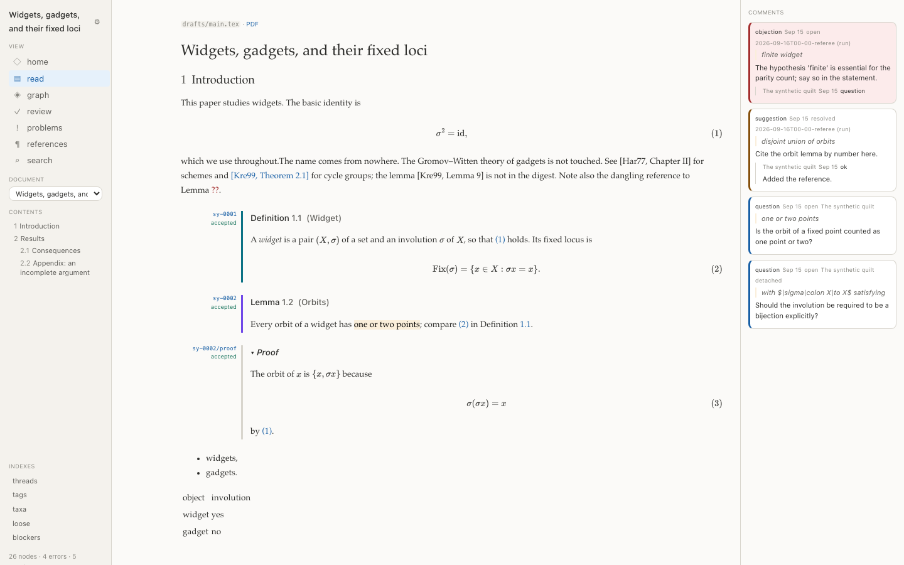
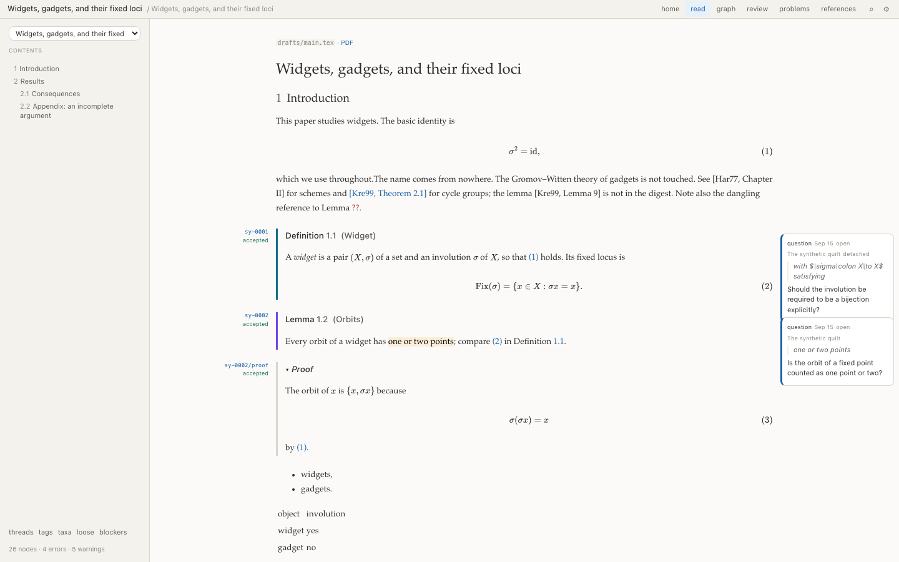
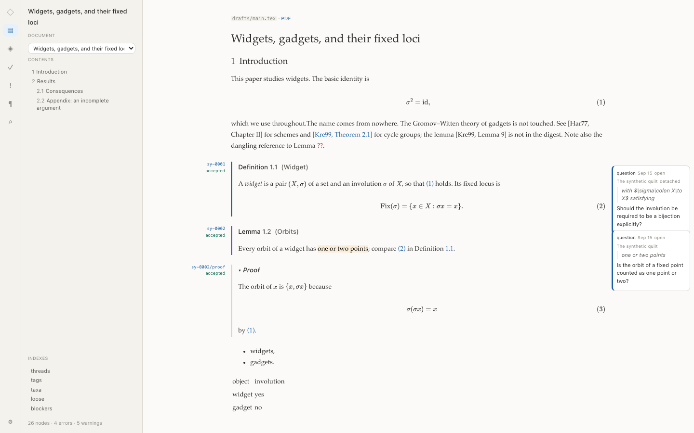
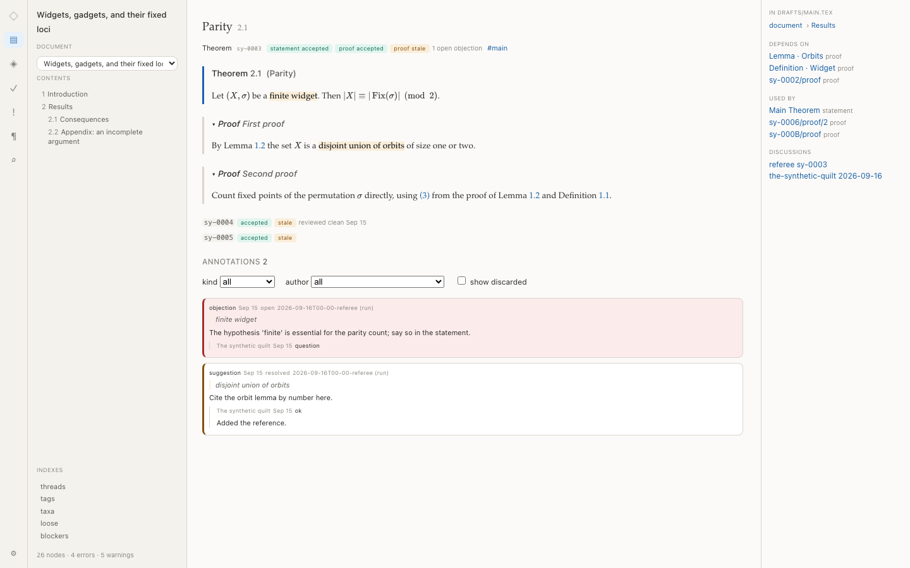
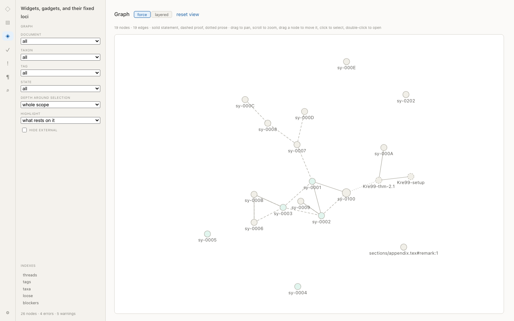
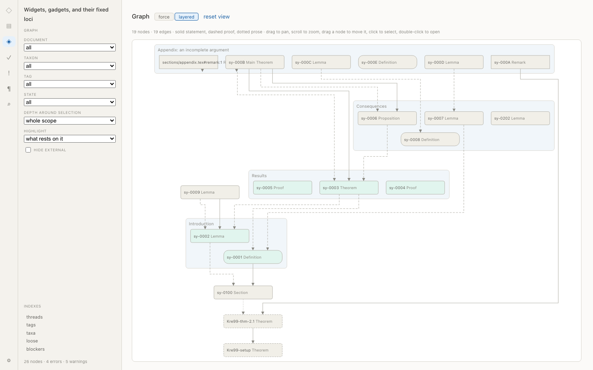
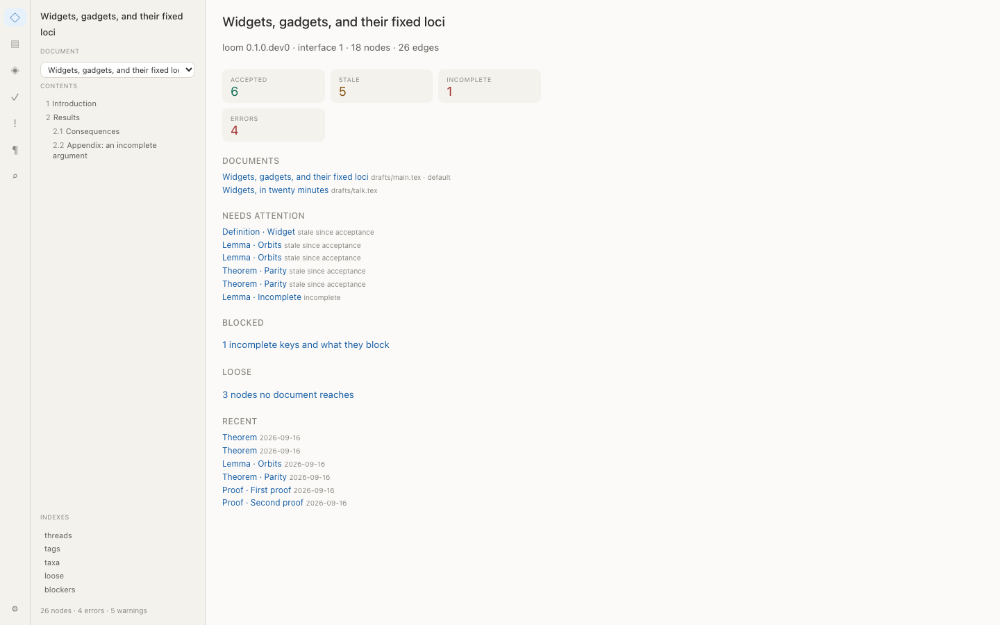

# 15. Arras layout and visual design

Chapter 10 says what arras shows. This chapter says what it looks like and how it is arranged: the three navigation shells, the regions every page has, what each rail holds per view, the graph's two layouts and its toggle, the token and typography rules, and the reference figures. It is arras's own design document and is not part of the loom–arras interface: nothing here changes what loom publishes, and a change here needs no manifest change. Chapter 10 remains authoritative on which pages exist and what data they show.

Markers as elsewhere. The chapter was written before the viewer was built and its numbers were **[assumed]**; they are now what the viewer ships, and the few places where building it changed a number say so. Where a figure and a number disagree, the figure is a screenshot of what exists and the number has been corrected to match.

## 15.1 Principles

**[decided]**

1. One persistent left rail, always present, always in the same place. The user never hunts for navigation.
2. A right rail appears only where there is context to show: node pages, the read view when a reached node carries comments, the review panel's explanations, the graph's inspector. It is absent elsewhere, and its absence is not a gap.
3. The shell renders no page content; the page renders no navigation. A page that reaches into the shell is a bug.
4. Nothing in arras writes to the quilt. Every control is navigation, filtering, or display.
5. Density is comfortable only. **[decided]** No compact mode in the MVP.
6. Below 900px the layout is undefined. **[decided]** Mobile is deferred; the rule is that shells collapse to no rail with a disclosure control, and nothing else is specified.

## 15.2 The three shells

**[decided]** Three navigation shells are built and shipped together as an experiment; the user picks one. They differ only in arrangement: every shell contains the same elements (quilt name, view switcher, document picker, contents, search) and no shell contains anything another lacks. The default is C.

**[decided]** The choice is a per-viewer preference stored in arras's own settings (browser `localStorage`), never in the quilt, plus a `?shell=` URL parameter so two shells can be compared by sending a link. Preferences are arras's: shell, typography, theme.

**[decided]** Deletion rule: if after a few weeks of real use nobody switches away from the default, two shells are deleted. The rule exists so that the experiment ends.

### 15.2.1 Shell A: rail sections



**[decided]** A 267px rail, `--leaf`, hairline right border, holding stacked sections separated by 10px and small-caps 9px muted labels: the corpus label (13px, no label) with the settings control beside it; `VIEW` (the six views as 13px rows with a 15px leading icon, the current one on `--link-wash` with `--link` text, and search below them); the page's own panel when it has registered one; `DOCUMENT` (a select, full rail width minus 2×14px); `CONTENTS` (the heading tree of the current document, indent 10px per level, the current section marked by a 2px `--link` bar on the left edge and `--ink` text); `INDEXES`; and the counts. No top bar.

### 15.2.2 Shell B: top bar and tabs



**[decided]** A 30px top bar, `--leaf`, hairline bottom border: the corpus label (12px) at the left; a breadcrumb beside it naming the current document; view tabs pushed right, the current one on `--link-wash`; a search affordance and the settings control at the far right. The rail below is 240px and holds the document picker, the page's panel when it has one, the contents tree, the indexes and the counts.

### 15.2.3 Shell C: icon strip and panel


**[decided]** A 44px icon strip, `--leaf`, holding six 19px view icons at a 38px vertical pitch, the current one on a 32×26px `--link-wash` with `--rad-control`, search below them and the settings control at the foot; every icon has an `aria-label` and a tooltip. The strip carries no separate home mark: home is one of the six views, and a second control going to the same place is a puzzle rather than a shortcut. The settings panel opens upward from that control, because a panel hung below the foot of a full-height column opens past the bottom of the window; its rows never wrap, so the widest of them sets its width and a longer option widens the panel instead of folding under it. Beside the strip a 252px panel: the page's own panel when it has registered one, otherwise the document picker above the contents tree in the views that are about a document and the view list elsewhere, with the indexes and the counts below. Default shell.

## 15.3 Page anatomy

**[decided]** Every page is: an optional header block (title, id, badges, tags), the content region, and an optional right rail. Pages never draw their own navigation, never place a title in the shell, and never assume a shell.

**[decided]** Right rail width `--rail-right`, hairline left border, 12px padding, sections labelled like the left rail's. The width was 159px in design and is 236px as built: a comment card at 159px wrapped its author onto four lines and clipped its status, and a rail that cannot hold a comment is not a rail for comments. A section with nothing in it says "nothing" rather than leaving a heading over blank space.

**[decided]** A page fills the shell's regions through two registries, one for the right rail and one for the left panel, rather than by drawing a rail of its own. That is what lets a table page put its filters where a document's contents otherwise sit (15.4) while the rule of 15.1 — the page renders no navigation — still holds.

### 15.3.1 Read view (a master)



**[decided]** The document rendered as a document, in a measured column with a gutter either side. The geometry is the site generator's own, so that a corpus page and a note page are laid out alike: the gutters are `(available − measure)/3` each and the text column absorbs the third they give up, one knob being the `/3`. Prose in the body typeface at 11–16px depending on the user's type setting, `line-height: 1.7`; the width setting is 36, 44 or 52rem, the middle being the site generator's own measure.

**[decided]** The left gutter holds each node's margin annotation: the id in mono accent and the state word beneath it in the state colour at 9px, right-aligned, ending exactly at the environment's per-taxon accent rule, which is the boundary between the gutter and the text. Environments follow sitegen's `environments.css` convention — a left-border accent, no filled background — and that border is the rule; the node's text is indented past it. Numbers come from the manifest and appear in the statement's label ("Lemma 3.4."). Proofs render collapsed with a disclosure marker, matching sitegen's `details.env-proof` treatment: no box, a left rule, a ▸/▾ marker.

**[decided]** The gutter is a container-relative length rather than a percentage, since the margin annotation and the gutter comments are positioned against a node and a percentage would resolve against that node instead of the page. Below 1100px there are no gutters, and everything that stands in one rejoins the flow (DR-98).

**[decided]** A node's comments stand in the right gutter beside it, each aligned with the node it is about; the read view uses no shell rail for them. A comment whose rendered text and replies run past 220 characters stays in the text instead, as a box below the node, because a paragraph squeezed into a gutter is unreadable and a reader who must hunt for the rest of a sentence would rather have it in the flow (DR-98).

### 15.3.2 Node page



**[decided]** Header: title and number, id (mono, 9px), state badge (a 14px pill, tinted background, state-coloured text, 9px), tags (muted). A title that carries mathematics is typeset (DR-96). A key with no page of its own — an unlabelled proof, a file container a diagnostic names — is not linked; where the key belongs to a node, the page points at that node instead of reporting an unknown key (DR-94). Body: statement; then each proof as its own block with its own state line, in manifest order, the detailed proof (reached by another master) included and labelled with the master that reaches it; marks rendered inline on `--mark`. Left panel in shell C shows an on-this-page list. Right rail sections in this order: in `<master>` (the inclusion breadcrumb, one per master that reaches it), depends on, used by, see also, comments (objection cards on the `--state-incomplete` wash, others on `--sheet`), detached comments, diagnostics.

### 15.3.3 Graph





See 15.5.

### 15.3.4 Home



**[decided]** Four metric cards (48px tall, `--leaf`, `--rad-control`, 9px muted label, 18px value in the state colour) — accepted, stale, incomplete, errors — then the documents, what needs attention, what is blocked, what is loose, and what is recent. Every line links. This is the landing route.

### 15.3.5 Review panel, problems, blockers, threads, indexes

**[decided]** Table-shaped pages: a header with counts and an explanatory sentence, filter controls in the left panel through the registry of 15.3, rows with state badge, id, taxon, title, cause, counts. A row expands in place to show the stale cause and its diff, as a two-column diff with the accepted text tinted by `--state-incomplete-wash` on the left and the current text by `--state-accepted-wash` on the right. There is no right rail; the expansion is in the table. Beside the title of the review, problems and blockers pages is a question mark that defines each state and names the command that records it.

**[decided]** The workbench layout (a node list, node body, and context pane as one screen) explored in design is dropped; the review panel plus the node page cover it.

## 15.4 Rails by view

**[decided]** As built. A page with nothing for a region registers nothing and the region is absent; a page that registers a left panel displaces the contents tree, which is where a table page's filters go.

| view | left (shell C panel; A and B equivalents) | right |
|---|---|---|
| home | document picker, contents tree | none |
| read | document picker, contents tree | none; comments stand in the page's own right gutter |
| node | document picker, contents tree | in `<document>`, depends on, used by, see also, discussions, detached comments, diagnostics |
| graph | layout, document, taxon, tag, state, depth, highlight | the selection and what rests on it |
| review | show, document, author, tag, and the count | none; a row expands in place |
| problems | severity and code filters | none |
| references | the indexes | none |
| search | the command palette's own list | none |

## 15.5 The graph

**[decided]** One graph page with two layouts and a toggle; the toggle preserves the selection, the filters, and the scope, and animates node positions between the two so it reads as one view rather than two pages.

**[decided]** Force is the default, in the spirit of org-roam-ui: a force-directed neighbourhood with circular nodes, labels beneath, node radius larger for the selection, and no direction encoded. It answers what sits near what.

**[decided]** Layered is the alternative: dependency direction on the vertical axis, upstream above, nodes as rounded rectangles in layers by longest path, edges as curves. It answers what this rests on and what breaks if it changes.

**[decided]** Shared by both: colour encodes state (15.6); statement edges solid, proof edges dashed, prose edges dotted; `see` relations are not drawn at all in this version, since the toggle that would draw them is deferred (plan 0.2 §2.4); inclusion is not drawn as edges (grouping only, in layered); external nodes drawn with a dashed border; scope controls are master, local depth around the selection (default 2, 0 meaning the whole scope), and filters by taxon, tag, and state; clicking selects and fills the inspector; double-clicking opens the node page.

**[decided]** Force is `d3-force`, stepped to completion rather than animated and seeded from the previous drawing so a filter change moves nodes rather than reshuffling them; layered is `elkjs` (DR-93). **[decided]** There is no node count at which the page scopes itself: the useful scope depends on the question, so the scope is chosen by selecting a node and a depth.

## 15.6 Tokens and vocabulary

**[decided]** Arras defines its own token vocabulary. It does not adopt the names used in these design documents or in any other product's design system: borrowing names would imply a shared system that does not exist, and arras's vocabulary should describe what it renders, which is a page of mathematics rather than application chrome. The names below are drawn from print. Every colour, measure, and typeface is a variable; no component hardcodes a value.

**[decided]** Padding and borders count inside a declared size, everywhere. A rail is `height: 100vh` with padding, and without this it is that much taller than the window, which puts the settings control and the counts line below the fold (DR-99).

**[decided]** Visual character: a warm off-white page, hairline rules rather than borders, generous line height, no shadows, no filled chrome, colour used only to carry meaning. Claude's web interface is a reasonable reference for that character; nothing is copied from it.

**[decided]** The vocabulary, with the light-mode values the viewer ships:

| token | value | use |
|---|---|---|
| `--paper` | `#fbfaf8` | the page |
| `--leaf` | `#f4f2ed` | rails, panels, metric cards |
| `--sheet` | `#ffffff` | content cards, raised surfaces |
| `--rule` | `#d8d5cd` | hairlines, 0.5–1px |
| `--rule-strong` | `#b4b2a9` | emphasised dividers, graph edges |
| `--ink` | `#2c2c2a` | body text |
| `--ink-soft` | `#5f5e5a` | supporting text |
| `--ink-faint` | `#888780` | rail labels, ids in lists, captions |
| `--link` | `#185fa5` | links, ids, the current item |
| `--link-wash` | `#e6f1fb` | the tint behind a current or selected item |
| `--mark` | `#faeeda` | annotation highlight behind marked text |
| `--gap-hair` `--gap-tight` `--gap` `--gap-wide` | 4, 8, 12, 20px | spacing scale |
| `--rad-pill` `--rad-control` `--rad-card` | 4, 8, 12px | radii |
| `--rail-left` `--rail-right` `--strip` | 252, 236, 44px | the fixed widths of 15.2 |
| `--rail-a` `--rail-b` `--topbar` | 267, 240, 30px | shell A's rail, shell B's rail, shell B's bar |
| `--gutter` | `(100cqw − --measure) / 3` | the read view's gutters, on the site generator's algebra |
| `--env-accent` | 3px | the per-taxon rule, and the boundary the left gutter ends at |
| `--measure` | 36rem, 44rem, 52rem by setting | body line width; the middle is the site generator's |

**[decided]** State tokens are a second group, named for the state rather than for a role, because arras's states are loom's and not a generic severity scale:

| token | text | wash | use |
|---|---|---|---|
| `--state-accepted` | `#0f6e56` | `#e1f5ee` | accepted; settled uses the same pair with a filled dot and 500 weight |
| `--state-stale` | `#854f0b` | `#faeeda` | the modifier on accepted; the badge reads "accepted, stale" |
| `--state-draft` | `#5f5e5a` | `#f1efe8` | neutral, not a warning |
| `--state-incomplete` | `#a32d2d` | `#fcebeb` | overrides everything |
| `--state-loose` | `#888780` | none | a mark, not a badge |

**[decided]** The manifest declares state labels with colour classes (`neutral`, `positive`, `positive-strong`, `warning`, `negative`, `info`; specs/manifest.md §8). Arras maps those classes onto the state tokens above in one file, so a publisher that declares states arras has never heard of still renders: `positive` to accepted, `warning` to stale, `negative` to incomplete, `neutral` to draft, `info` to loose, anything unknown to `--ink-soft` with no wash. The mapping is the only place the interface's vocabulary and arras's meet.

**[decided]** Dark values are the same vocabulary a second time in the same file: `--paper: #17171a`, inks inverted, and every state wash expressed as a low-alpha overlay of its state colour rather than a second hand-picked hue. The block is declared under both `@media (prefers-color-scheme: dark) :root:not([data-theme='light'])` and `:root[data-theme='dark']`, so the system setting and an explicit choice share one definition (DR-90).

## 15.7 Typography

**[decided]** Serif by default for mathematical content: statements, proofs, prose, digests. Sans for chrome: rails, badges, labels, tables, buttons. Mono for ids.

**[decided]** The serif is the stack the author's site generator uses, copied from that project's `tokens.css` so that a corpus page and a note page read as the same publication: `'Palatino Linotype', Palatino, 'Book Antiqua', Georgia, serif` (DR-90). Chrome is Inter and ids are the existing monospace stack.

**[decided]** A settings control, in arras's own settings and written to arras's preferences, offers: body typeface (serif or sans), body size (three steps), line width (three steps), and theme (light, dark, system). Nothing else is user-adjustable in the MVP.

**[decided]** Type scale: page title 15px/500, section heading 13px/500, body 11–16px by the size setting with `line-height: 1.7`, rail labels 9px uppercase muted with 0.04em tracking, rail items 10–13px, ids 9px mono, badges 9px. Sentence case everywhere. Two weights, 400 and 500.

## 15.8 Component contracts

**[decided]** The shells are one component tree with three arrangements:

```
NavShell({ label, views, currentView, masters, currentMaster, contents,
           currentSection, counts, search, rail, panel, panelLabel })
  renders one of RailSections | TopBarTabs | IconStrip
  renders the page, the page's right rail, and the page's left panel
```

Rules: pages receive no shell props and import no shell module; a page that needs a right rail or a left panel registers one, and the shell places it; a page's title lives in the page, never in the shell; the three arrangements differ only in placement, never in what they contain. Adding an element to one shell means adding it to all three or to none. Every rail is a scroll container, and that belongs to the shell rather than to any page's stylesheet, so no view can regress it. A rail's scrollbar is `thin` with a transparent thumb until the pointer or the keyboard is in the rail, so a contents tree of 74 entries does not carry a grey stripe down the side of every page; the space it needs is reserved either way, so nothing shifts when it appears (DR-99).

**[decided]** Shared components as built: `Badge(parts, facts)` and `IdChip(id, aliases)` for the header line; `RailList(label, empty)` for every section of the right rail; `DiffView(path)` for the two-column diff of 15.3.5; `HelpDot(label, topic)` for the question mark of 15.3.5; `Contents`, `DocumentPicker` and `Settings` shared by the three shells; `PageRail` and `PagePanel`, the two registries; `Tex(text)`, which typesets a title that carries mathematics, since a title keeps its `$…$` rather than losing it (DR-96).

## 15.9 Reference figures and their status

**[decided]** The schematic drawings this chapter was designed against have been superseded, as they said they would be. The figures are now screenshots of the viewer rendering the conformance fixture, generated by `npm run shots` in `arras/` and committed: `page-home.png`, `page-read-master.png`, `page-node.png`, `page-node-dark.png`, `page-review.png`, `page-problems.png`, `page-graph-force.png`, `page-graph-layered.png`, and one page in each shell as `shell-a-rail-sections.png`, `shell-b-topbar-tabs.png`, `shell-c-icon-strip.png`. They are regenerated on any change to the chrome, and the release checklist carries "screenshots regenerated".

The original `.svg` drawings remain beside them for the record of what was intended. Where a screenshot and this chapter's numbers disagree, the screenshot is what exists and the chapter is corrected.

## 15.10 Accessibility

**[decided]** Every icon-only control carries an `aria-label`; the icon strip is a `nav` with a list; marks are `mark` elements with `aria-describedby` pointing at their comment; the contents tree is a `nav` with `aria-current` on the current section; focus order runs shell then page then right rail; the graph canvas is preceded by a visually hidden summary and is not the only route to any information. Contrast: every state text colour on its tint meets AA at 11px.

## Open questions

- The serif stack. **[decided]**, DR-90: the site generator's own stack.
- Whether the read view's right rail should push the text column or overlay it when comments appear. **[decided]** Push: the rail is a column of the shell's grid, so the text never moves under the cursor while reading.
- Whether shell B's breadcrumb should be the document picker on node pages too. **[decided]** No: the breadcrumb names the current document and the picker lives in the rail, in every view.
- Dark-mode values. **[decided]**, DR-90: derived from the light set in one file.
- Whether the graph inspector and the node page's right rail should be the same component. **[decided]** They share `RailList` and nothing else. The two hold different things — one a selection, the other a node's whole context — and a component that served both would be a switch with two branches.
