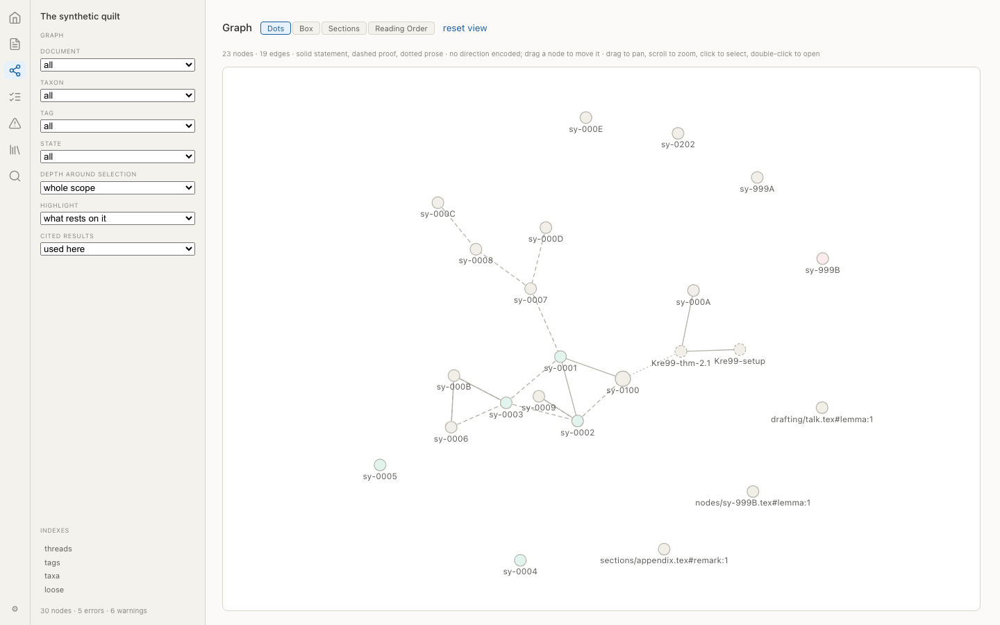
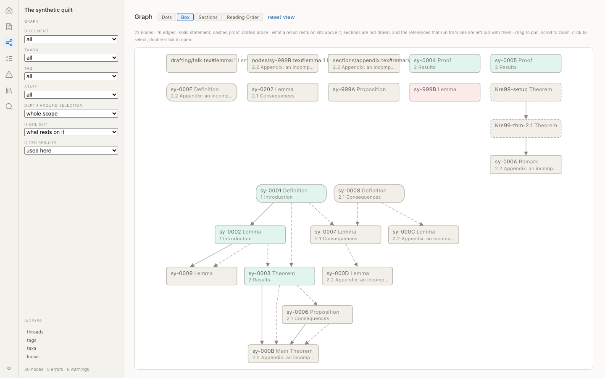
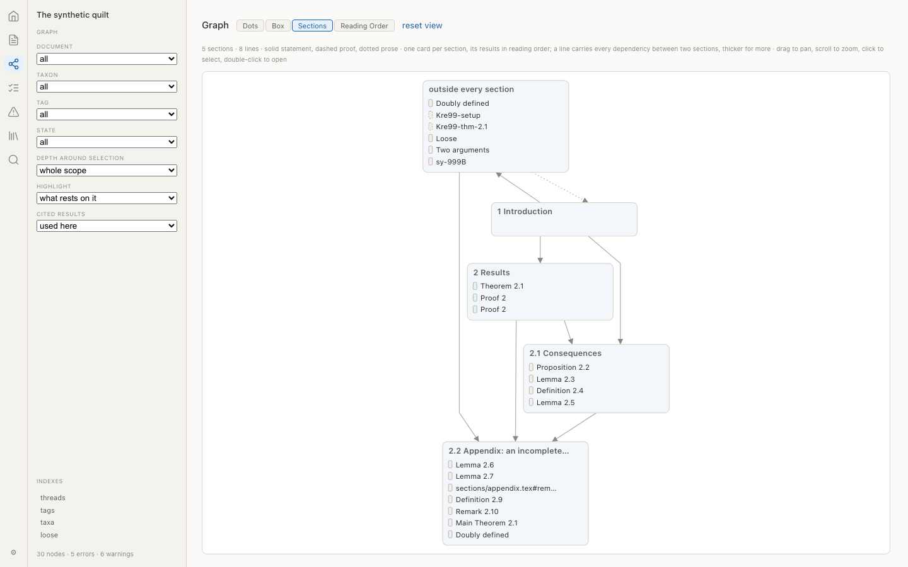
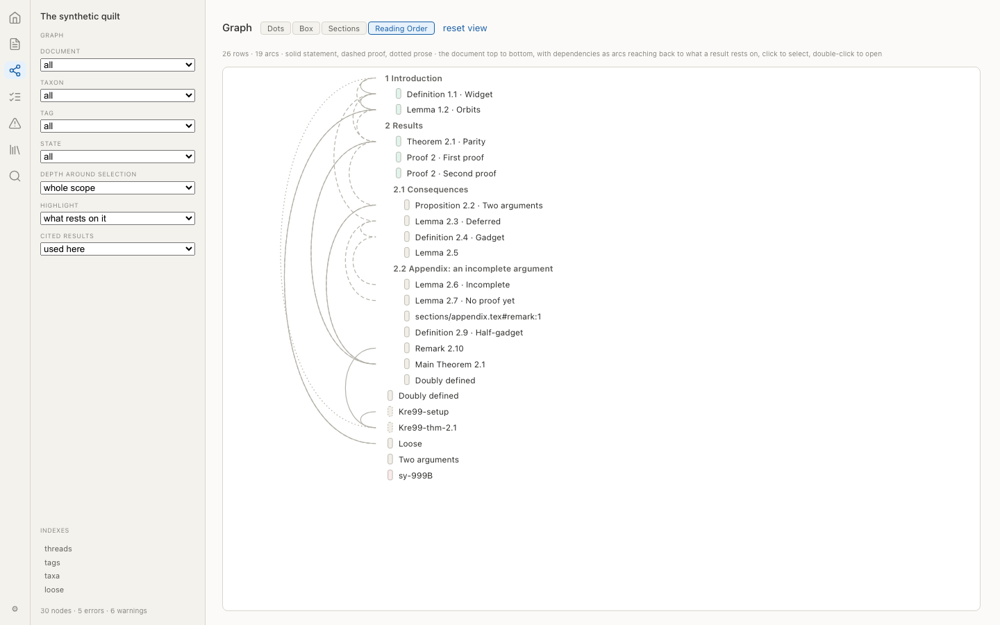

# 15. Arras layout and visual design

Chapter 10 says what arras shows. This chapter says what it looks like and how it is arranged: the two navigation shells, the regions every page has, what each rail holds per view, the graph's two layouts and its toggle, the local graph, the token and typography rules, and the reference figures. It is arras's own design document and is not part of the loom–arras interface: nothing here changes what loom publishes, and a change here needs no manifest change. Chapter 10 remains authoritative on which pages exist and what data they show.

Markers as elsewhere. The chapter was written before the viewer was built and its numbers were provisional; they are now what the viewer ships, and the few places where building it changed a number say so. Where a figure and a number disagree, the figure is a screenshot of what exists and the number has been corrected to match.

## 15.1 Principles

**[decided]**

1. One persistent left rail, always present, always in the same place. The user never hunts for navigation.
2. A right rail appears only where there is context to show: node pages and the graph's inspector. It is absent elsewhere, and its absence is not a gap.
3. The shell renders no page content; the page renders no navigation. A page that reaches into the shell is a bug.
4. Nothing in arras writes to the quilt. Every control is navigation, filtering, or display.
5. Density is comfortable only. **[decided]** No compact mode in the MVP.
6. Below 900px the layout is undefined. **[decided]** Mobile is deferred; the rule is that shells collapse to no rail with a disclosure control, and nothing else is specified.

## 15.2 The two shells

**[decided]** Two navigation shells are built and shipped together; the user picks one. They differ only in arrangement: every shell contains the same elements (the corpus's name, view switcher, document picker, contents, search) and no shell contains anything another lacks. The default is C. The document picker offers both kinds of document in two headed groups — Canon, newest first; then Working Drafts — and the name at the top of the shell is `corpus.name`, the project's own name rather than the default document's title.

**[decided]** The choice is a per-viewer preference stored in arras's own settings (browser `localStorage`), never in the quilt, plus a `?shell=` URL parameter so two shells can be compared by sending a link. Preferences are arras's: shell, typography, theme.

**[decided]** Deletion rule: if after a few weeks of real use nobody switches away from the default, the other shell is deleted. The rule exists so that the experiment ends; it has already retired one of the three shells first built (DR-113).

### 15.2.1 Shell A: rail sections


**[decided]** A 267px rail, `--leaf`, hairline right border, holding stacked sections separated by 10px and small-caps 9px muted labels: the corpus label (13px, no label) with the settings control beside it; `VIEW` (the six views as 13px rows with a 15px leading icon, the current one on `--link-wash` with `--link` text, and search below them); the page's own panel when it has registered one; `DOCUMENT` (a select, full rail width minus 2×14px); `CONTENTS` (the heading tree of the current document, indent 10px per level, the current section marked by a 2px `--link` bar on the left edge and `--ink` text, always showing and following the reader's scroll rather than the URL fragment (DR-112)); `INDEXES`; and the counts. No top bar.

### 15.2.2 Retired

Shell B, a top bar with view tabs, was retired (DR-113). The number is kept so that references to 15.2.3 still resolve; a stored or linked choice of it opens the default.

### 15.2.3 Shell C: icon strip and panel


**[decided]** A 44px icon strip, `--leaf`, holding six 19px view icons at a 38px vertical pitch, each drawn as a stroked path on a 24-unit grid at a single stroke width rather than set as a unicode character — a glyph renders at whatever weight and baseline a font decides, so a column of them sits unevenly and reads as punctuation (DR-112) — the current one on a 32×26px `--link-wash` with `--rad-control`, search below them and the settings control at the foot; every icon has an `aria-label` and a tooltip. The strip carries no separate home mark: home is one of the six views, and a second control going to the same place is a puzzle rather than a shortcut. The settings panel opens upward from that control, because a panel hung below the foot of a full-height column opens past the bottom of the window; its rows never wrap, so the widest of them sets its width and a longer option widens the panel instead of folding under it. It is sized by its content and not by the control it hangs off, which here is 44px wide and would otherwise clip the last option in a row, and it closes on a press outside it or on Escape, as every floating box does (DR-121). Beside the strip a 252px panel: the page's own panel when it has registered one, otherwise the document picker above the contents tree, with the indexes and the counts below. The panel never lists the views: they are the strip beside it (DR-118). Default shell.

## 15.3 Page anatomy

**[decided]** Every page is: an optional header block (title, id, badges, tags), the content region, and an optional right rail. Pages never draw their own navigation, never place a title in the shell, and never assume a shell.

**[decided]** Right rail width `--rail-right`, hairline left border, 12px padding, sections labelled like the left rail's. The width was 159px in design and is 236px as built: a comment card at 159px wrapped its author onto four lines and clipped its status, and a rail that cannot hold a comment is not a rail for comments. A section with nothing in it says "nothing" rather than leaving a heading over blank space.

**[decided]** A page fills the shell's regions through two registries, one for the right rail and one for the left panel, rather than by drawing a rail of its own. That is what lets a table page put its filters where a document's contents otherwise sit (15.4) while the rule of 15.1 — the page renders no navigation — still holds.

### 15.3.1 Read view (a live document, or a landmark)


**[decided]** The document rendered as a document, in a measured column with a gutter either side. Two kinds of document are read here and the page is the same shape for both: a live document at `/master/<stem>`, with everything below, and a landmark at `/canon/<stem>`, with none of it — no margins, no heading links, no comments, no local graph — because nothing in a landmark is a node (10.2.2). A landmark's head line names the step that wrote it and its message; its theorems are typeset and go nowhere.

**[decided]** When the drafting directory holds no document, the read view, the graph and the review panel each show one bordered notice in place of their content: *Nothing is being worked on*, what is consequently absent, the newest landmark as a link, and a pointer to the problems page, where the publisher's diagnostic carries the command that starts a draft. The notice never names a command itself (10.8). The geometry is the site generator's own, so that a corpus page and a note page are laid out alike: the gutters are `(available − measure)/3` each and the text column absorbs the third they give up, one knob being the `/3`. Prose in the body typeface at 11–16px depending on the user's type setting, `line-height: 1.7`; the width setting is 36, 44 or 52rem, the middle being the site generator's own measure.

**[decided]** The left gutter holds each node's margin annotation: the id in mono accent and the state word beneath it in the state colour at 9px, right-aligned, ending exactly at the environment's per-taxon accent rule, which is the boundary between the gutter and the text. Environments follow sitegen's `environments.css` convention — a left-border accent, no filled background — and that border is the rule; the node's text is indented past it. Numbers come from the manifest and appear in the statement's label ("Lemma 3.4."). Proofs render collapsed with a disclosure marker, matching sitegen's `details.env-proof` treatment: no box, a left rule, a ▸/▾ marker.

**[decided]** A display block scrolls sideways when its formula is wider than the column, and never up and down: naming one axis of `overflow` makes a browser compute the other to `auto`, and the renderer's off-screen glyph cache and its hidden accessibility copy are then counted as content. The edge with content past it carries a shadow, so a reader is never left wondering why a block moves (DR-104).

**[decided]** The gutter is a container-relative length rather than a percentage, since the margin annotation and the gutter comments are positioned against a node and a percentage would resolve against that node instead of the page. Below 1100px there are no gutters, and everything that stands in one rejoins the flow (DR-98).

**[decided]** Where a node's comments stand is a display preference (15.7). In the margin, the default, they stand in the right gutter beside the node, each aligned with the node it is about; the read view uses no shell rail for them. A comment whose rendered text and replies run past 220 characters stays in the text instead, as a box below the node, because a paragraph squeezed into a gutter is unreadable and a reader who must hunt for the rest of a sentence would rather have it in the flow (DR-98). Inline, the gutter is empty: a mark on the text expands its comment, with its replies inside it, beneath the paragraph, item or display the mark sits in; one is open at a time, and a press outside it or Escape closes it. A comment with no mark — no quote, or an anchor that no longer resolves — is reached from a small count beside its node's label (DR-114).

**[decided]** A mark is coloured by the kind of its leading comment, in either placement: an objection on the incomplete wash with an incomplete underline, a suggestion on the stale pair, a question on `--link-wash` with a `--link` underline, a confirmation on the accepted pair. A mark covering a whole block carries the colour down its left edge instead (DR-114).

**[decided]** A round control at the window's lower right opens the local graph (15.5.1) as a 300px floating panel over the text; its centre is the result being read, and whether it is open is remembered in this browser (DR-116).

### 15.3.2 Node page


**[decided]** Header: title and number, id (mono, 9px), state badge (a 14px pill, tinted background, state-coloured text, 9px), tags (muted). A title that carries mathematics is typeset (DR-96). A key with no page of its own — an unlabelled proof, a file container a diagnostic names — is not linked; where the key belongs to a node, the page points at that node instead of reporting an unknown key (DR-94). Body: statement; then each proof as its own block with its own state line, in manifest order, the detailed proof (reached by another master) included and labelled with the master that reaches it; marks rendered inline on `--mark`. Left panel in shell C shows an on-this-page list. Right rail sections in this order: the local graph (15.5.1), in `<master>` (the inclusion breadcrumb, one per master that reaches it), depends on, used by, see also, comments (objection cards on the `--state-incomplete` wash, others on `--sheet`), detached comments, diagnostics.

### 15.3.3 Graph









See 15.5.

### 15.3.4 Home


**[decided]** Four metric cards (48px tall, `--leaf`, `--rad-control`, 9px muted label, 18px value in the state colour) — accepted, stale, incomplete, errors — then the documents, what needs attention, what is blocked, what is loose, and what is recent. Every line links. Each card opens the table of exactly what it counts: `/review?show=accepted`, `?show=stale`, `?show=incomplete`, and `/problems?severity=error` (DR-118). This is the landing route.

### 15.3.5 Review panel, problems, threads, indexes

**[decided]** Table-shaped pages: a header with counts and an explanatory sentence, filter controls in the left panel through the registry of 15.3, rows with state badge, id, taxon, title, cause, counts. Filters live in the URL, so a filtered table is a link, and each count in the header toggles its own filter. A column no row in the current table fills is not drawn. A row expands in place to show the stale cause and its diff, as a two-column diff with the accepted text tinted by `--state-incomplete-wash` on the left and the current text by `--state-accepted-wash` on the right. The review table's incomplete view, which is what `/blockers` opens, adds a column saying how many results each gap blocks, expanding in place to the list (DR-118). There is no right rail; the expansion is in the table. Beside the title of the review and problems pages is a question mark that defines each state and names the command that records it; its panel closes on a press outside it (DR-121).

**[decided]** The workbench layout (a node list, node body, and context pane as one screen) explored in design is dropped; the review panel plus the node page cover it.

### 15.3.6 Hover previews

**[decided]** Resting on a link to a node — a reference in the text, a rail list, a table row, a node in a graph — or to a cited work shows a card: for a node its label, number, id, state and statement, typeset, with proofs hidden and the text clamped at 12rem by a fade rather than cut; for a work its title, authors, outward links and digest. The card is `--sheet` with a hairline and one soft shadow, at most 26rem wide, placed below the link or above it when there is no room, and beside a graph drawing so that it never covers the drawing's controls. The timings are the author's site generator's: 300ms before showing, so crossing a paragraph of links does not flicker, and 200ms of grace to move into the card, which stays while the pointer is in it so its links work. Escape, a scroll, or a press elsewhere dismisses it; a device that cannot hover gets none. A section previews its title and state without its text, and a link to the page already open previews nothing (DR-117).

### 15.3.7 The PDF viewer

**[decided]** One dialog, mounted once by the layout, that anything linking into a cited work opens: a comment's `loom:` link (10.4.1), or a digest result's page in its locator. The paper is shown in the browser's own PDF renderer in an `iframe` at `/refs/<dir>/paper.pdf#page=N`, under a header with the work's title, its identifier and the page, a link to open the file in a tab, and a close control; it is 90% of the window, `--sheet` on a dimmed backdrop, and closes on a press outside it or Escape (DR-121). A `#quote=` anchor is shown above the paper as "look for …", since finding text needs a text layer the browser's renderer does not expose. When no copy of that artifact is on file, the dialog explains that fetched papers are not in version control and links to the identifier's own service; when a copy of a different version is, it says the pages may not match and offers to open it anyway (DR-123). Safari's handling of `#page=` is not verified; opening the file in a tab is the fallback.

**[decided]** The problems page carries two more things: a heading per **subject** — *The source* and *The record* — shown only when both are present, with a filter beside severity and code; and, under any diagnostic that carries them, its **fixes**, each the command as the publisher wrote it with a button that copies it. The button says `copy`, then `copied`; the command is always on screen, so a browser that refuses the clipboard costs nothing. Nothing in arras runs a command.

## 15.4 Rails by view

**[decided]** As built. A page with nothing for a region registers nothing and the region is absent; a page that registers a left panel displaces the contents tree, which is where a table page's filters go.

| view | left (shell C panel; A and B equivalents) | right |
|---|---|---|
| home | document picker, contents tree | none |
| read | document picker, contents tree | none; comments stand in the page's own right gutter or in the text, and the local graph floats when opened |
| node | document picker, contents tree | local graph, in `<document>`, depends on, used by, see also, discussions, detached comments, diagnostics |
| graph | drawing, document, taxon, tag, state, depth, highlight, cited results | the selection and what rests on it, or the selected paper and its links |
| review | show, document, author, tag, and the count | none; a row expands in place |
| threads, tags, taxa, loose | document picker, contents tree | none |
| problems | severity and code filters | none |
| references | document picker, contents tree | none |
| search | the command palette's own list | none |

## 15.5 The graph

**[decided]** One graph page with four drawings of the one filtered graph — **Dots**, **Box**, **Sections** and **Reading Order** — chosen by a control that keeps the selection, the filters and the scope, so moving between them is one view asked a different question rather than four pages (DR-129).

**[decided]** **Dots** is the default, in the spirit of org-roam-ui: a force-directed neighbourhood with circular nodes, labels beneath, node radius larger for the selection, and no direction encoded. It answers what sits near what.

**[decided]** **Box** draws the results in layers: dependency direction on the vertical axis, upstream above, rounded rectangles in layers by longest path, each box carrying its id, taxon and the section it sits in, edges from a dependency down to what uses it. Sections are not drawn, and the references that run from a section's prose are left out with them. Grouping the boxes by section, which this replaced, is what made the drawing sprawl: a group spanning several layers reserves the whole column and every edge leaving it is routed around the rest, which on `demos/acgs` — 71 results inside 74 sections — filled a canvas a screen could only show at an unreadable zoom (DR-129). It answers what this rests on and what breaks if it changes.

**[decided]** **Sections** is the same graph seen a section at a time: one card per section holding its results in reading order, a line between two cards for every dependency between them, thicker for more, and prose references drawn dotted. A section that holds nothing drawn belongs to the nearest section above it that does, so a reference to a section is a reference to the card it is drawn as; cited works drawn as papers, and results outside every section, get a card of their own. Hovering a result lights the lines it is in; clicking one selects it, and clicking a card selects the section. It answers which parts of the paper lean on which (DR-129).

**[decided]** **Reading Order** is not laid out at all: the document top to bottom, sections and results as rows in the order the master reaches them, and every dependency an arc in the left margin, bulging with the distance it reaches. Hovering or selecting a row tints it and lights its arcs. Nothing can sprawl and every label is at full size, at the cost of showing no depth. What is not in play fades only halfway, since a row of text is unreadable at the dimming a shape tolerates (DR-129).

**[decided]** Shared by all four: colour encodes state (15.6); statement edges solid, proof edges dashed, prose edges dotted; `see` relations are not drawn at all in this version, since the toggle that would draw them is deferred (plan 0.2 §2.4); inclusion is not drawn as edges; external nodes drawn with a dashed border; scope controls are master, local depth around the selection (0 meaning the whole scope, counted in the quilt's dependency graph), and filters by taxon, tag, and state; clicking selects and fills the inspector; double-clicking opens the node page. Dragging the background pans and the wheel zooms about the pointer in the three laid-out drawings; Reading Order scrolls like the document it follows. Dragging a node moves it in Dots only: a laid-out drawing's positions are its meaning, so a drag there pans. The shapes drawn are those of the drawing that has arrived, so choosing Box or Sections keeps the previous drawing until ELK answers (DR-115, DR-129).

**[decided]** Dots is `d3-force`, stepped to completion rather than animated and seeded from the previous drawing so a filter change moves nodes rather than reshuffling them; Box and Sections are `elkjs` (DR-93); Reading Order is arithmetic on the manifest's inclusion tree. **[decided]** There is no node count at which the page scopes itself: the useful scope depends on the question, so the scope is chosen by selecting a node and a depth.

### 15.5.1 The local graph

**[decided]** One node's neighbourhood, drawn as **Dot** or as **Box** — the graph page's two laid-out drawings at neighbourhood scale, chosen in the panel's own bar, which reads `Local Graph`, then the depth, then the drawing, then expand and close (DR-129). The nodes are those one or two dependency steps out in either direction (a two-button control, default one), with `see` relations drawn dotted but never followed, and a proof drawn as its statement. `d3-force` runs animated here, with the centre pinned in the middle, so when the centre changes the nodes that stay keep their places and only arrivals move, each starting beside a neighbour already placed. A node's radius grows with its degree and its fill is its state's tone; the centre is `--link`; an external node is hollow with a dashed rim. Hovering a node dims everything but it and its neighbours and labels them; otherwise only the centre is labelled, until the reader zooms in. Each node is a link, so a click opens it — a result the document being read holds is a jump within it — and a rest previews it (15.3.6). The drawing fits itself to its box, enlarging at most 1.6 times, until the reader zooms or pans. It heads a node page's right rail at 200px tall, and floats over the read view at 300px wide when opened, centred on the last statement or proof whose top has passed a third of the way down the window, so prose between two results keeps the one above and the centre does not flicker. Either expands to a dialog of 80% of the window, labelling every node, that closes on a press outside it or Escape (DR-116, DR-121). It is SVG rather than Quartz's PixiJS, since a neighbourhood is tens of nodes and a renderer would be weight in every install. Box lays the same neighbourhood out in layers with ELK and no section groups, since a neighbourhood crosses sections and a handful of boxes reads without them; the expanded dialog is moved to the end of the document so that no panel it was declared inside can cover it (DR-129).

### 15.5.2 The work graph

**[decided]** "Cited results: as papers" draws the corpus's own results as they are and every cited work as one node: the quotient of the result graph by source, taken over external nodes only. An edge runs from an own result to a paper when the result depends on any of the paper's digested results, or cites the paper at all (dash-dot), and between two papers when a result in one digest depends on a result in another; an edge standing for several results is drawn thicker, by their count's logarithm. A work cited but never digested appears too, which the expanded graph cannot show. A paper is a square box on `--leaf` with a darker rim in Dots, a box labelled "paper" and its title in Box, and a card of its own in Sections; selecting one fills the inspector with the work, its links and how many results here use it, and double-clicking opens its reference page. The manifest carries everything needed, since a node's source is its `digest`. Contracting the corpus's own results as well would leave one node and a star for a single corpus, so it waits for a corpus spanning several quilts (DR-124).

## 15.6 Tokens and vocabulary

**[decided]** Arras defines its own token vocabulary. It does not adopt the names used in these design documents or in any other product's design system: borrowing names would imply a shared system that does not exist, and arras's vocabulary should describe what it renders, which is a page of mathematics rather than application chrome. The names below are drawn from print. Every colour, measure, and typeface is a variable; no component hardcodes a value.

**[decided]** Padding and borders count inside a declared size, everywhere. A rail is `height: 100vh` with padding, and without this it is that much taller than the window, which puts the settings control and the counts line below the fold (DR-99).

**[decided]** Visual character: a warm off-white page, hairline rules rather than borders, generous line height, no shadows, no filled chrome, colour used only to carry meaning. Claude's web interface is a reasonable reference for that character; nothing is copied from it.

**[decided]** The vocabulary, with the light-mode values the viewer ships:

| token | value | use |
|---|---|---|
| `--paper` | `#fbfaf8` | the page |
| `--leaf` | `#f4f2ed` | rails, panels, metric cards |
| `--sheet` | `#ffffff` | content cards, raised surfaces |
| `--rule` | `#d8d5cd` | hairlines, 0.5–1px |
| `--rule-strong` | `#b4b2a9` | emphasised dividers, graph edges |
| `--ink` | `#2c2c2a` | body text |
| `--ink-soft` | `#5f5e5a` | supporting text |
| `--ink-faint` | `#888780` | rail labels, ids in lists, captions |
| `--link` | `#185fa5` | links, ids, the current item |
| `--link-wash` | `#e6f1fb` | the tint behind a current or selected item |
| `--mark` | `#faeeda` | annotation highlight behind marked text |
| `--gap-hair` `--gap-tight` `--gap` `--gap-wide` | 4, 8, 12, 20px | spacing scale |
| `--rad-pill` `--rad-control` `--rad-card` | 4, 8, 12px | radii |
| `--rail-left` `--rail-right` `--strip` | 252, 236, 44px | the fixed widths of 15.2 |
| `--rail-a` | 267px | shell A's rail |
| `--gutter` | `(100cqw − --measure) / 3` | the read view's gutters, on the site generator's algebra |
| `--env-accent` | 3px | the per-taxon rule, and the boundary the left gutter ends at |
| `--measure` | 36rem, 44rem, 52rem by setting | body line width; the middle is the site generator's |

**[decided]** State tokens are a second group, named for the state rather than for a role, because arras's states are loom's and not a generic severity scale:

| token | text | wash | use |
|---|---|---|---|
| `--state-accepted` | `#0f6e56` | `#e1f5ee` | accepted; settled uses the same pair with a filled dot and 500 weight |
| `--state-stale` | `#854f0b` | `#faeeda` | the modifier on accepted; the badge reads "accepted, stale" |
| `--state-draft` | `#5f5e5a` | `#f1efe8` | neutral, not a warning |
| `--state-incomplete` | `#a32d2d` | `#fcebeb` | overrides everything |
| `--state-loose` | `#888780` | none | a mark, not a badge |

**[decided]** The manifest declares state labels with colour classes (`neutral`, `positive`, `positive-strong`, `warning`, `negative`, `info`; specs/manifest.md §8). Arras maps those classes onto the state tokens above in one file, so a publisher that declares states arras has never heard of still renders: `positive` to accepted, `warning` to stale, `negative` to incomplete, `neutral` to draft, `info` to loose, anything unknown to `--ink-soft` with no wash. The mapping is the only place the interface's vocabulary and arras's meet.

**[decided]** Dark values are the same vocabulary a second time in the same file: `--paper: #17171a`, inks inverted, and every state wash expressed as a low-alpha overlay of its state colour rather than a second hand-picked hue. The block is declared under both `@media (prefers-color-scheme: dark) :root:not([data-theme='light'])` and `:root[data-theme='dark']`, so the system setting and an explicit choice share one definition (DR-90).

**[decided]** The token vocabulary is a contract, not a private stylesheet. The custom properties this chapter names, and the class names the components emit, are what a host restyles a corpus with; they are documented here for that purpose and are not renamed without a decision record. A host that wants a different look writes ordinary CSS against them (10.8.1).

## 15.7 Typography

**[decided]** Serif by default for mathematical content: statements, proofs, prose, digests. Sans for chrome: rails, badges, labels, tables, buttons. Mono for ids.

**[decided]** The serif is the stack the author's site generator uses, copied from that project's `tokens.css` so that a corpus page and a note page read as the same publication: `'Palatino Linotype', Palatino, 'Book Antiqua', Georgia, serif` (DR-90). Chrome is Inter and ids are the existing monospace stack.

**[decided]** A settings control, in arras's own settings and written to arras's preferences, offers: the shell (15.2), body typeface (serif or sans), body size (three steps), line width (three steps), theme (light, dark, system), and where comments stand (margin or inline, 15.3.1). Nothing else is user-adjustable in the MVP. Each is one row of the panel, its label and its options on a single line — `Shell  [rail] [strip]` — with the labels in a column of fixed width so that every row's options begin at the same place.

**[decided]** Type scale: page title 15px/500, section heading 13px/500, body 11–16px by the size setting with `line-height: 1.7`, rail labels 9px uppercase muted with 0.04em tracking, rail items 10–13px, ids 9px mono, badges 9px. Sentence case everywhere. Two weights, 400 and 500.

## 15.8 Component contracts

**[decided]** The shells are one component tree with two arrangements:

```
NavShell({ label, views, currentView, masters, currentMaster, contents,
           currentSection, counts, search, rail, panel, panelLabel })
  renders one of RailSections | IconStrip
  renders the page, the page's right rail, and the page's left panel
```

Rules: pages receive no shell props and import no shell module; a page that needs a right rail or a left panel registers one, and the shell places it; a page's title lives in the page, never in the shell; the two arrangements differ only in placement, never in what they contain. Adding an element to one shell means adding it to both or to neither. Every rail is a scroll container, and that belongs to the shell rather than to any page's stylesheet, so no view can regress it. A rail's scrollbar is `thin` with a transparent thumb until the pointer or the keyboard is in the rail, so a contents tree of 74 entries does not carry a grey stripe down the side of every page; the space it needs is reserved either way, so nothing shifts when it appears (DR-99).

**[decided]** Shared components as built: `Badge(parts, facts)` and `IdChip(id, aliases)` for the header line; `RailList(label, empty)` for every section of the right rail; `DiffView(path)` for the two-column diff of 15.3.5; `HelpDot(label, topic)` for the question mark of 15.3.5; `Contents`, `DocumentPicker` and `Settings` shared by both shells; `PageRail` and `PagePanel`, the two registries; `Tex(text)`, which typesets a title that carries mathematics, since a title keeps its `$…$` rather than losing it (DR-96); `WorkLinks(ref)` for a work's outward links (DR-119); `LinkPreview`, mounted once by the layout (15.3.6); `LocalGraph(center, depth, height)` and `LocalGraphPanel` around it (15.5.1); the `dismiss` action every floating box closes through (DR-121); `PdfViewer` and `Locator(ref, locator)` for 15.3.7.

## 15.9 Reference figures and their status

**[decided]** The schematic drawings this chapter was designed against have been superseded, as they said they would be. The figures are now screenshots of the viewer rendering the conformance fixture, generated by `npm run shots` in `arras/` and committed: `page-home.png`, `page-read-master.png`, `page-node.png`, `page-node-dark.png`, `page-review.png`, `page-problems.png`, `page-graph-dots.png`, `page-graph-box.png`, `page-graph-sections.png`, `page-graph-reading.png`, and one page in each shell as `shell-a-rail-sections.png` and `shell-c-icon-strip.png`. They are regenerated on any change to the chrome, and the release checklist carries "screenshots regenerated".

The original `.svg` drawings remain beside them for the record of what was intended. Where a screenshot and this chapter's numbers disagree, the screenshot is what exists and the chapter is corrected.

## 15.10 Accessibility

**[decided]** Every icon-only control carries an `aria-label`; the icon strip is a `nav` with a list; marks are `mark` elements with `aria-describedby` pointing at their comment in the margin placement and `aria-expanded` in the inline one, and are reachable by keyboard; the contents tree is a `nav` with `aria-current` on the current section; focus order runs shell then page then right rail; the graph canvas is preceded by a visually hidden summary and is not the only route to any information. Contrast: every state text colour on its tint meets AA at 11px.
