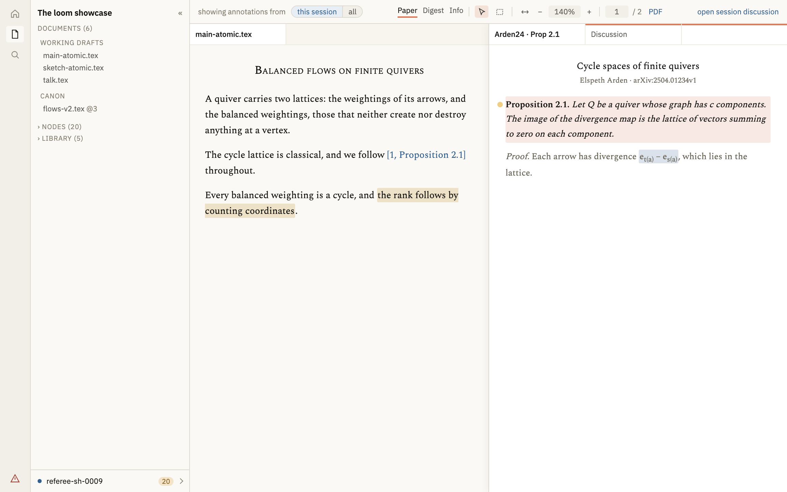
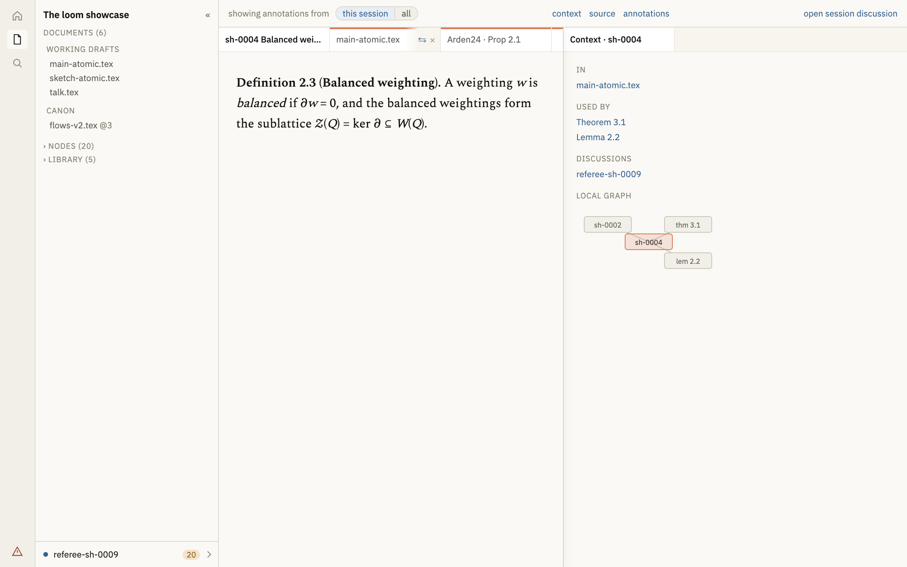

# 15. Arras layout and visual design

Chapter 10 says what arras shows. This chapter says what it looks like and how it is arranged: the two navigation shells, the regions every page has, what each rail holds per view, the graph's two layouts and its toggle, the local graph, the token and typography rules, and the reference figures. It is arras's own design document and is not part of the loom–arras interface: nothing here changes what loom publishes, and a change here needs no manifest change. Chapter 10 remains authoritative on which pages exist and what data they show.

Markers as elsewhere. The chapter was written before the viewer was built and its numbers were provisional; they are now what the viewer ships, and the few places where building it changed a number say so. Where a figure and a number disagree, the figure is a screenshot of what exists and the number has been corrected to match.

## 15.1 Principles

**[decided]**

1. One persistent left rail, always present, always in the same place. The user never hunts for navigation.
2. A right rail appears only where there is context to show: the graph's inspector. It is absent elsewhere, and its absence is not a gap. A node's context is an item read beside it (15.2.4), not a rail.
3. The shell renders no page content; the page renders no navigation. A page that reaches into the shell is a bug.
4. Arras asks the local Loom publisher to write only through advertised controls. The explicit Incorporate pull control is the sole author-file write.
5. Density is comfortable only. **[decided]** No compact mode in the MVP.
6. Below 900px the layout is undefined. **[decided]** Mobile is deferred; the rule is that shells collapse to no rail with a disclosure control, and nothing else is specified.

## 15.2 The frame

**[decided]** One arrangement (DR-226): left to right, a 44px icon strip, the side panel (collapsible, 15.2.3), and the page. In **reading mode** — a document, a cited work, a node, a node's context, a session — the page is the **workspace** (15.2.4) with one 34px **global rail** above it (15.2.5); the tables, the graph, home and the problems page render full width in its place, with no rail. The name at the top of the panel is `corpus.name`, the project's own name rather than the default document's title. Preferences — typeface, size, width, theme, the setting a document is read in, where annotations stand — are arras's, kept in the browser (`localStorage`), never in the quilt.

### 15.2.1 Retired

Shell A, one rail of stacked labelled sections with a document dropdown, was retired with the choice between arrangements (DR-226): two arrangements meant every panel change was made twice, and the second fell behind on the first that was not. The number is kept so that references to 15.2.3 still resolve.

### 15.2.2 Retired

Shell B, a top bar with view tabs, was retired (DR-113). The number is kept so that references to 15.2.3 still resolve; a stored or linked choice of it opens the default.

### 15.2.3 The icon strip and the side panel


**[decided]** A 44px icon strip, `--leaf`, holding one 19px icon per view the corpus declares — seven at most, the seventh being `digest` (DR-184) — at a 38px vertical pitch, each drawn as a stroked path on a 24-unit grid at a single stroke width rather than set as a unicode character — a glyph renders at whatever weight and baseline a font decides, so a column of them sits unevenly and reads as punctuation (DR-112) — the current one on a 32×26px `--link-wash` with `--rad-control`, search below them, and at the foot the problems view as a warning glyph above the settings control; every icon has an `aria-label` and a tooltip. The glyph carries the publisher's counts as its name and takes the colour of the worst of them — the incomplete red for an error, the stale amber for a warning — so whether anything is wrong is legible without a number, and no line under the panel restates them (DR-229-ikmartin). The strip carries no separate home mark: home is one of the views, and a second control going to the same place is a puzzle rather than a shortcut. The settings panel opens upward from that control, because a panel hung below the foot of a full-height column opens past the bottom of the window; its rows never wrap, so the widest of them sets its width and a longer option widens the panel instead of folding under it. It is sized by its content and not by the control it hangs off, which here is 44px wide and would otherwise clip the last option in a row, and it closes on a press outside it or on Escape, as every floating box does (DR-121). Beside the strip a 252px panel: the page's own panel when it has registered one, otherwise the documents with the open document's contents, with the write target pinned beneath. The panel never lists the views: they are the strip beside it (DR-118).

**[decided]** The panel is **one scrolling column** (plan 0.13.3 S1): the corpus name with its collapse control; **Documents**, working drafts then canon; **Nodes**, the corpus's own statements by id, taxon and title, folded by default and narrowed by what is typed; and the **Library**, every cited work narrowed by what is typed, each row its title and a dot that is filled when a copy of the paper is filed here — the one thing a click on it cannot be guessed to give — with `ledger` at its foot. The panel is the list's one home; the counts are the ledger's (10.2.3, DR-239-ikmartin). The indexes are behind the `⚗` development shelf. There is no tab strip and no view switcher, because every section answers a question asked while reading. **The open document's contents hang under its row, open by default**, with `hide ⌄` / `show ›` on the row: *where am I in this* is the question asked most often while reading and should not cost a click. The tree follows `workspace.current`, the focused pane's active item (S3): it hangs under that document's row, and no row carries it while the current item is not a document. **The column scrolls as one region** — the contents tree no longer carries the only scrollbar, which is how a group added below it pushed its last entries off a column that could not scroll — and **collapses** by a control in its head, the column going with it, so the content and the Chat have the width; it collapses independently of the split and goes first. **Below 1200px it shows folded** whatever the reader's stored choice, and its control opens it for the visit without rewriting that choice (DR-248-ikmartin).

**[decided]** **The write target is pinned beneath the column** (DR-229-ikmartin), outside the scroll: a state dot, the selected session's name, how many events arrived in it since it was last opened, and a chevron. Annotations land in the selected session whatever is shown, so a reader must never go looking for where their work will go. Its tone is `writable()`'s answer: writable is no fill, a blue dot and the name in ink; refused is an amber fill, a hollow ring and the name in the warning ink — `no session selected` when nothing is. It carries only the state; the sentence explaining a refusal stands beside the refused control (DR-230-ikmartin). The tone concerns annotations only: review decisions and incorporating a pull name no session and are never refused for want of one. **The footer opens the session picker**, a popover 320px wide — wider than the column, because a row carries a name, a count and a date: a find field and `+ new`, which opens a session and selects it; `WRITING INTO`, the open sessions, most recently touched first, each with its open count and when it was last touched; `CLOSED (n)`, folded, holding the setting that admits closed sessions' annotations and the closed rows, each carrying `⟳`, which reopens the session and selects it; and `select none`, the one way to detach. Rename, close and remove stand over the end of a row on hover or keyboard focus, so a row never shifts when they appear and at rest carries only its name, count and date. Choosing a row selects it, closes the picker and **opens the session's Chat** beside what is being read, or reveals it, with focus left in the pane the reader was in; `+ new` and `⟳` do the same, and outside reading mode choosing only selects (DR-253-ikmartin, DR-266-ikmartin). **One Chat at a time**: opening a session's Chat, from here, a link or a URL, selects that session and closes any other session's item, so the footer and the Chat never name two conversations. Choosing the selected row keeps it. The selection is kept in this browser and read back at load; a stored session the corpus no longer lists is let go. A rename shows at once, before the publisher has rebuilt.

### 15.2.4 The workspace



**[decided]** **Reading mode is items in panes** (DR-231-ikmartin). An item is a document, a cited work, a node, a node's context or a session: a thing with an address, a renderer, controls and optionally internal views. One registry maps each kind to those, and nothing else in the viewer knows what kinds exist. The reading routes render nothing of their own: a route's URL is an item's address, read into the workspace, and the item's renderer draws no chrome.

**[decided]** **At most two panes, of equal rank** (DR-232-ikmartin). Both hold every kind and behave alike; neither is primary. The ratio is one preference, half by default; **the divider is one 3px rule** inside a wider target of its own, beneath the panes so that a box a pane opens over its text stands over the divider (DR-263-ikmartin), and it snaps at the middle and nowhere else, a double-click resets it, and the arrow keys nudge it (DR-249-ikmartin). While a cited work is in either pane the divider stops short of squeezing its reading controls below about 420px. The first pane is one element however many panes there are, so opening a second never re-creates it. **Below 700px one pane shows at a time**, under one strip holding both panes' tabs, the unfocused pane's quieter and a tab in it focusing its pane: two panes on a phone are two unusable panes (DR-248-ikmartin).

**[decided]** **A pane's head is its tab strip and nothing else.** Tabs are a fixed 148px, chosen against real names with the controls showing, so a target does not move as its neighbours open and close; a name that does not fit ends in an ellipsis before the controls, never under them. A tab names what it holds as a reader would: a document by its file, a result by taxon and number, a work at a result as `Arden24 · Prop 2.1` — the postnote's page dropped, the taxon abbreviated — and a context by its node's name after a graph glyph, read as `context of …` wherever it is text (DR-247-ikmartin); the strip scrolls sideways on hover with its scrollbar's room reserved. `⇄` and `×` sit over a tab's right end behind a gradient in its colour — always on the active tab, on hover or keyboard focus for the others — and neither appears on the lone tab of a lone pane. `⇄` moves a tab to the other pane and focus follows it; moving or closing the last tab of a pane closes the pane, and the other takes the width. **Tabs accumulate and the reader closes them**: no cap, no eviction. An inactive tab is not kept rendered; its item keeps its view, its place, its scroll offset and its controls' state, and comes back as it was left.

**[decided]** **One rule for every link** (DR-269-ikmartin, amending DR-233-ikmartin). A link names an item and a place in it. **If the item is open**, in either pane, it is revealed where it is — that pane takes focus, its tab becomes active, it goes to the place the link names, and the place is marked by a brief fade (`.travelled`) so the eye is told where it arrived; a document's links to its own content are this case, and so is a link to an item open in the link's own pane (DR-234-ikmartin). **A node is open where an open document holds it** (DR-280-ikmartin): the document is revealed at the node — the one the link stands in, else one on screen, else the one behind another tab that was looked at last, brought forward — and the name the link was given, from the default document, may read differently there. **If it is not open**, it opens as a new tab in the pane the reader is not in, so both ends of the connection stay on screen; with one pane, the second is made. There are no exceptions: a context's link opens in the other pane like any other, and the node the context is about stays there as a tab behind it (superseding DR-250-ikmartin). A link to an annotation opens what it is on with its box open — a reply's, its thread's; a note on an equation, in the node that holds it — and is named by its kind, a reply as `reply on …` (DR-279-ikmartin). A click in the side panel or the rail is a choice of what to read and opens in the focused pane, and never splits.

**[decided]** **Focus is taken by any interaction with a pane** — a press, a wheel, a tab into it — in the capture phase, so what acts on the focused pane reads the new value in the same frame; a pane scrolling itself is not an interaction. While both are open the focused pane is marked by its shadow and a white head, and nothing drawn on it; the other is not dimmed (DR-249-ikmartin).

**[decided]** **The URL is the arrangement** (DR-237-ikmartin): the left pane's active item as the path, in the reading routes' own shapes (`/master/<stem>#<id>`, `/canon/<stem>`, `/node/<key>`, `/library/<citekey>?page=N&result=…&view=digest`), and the right pane's as `?beside=`, one encoded address in the same shapes; `/context/<key>` and `/session/<id>` are addresses with no page of their own. Only the two active items travel, so a link reproduces what its sender was looking at and not their working set. The workspace rewrites the URL as it changes, replacing rather than pushing: nothing in it replaces anything a reader would go back to. A URL it did not write — a load, a link from outside reading mode, the palette — fills an empty workspace exactly, and otherwise opens its item in the focused pane.

### 15.2.5 The global rail

**[decided]** One rail above the workspace, holding exactly two things: the **annotation filter** at its left (15.3.1), and the **control cluster** for the current item in the space beside it — its internal views, then its controls, drawn once, since two panes each carrying a row would be the same widgets twice for a document only one of which is being read. A session's Chat is opened by choosing the session (15.2.3), so the rail carries no session control (DR-266-ikmartin, superseding DR-259-ikmartin). Every control in the cluster names the item it acts on. A document's are the annotating tools, select and box, where a write API is served (15.3.10), `show all annotations` (`hide all` once they are open), **the settled control** beside it — `show settled`, `hide settled` while it is on — and `PDF`; a work's are its views `Paper · Digest · Info`, then select and box, fit-width, zoom and page — typed into — and `PDF`, all drawn and greyed out on the Digest and the Info and on a work with no readable copy (DR-254-ikmartin); a node's are the annotating tools, `context`, `source`, `show all annotations` and `show settled`. The settled control draws the resolved and discarded annotations faintly (15.3.1); it is a mode of the sitting rather than a setting or a property of one page: held in memory for the visit, never written anywhere, off on every fresh visit, and the same on every document and node the reader moves to (DR-294-ikmartin). Its key is `s`, beside `e` and `h`, from inside the document. It is offered wherever the item holds a settled annotation, even one with nothing drawn at rest, and a followed `quilt:` link to a settled annotation turns it on for the sitting before opening the box, since the link asked to see it. The rail is one 12.5px line: the filter a quiet label and a rounded pill, its chosen side in the link's wash; the active view underlined in `--accent`; short rules between the cluster's groups. **When its two parts do not fit**, the filter goes behind a `⋯` at its right and the cluster keeps its place (DR-248-ikmartin).

## 15.3 Page anatomy

**[decided]** Every page is: an optional header block (title, id, badges, tags), the content region, and an optional right rail. Pages never draw their own navigation, never place a title in the shell, and never assume a shell.

**[decided]** A reading page is an item in the workspace (15.2.4): rendered in a pane, laid out as a page is, with its controls in the global rail and no header of chrome above its own first line.

**[decided]** Right rail width `--rail-right`, hairline left border, 12px padding, sections labelled like the left rail's. The width was 159px in design and is 236px as built: an annotation box at 159px wrapped its author onto four lines, and a rail that cannot hold a box is not a rail for boxes. A section with nothing in it says "nothing" rather than leaving a heading over blank space.

**[decided]** A page fills the shell's regions through two registries, one for the right rail and one for the left panel, rather than by drawing a rail of its own. That is what lets a table page put its filters where a document's contents otherwise sit (15.4) while the rule of 15.1 — the page renders no navigation — still holds.

### 15.3.1 Read view (a live document, or a landmark)


**[decided]** The document rendered as a document, in a measured column with a gutter either side. Two kinds of document are read here and the page is the same shape for both: a live document at `/master/<stem>`, with everything below, and a landmark at `/canon/<stem>`, with none of it — no margins, no heading links, no annotations, no local graph — because nothing in a landmark is a node (10.2.2). A landmark's tab names the step that wrote it (`flows-v2 @3`), which is its identity rather than a note about it; its path and message are not shown, and its theorems are typeset and go nowhere.

**[decided]** When the drafting directory holds no document, the read view, the graph and the review panel each show one bordered notice in place of their content: *Nothing is being worked on*, what is consequently absent, the newest landmark as a link, and a pointer to the problems page, where the publisher's diagnostic carries the command that starts a draft. The notice never names a command itself (10.8). The geometry is the site generator's own, so that a corpus page and a note page are laid out alike: the gutters are `(available − measure)/3` each and the text column absorbs the third they give up, one knob being the `/3`. Prose in the body typeface at 11–16px depending on the user's type setting, `line-height: 1.7`; the width setting is 36, 44 or 52rem, the middle being the site generator's own measure.

**[decided]** The **side panel** holds Documents, Nodes and the **Library**, which lists each cited work as a whole document rather than as loose nodes, with the open document's contents under its row and the write target pinned beneath (15.2.3). What loom is **writing to** and what the page is **showing** are said in two places, because they are two questions: the panel's footer names the write target, and **the annotation filter** — `showing annotations from [this session | all]` — stands at the left of the global rail, because it governs which annotations a document draws rather than which sessions are listed. Writing lands in the selected session whatever is being shown, and a viewer that moved the write target when the view changed would file work where it was not meant to go. **The filter governs the page** — a mark is drawn only for a visible annotation, and a label mark only for the visible ones it stands for, because a filtered page can otherwise look lightly annotated when it is not. The filter is the first of the global rail's two things (15.2.5).

**[decided]** The left gutter holds each node's margin label: the id in mono accent and the state word beneath it in the state colour at 9px, right-aligned, ending exactly at the environment's per-taxon accent rule, which is the boundary between the gutter and the text. Environments follow sitegen's `environments.css` convention — a left-border accent, no filled background — and that border is the rule; the node's text is indented past it. Numbers are the document's own, from its compile, and appear in the statement's label ("Lemma 3.4."); a document never compiled shows none, and a reference to a result it cannot number names the result's title (DR-245-ikmartin). Proofs render collapsed with a disclosure marker, matching sitegen's `details.env-proof` treatment: no box, a left rule, a ▸/▾ marker.

**[decided]** A display block scrolls sideways when its formula is wider than the column, and never up and down: naming one axis of `overflow` makes a browser compute the other to `auto`, and the renderer's off-screen glyph cache and its hidden accessibility copy are then counted as content. The edge with content past it carries a shadow, so a reader is never left wondering why a block moves (DR-104).

**[decided]** The gutter is a container-relative length rather than a percentage, since the margin label is positioned against a node and a percentage would resolve against that node instead of the page. Below 1100px there are no gutters, and everything that stands in one rejoins the flow (DR-98).

**[decided]** Where an annotation's box stands is a display preference (15.7), **inline** or **floating**, and either way the mark is what opens it. Inline, a mark on the text expands its box, with its replies inside it, beneath the paragraph, item or display the mark sits in, and a mark on a label beneath the label; floating, the box stands over the page at the mark, kept clear of every edge and following its mark as the page scrolls; a press outside it or Escape closes it, and a second mark opens a second box. **Every annotation at once** — `show all annotations`, or `e` — **opens in the flow** whatever the setting, each box under its own paragraph or label, since floating boxes opened together stand on one another and on the words (DR-260-ikmartin); `h` closes them. The read view uses no shell rail for boxes and puts none in a gutter: the margin placement, which stood short annotations in the right gutter and left long ones in the flow, is retired with DR-293-ikmartin.

**[decided]** **The box is titled by its kind** (DR-293-ikmartin, DR-295-ikmartin; annotation study fixes 12–17). Its first line is the kind in sans in the mark's hue (`--ann-<kind>`, the neutral for a note or an unknown kind), followed for an objection or a suggestion by its severity — `Objection (Major)`, `Suggestion (Minor)` — with the box's × at the right of the same line; a box that stands open beside a comparison has no ×, and where several boxes share one opened host the × is the first one's. Otherwise it says nothing in words that the record already shows: no status word, and no quote for an anchored annotation, whose mark is the quote. The kind is also the box's left stripe, 3px in the same hue; severity is also the mark's weight, and `edit` sets it. After the title the order is: the quote, italic at a rule, only for an annotation with no mark of its own — unanchored, or detached, where the quote is the only record of the words; the body; what the kind adds — a suggestion's proposed text at a 2px rule in the suggestion's hue, headed by one word from its `placement` (`replace`, `after`, `before`, or `proposed` when it names none), rendered by default with `verbatim` one link away; a citation's work (its `payload`; the body is the claim) at a 2px rule in the citation's hue — then one meta line, `<author> · <date>` at the left and the verbs (15.3.4a) at the right, the verbs dropping to a line of their own when the box is narrow; then the replies, indented under a rule, each its body, its own meta line and its own verbs. A settled box, resolved or discarded, keeps its stripe and its title at 50% (`color-mix` of the hue with transparent), sets its body in `--ink-soft`, and adds the outcome once to the meta line — `· resolved`, `· discarded`, or for a citation `· accepted` or `· rejected`. Floating, the box keeps its stripe and loses its other borders: the host's shadow is its frame. **The box carries its id**, `ann-<id>`, wherever it is placed, and a reply inside it carries its own, so travel is two-way and one gesture each way: a double-click on a mark lands on its box, opening it first when it is closed, and a double-click on the box lands on its mark, the one in the box's own pane; an annotation with no mark here gets the notice, and nothing is invented. Beside a comparison every annotation's card stands in the flow and is its one box: its mark travels to it rather than opening a second.

**[decided]** **The mark** is `style()` of the annotation's record and nothing else (DR-293-ikmartin; principles A1–A6 of the annotation study). One annotation, one mark: an annotation with a quote that resolves is a mark on those words; one with no quote, or an anchor that no longer resolves, is a mark on its node's label — the environment's label, the section's heading, the document's title — and several such share one label mark whose box lists them; a phrase carrying several annotations is one mark whose box lists them, with no count drawn anywhere. Each visual channel answers one question. **Hue is the kind:** `--ann-objection` red, `--ann-suggestion` yellow, `--ann-question` blue, `--ann-citation` violet, and `--ann-neutral` for a note and for any kind the viewer has never heard of (15.6). **Weight is the severity:** the underline is 1px for `minor`, 3px for `major`, and 2px for `moderate` and for the kinds that take no severity. **The wash is which box is open:** at rest a mark is its underline over its hue at 5% (DR-295-ikmartin); the one whose box is open takes its hue's wash, `--ann-<kind>-wash` at 10%, whatever its severity; nothing else is outlined or tinted, so the selected mark has one look and not two. **Shape is the anchor:** a phrase is underlined line by line, a whole block likewise rather than barred down its edge, a displayed formula is ruled beneath, a span on a PDF page is underlined beneath each of its lines, and a box drawn on a page is outlined in the hue — the same annotation looks the same on every surface. **Settled means not drawn:** a resolved or discarded annotation's mark is absent at rest, and the session filter's excluded marks likewise; when the reader turns settled annotations on (the rail's `show settled`, or `s`, held for the sitting and off on every fresh visit, or a followed link to a settled annotation, 15.2.5; the class `show-settled` on the fragment or the paper), each keeps its hue at a 3% wash with its underline at half its weight and 50% opacity, and the words it sits on are never faded. A mark never splits a formula — it takes one whole or not at all — so what it marks still typesets, and a quote is typeset wherever it is shown (DR-244-ikmartin). The classes are the seam a host restyles against: `annotation`, `k-<kind>`, `s-<severity>`, `open`, `settled`, `hidden`, `annotation-label`, `basis-box`; the hue and weight tokens are `--ann`, `--ann-w` and `--ann-bg` on the mark. The same `k-<kind>` on `box` gives a box its stripe and on `ann-dot` gives a list its kind dot (15.3.2, 15.3.9), so the kind has one seam on every surface.

**[decided]** A round control at the document pane's lower right opens the local graph (15.5.1) as a 300px floating panel over the text, standing against the pane rather than the window so that it never covers the other pane; its centre is the result being read, and whether it is open is remembered in this browser (DR-116). While a context is on screen, which draws a graph of its own, the float and its control stand down (DR-251-ikmartin).

### 15.3.2 Node, and a node's context



**[decided]** **A node draws its statement and its proofs, and nothing about them** (DR-242-ikmartin). No heading — the tab names it — and no meta row: with Show ids, its id and state stand in the left gutter, as a document's do; a missing proof is said where the proof would be, `No proof is attached.`; a section node lists what is on it. Each proof follows the statement in manifest order, the detailed proof (reached by another master) included. A key with no page of its own — an unlabelled proof, a file container a diagnostic names — is not linked; where the key belongs to a node, the page points at that node instead of reporting an unknown key (DR-94). **Its annotations are reached by their marks**, each opening its box — one with no place in the words by the mark on the node's label (15.3.1) — and the rail's `show all annotations` opens every one that is drawn; nothing below the node lists them again. **No right rail**: the rail's controls are the annotating tools, `context`, `source`, `show all annotations` and `show settled`.

**[decided]** **A node's context is an item**, opened beside it by `context` (`/context/<key>`): everything about the node that is not the node, in one column, the lists first (DR-255-ikmartin) — `in` (each document that reaches it by its file name, linked to the node in it, then the section crumbs), `from` (the work a digest result was read off and where, the landmark each of its keys' text was recorded at, its tags), depends on and what it rests on, used by, see also, discussions, detached annotations, the citations suggested for it, a quiet `N discarded — show` when anything on it was discarded, and diagnostics — and the local graph (15.5.1) last, at 150px, one expand from full size. Every result in a list is named as a reader names it, `Theorem 3.1` or `proof of Lemma 1.2`, with its key as the link's title, and a use from a proof is a use by the result the proof belongs to (DR-242-ikmartin). **Absences are omitted, not reported**: a node no document reaches shows no `in` heading and no `unreachable` diagnostic, which is the problems page's business; one nothing depends on or uses shows no heading over nothing, and its graph draws the node alone without a caption, because nobody asks whether a thing is in nothing (DR-255-ikmartin). **The detached and the discarded are rows, not boxes** (DR-294-ikmartin; annotation study A2): each a 7px dot in the kind's hue (`ann-dot`, the neutral for a note, the kind word as its label for a screen reader) and a `quilt:` link to the annotation whose text is a short preview of its body — the words it quoted when it has none — with no severity shown; the link opens the node with the box, turning the settled control on for a discarded one. The discarded stay folded behind the count.

**[decided]** Both closure questions are answered beside the node, in its context (DR-160, DR-242-ikmartin): the local graph is navigable, its nodes links; and **what this rests on**, under `depends on`, stacks the closure in dependency order with the result last, at depth 1 or 2, seeded from the result *and its proofs* — in most quilts a statement's own dependencies are all declared inside its argument. The stack is built only when opened.

**[decided]** `source`, in the rail, flips a node between its rendering and its own source, fetched from `source/<key>.tex` when the publisher wrote any, and names the reading a click gives (`verbatim code`, `rendered latex`); a corpus that publishes no source shows no control. A suggestion's **payload** is shown in its box (15.3.1), headed by the word its `placement` hint gives. Nothing in the viewer applies anything.

### 15.3.3 Graph


See 15.5.

### 15.3.4 Home


**[decided]** Four metric cards (48px tall, `--leaf`, `--rad-control`, 9px muted label, 18px value in the state colour) — accepted, stale, incomplete, errors — then the documents, what needs attention, what is blocked, what is loose, and what is recent. The first three cards summarize the corpus without pretending that Review has a quilt-wide document table; errors opens `/problems?severity=error`, and blocked work links to Review's default document (DR-220, DR-225). This is the landing route.

### 15.3.4a Answering a finding

**[decided]** An annotation box carries one quiet row of verbs at the right of its meta line, `--ink-faint` until reached for, each shown only when `GET /_api` says the publisher serves its endpoint, so a corpus read from a static host shows none of them (DR-161). An open annotation offers **reply**, **resolve**, **edit** and **discard**; a citation offers **accept** and **reject** in place of resolve and edit, since a citation is answered by deciding it, and both post to `refs-cite`, which resolves the annotation and, on accept, leaves the reference note the Library lists (the Library's list of suggested citations links to the box and decides nothing). A settled annotation offers **reopen** alone: the undo of whichever of resolve or discard settled it, appended as an event like every undo (7.4).

**[decided]** **Everything an annotation can do happens inside its box** (annotation study fixes 14 and 17). `reply`, `edit` and `discard` take text, so each opens a block beneath the meta line, inside the box, which grows to hold it — a textarea with `cancel` and the verb, and for an edit the severity beside them; an edit starts from the body it supersedes, and a discard's reason is optional and published as the reason it was withdrawn. Nothing pops over the text, and no verb folds behind a menu: when the box is narrow the meta line wraps. Escape or a press outside the box closes the block. `resolve`, `accept`, `reject` and `reopen` need nothing and are one click; a refusal is shown in the box in the publisher's own words, since a verb that opens nothing has nowhere else to say why.

**[decided]** A reply carries **edit** and **withdraw** of its own, because a reply is an annotation with `in_reply_to` set and withdrawing one is `discard` on its own id. Nothing in the viewer deletes: reverting an edit is another edit back to the wording the log still holds.

### 15.3.8 The four settings a document is read in

**[decided]** One switch on the root element, so the read view and a node's own page change together: a result should not read as a different kind of thing depending on which page it is standing on. Nothing about the content changes, only how it is set. The values are `p1`, `p2`, `b1` and `b2`, and **`p1` is the default** (DR-175).

**[decided]** **`p1` is the compiled page.** Modelled on what `amsart` prints: a text block of about 4.6in, justified and hyphenated, paragraphs indented and unspaced, section heads centred in small caps, and theorem heads **run into the first line** — bold for a result or a definition, italic for a remark, with the statement italic where the class italicises it. **No rule, no fill and no colour on an environment at all.** That is the point rather than a side effect: with the taxa uncoloured the only coloured thing on the page is a finding.

**[decided]** **`p2` is `p1` with the compiled paper's page boundaries.** They are not invented: loom publishes the page each numbered result fell on, read from the `.aux` (`nodes[key].numbers[master].page`, specs/manifest.md §5), and a divider goes before the first element whose page is higher than the one before it, carrying that page's own number. Two limits follow and are left visible rather than papered over — a boundary can only be seen at a numbered element, so a run of prose between two results carries no divider however many pages it spans; and a master that has never been compiled publishes no numbers, so `p2` shows what `p1` shows. A page here is *the page this result is on*, never a sheet of invented height.

**[decided]** **`b1` and `b2` are the web settings**, and are what arras had before: `b1` the measured column with a taxon accent at its edge, `b2` the wider setting with sans heads, tinted panels and no numbers, since a website points at a result by name and a paper by number.

**[decided]** What the viewer adds — an annotation box, a margin key, a composer — is not set like the paper even inside it: left-aligned, unindented, unhyphenated. A box justified to a narrow measure is unreadable.

### 15.3.5 Review panel, problems, threads, indexes

**[decided]** The Review page has one tab per working document, followed by Needs review and Incoming. The configured default document opens first; a document tab shows the state, basis, proof, gap and reachability information for keys that document reaches, and its counts come from exactly those rows. A shared node appears in every document that reaches it with one shared state. Needs review is one quilt-wide dependency-ordered block queue. Incoming shows the exact fetched revision, comparisons, affected dependents, and changed files. No review filters occupy the left panel. A column no row fills is not drawn, stale cause details still expand in place, and `/blockers` redirects to the default document. Runs and sessions belong to their existing session and thread surfaces, and undigested works belong to Library; neither is repeated below a document's table.

`/review?show=incoming` is a separate view of a fetched source revision (DR-217). It lists changed block IDs and files, places the current local block beside the incoming rendering, offers source diffs for changed TeX and bibliography files, and links potentially affected dependents to their citations. One **Incorporate pull** click verifies and applies that exact revision and creates two local commits. Conflicts stop before author files change. The action never pushes or accepts mathematics.

**[decided]** The workbench layout (a node list, node body, and context pane as one screen) explored in design is dropped; the review panel plus the node page cover it.

### 15.3.6 Hover previews

**[decided]** **A hover card renders an item** (DR-240-ikmartin). Resting on a link — a reference in the text, a context list, a table row, a node in a graph, a `cited:` or `quilt:` link — reads it as the item it names, a link to an annotation as what the annotation is on, and the registry's small render draws that item; the card owns only its timing, its place and `open here`. A node's card is its label, number, id and state and its statement typeset, proofs hidden, the text clamped by a fade rather than cut; a section says how many entries it holds. **A citation previews the paper, not the transcription of it** (H3): a digest result with a filed paper and a located page shows that page, cropped to the statement and two lines either side at 115% of the card's width, the place marked by a translucent dot at the start of its first line (H4); a `cited:` link or a work URL shows the page it names, lit where a span, a box or a quote says; a postnote naming a page opens there, one naming a place nobody can find opens no card, and a bare citation's front page stands (H5). **A kind with no small render — a document, a context, a session — opens no card**, rather than one about it. The card is `--sheet` with a hairline and one soft shadow, placed against the window below the link or above it when there is no room, and beside a graph drawing so that it never covers the drawing's controls; no pane can clip it. The timings are the author's site generator's: 300ms before showing, so crossing a paragraph of links does not flicker, and 200ms of grace to move into the card, which stays while the pointer is in it so its links work. Escape, a press elsewhere, or a scroll anywhere but inside the card dismisses it — the card's own column scrolling itself to the page it was asked for is not a scroll away; a device that cannot hover gets none. A link to what its own pane is already showing previews nothing (DR-117). **Every card over a link in a pane carries one action**, drawn always rather than revealed once the pointer is inside: `open here`, the destination a click on the link does not give — the same item at the same place in the link's own pane, or revealed where it is already open (DR-269-ikmartin).

### 15.3.7 The PDF viewer

**[decided]** One dialog, mounted once by the layout, that a link into a cited work opens **when the copy on this machine is another version of the work, or there is none** (DR-210); a link to an artifact filed here opens that work as an item instead, beside when it was followed from a pane (15.2.4). It was every link's destination until plan 0.13 made reading a mode of the work's own page. The paper is drawn by arras's own renderer (DR-201), under a header with the work's title, its identifier and the page, the reading tools, a link to open the file in a tab, and a close control; it is 90% of the window, `--sheet` on a dimmed backdrop, and closes on a press outside it or Escape (DR-121). A `#quote=` anchor is shown above the paper as "look for …", since finding text needs a text layer the browser's renderer does not expose. When no copy of that artifact is on file, the dialog explains that fetched papers are not in version control and links to the identifier's own service; when a copy of a different version is, it says the pages may not match and offers to open it anyway (DR-123). Safari's handling of `#page=` is not verified; opening the file in a tab is the fallback.

**[decided]** The problems page carries two more things: a heading per **subject** — *The source* and *The record* — shown only when both are present, with a filter beside severity and code; and, under any diagnostic that carries them, its **fixes**, each the command as the publisher wrote it with a button that copies it. The button says `copy`, then `copied`; the command is always on screen, so a browser that refuses the clipboard costs nothing. Nothing in arras runs a command.

### 15.3.9 A session: its Chat, and what it did

**[decided]** **A session has two readings** (DR-238-ikmartin, DR-266-ikmartin), the rail's views `Chat · What it did`, because it is read on two errands: while working it is a conversation, and on its own it is being audited. `/session/<id>` addresses it, and `?view=did` the second reading.

**[decided]** **Chat** is the conversation and its input in one pane (DR-266-ikmartin), with no title of its own — the tab names the session, once. The transcript is every message the person and the agent said, in order, **newest at the bottom and the first thing seen**; scrolling up loads the page before (specs/manifest.md §10.1), and a reader at the newest stays there when the pane's height changes. It is flat, like a log: a line saying who and when in words (`today 11:00`), then the body at full width, rendered and typeset, its links followed by the rule of 15.2.4 and named by the viewer when they carry no text of their own; the agent's messages carry a faint rule and nothing else tells the two parties apart. Annotations are not in it: an agent links the ones it wrote. Where a publisher serves, beneath the transcript stand one **status line** — who is attached, or that messages wait in the inbox, and after a send what became of it; where loom starts the agent (11.9), the turn instead: `Claude Agent is working · loom source sh-0009`, the last command it logged, with **stop** at the line's end while it runs, `could not run: …` when it failed, `cannot be started: …` when something keeps loom from starting it, `was stopped`, or `starts when you send` (DR-276-ikmartin, DR-278-ikmartin) — and the **input**, as wide as its pane, growing from two lines to eight. Between them, while it holds anything, the **tray**: what the next message will carry — the annotations the person wrote in this session since a message last carried any — only theirs — one row each: a dot in the kind's hue (a ring for a reply) and a link to the annotation named by what it is on, never the kind as a word (DR-294-ikmartin); `preview` shows the text the agent will read, verbatim; the tray keeps its own height up to two fifths of the Chat, and scrolls past that. Send works with nothing typed when the tray holds something, and a sent message shows what it carried as one line of counts, `carried 2 questions, 1 note` (DR-272-ikmartin); new messages arrive from `/_api/events` within a second, without waiting for the manifest (DR-267-ikmartin). With no publisher answering there is neither, since neither would be true (P3).

**[decided]** **What it did** is the session's `run.log`, the plain record of everything done through loom in it (DR-277-ikmartin): one row per line, in order, the view opening at its last row so the newest action is the first thing seen. A row is when, in words (`today 11:00`), and the command as it was run; a row that made or changed an annotation also says its kind as a 7px dot in the kind's hue — a ring for a reply, the kind word kept only as the dot's label (DR-294-ikmartin) — then links it by the key it was filed under, followed by the one rule — `sh-0009`, `drafting/main.tex`, a work's citekey and page — and never as a reader numbers it, which a renumbering changes, and says where it stands: `open`, `resolved` or `discarded`. Severity is not shown in a list. The row's link opens the annotation's box at its mark in the other pane — for a settled annotation turning the settled control on (15.2.5) — and the mark's double-click lands on that box (15.3.1), so the two panes point at each other. A session whose log is empty says so in one line. The summary sentence, the sections, the rendered report and its notation are gone: the list is to be edited down later, and the report is read, if at all, through what the agent links (DR-277-ikmartin, superseding the What it did half of DR-238-ikmartin and DR-158 in the viewer).

### 15.3.10 Writing, where a publisher is serving

**[decided]** Every editing affordance is detected and not assumed (DR-161): with no write API there are no annotating tools, no accept and reject on a citation suggestion, and no sign that there might have been. Where the API is served, **annotations are written with the same two tools on every reading item** (DR-243-ikmartin) — a cited work's pages, a node, a document. **Select** leaves a selection a selection and offers one `annotate` chip at its end, in the annotation neutral at the reader's body size (15.9) on every surface, its face opaque under the pointer since it stands over words, gone once the composer opens; Enter on the selection does what the chip does; the note's place is the result, proof or section the selection is in, and its quote is the selection with each formula it touches given as its TeX, which is what loom looks for in the source. **Box**, or Alt-drag from select, draws round what a selection cannot hold: a labelled equation is annotated as itself, anything else as the words of the block under the box. **The composer** opens where the place is, inset from the window like a floating box and 504px wide, every size in it 1.2× the viewer's other small controls, while **the place stays lit on the page**: the words selected keep a selection's highlight after the composer takes focus, and a box drawn stays drawn, until the annotation is written or cancelled (DR-262-ikmartin). It asks for three things and shows nothing the page already says (annotation study fixes 5 and 18–21). Its header names the words — `on “<the words>” in Theorem 2.1`, the quote italic in the body face and clipped to the line; `on the whole of Theorem 2.1` when nothing is quoted; `on p. 4, a box` or `on p. 4, “<the words>”` on a cited work's page, where loom's own account of what it found on the page stands beneath — and never the place's key. The body is first. The five kinds are a row of buttons, each in its hue (15.6), `note` chosen on every route — selection, box, page — until the reader picks another with one click. Severity is three buttons, `major · moderate · minor`, present whatever the kind and enabled only for an objection or a suggestion, greyed to 35% otherwise, so the form never moves as the kind changes; none is chosen by default. The submit is the kind's verb in the kind's hue — `Object`, `Suggest`, `Ask`, `Cite`, `Note`. × at the corner and Escape cancel, and there is no third button. An annotation written while reading a document is filed with that document (`in`, book 7): it is marked there, listed on the node's own page and absent from any other document; one written on the node's own page is filed with none. The publisher is allowed to refuse, and its own words are shown — "quote not found" means something different from "no such key", and a document that does not hold the node is refused in the same place — with, for a quote it could not find, the offer to annotate the whole result instead, so nothing is filed as anchored that is not. A document carries no annotation block of its own (plan 0.13.3 D4): an annotation on the whole document is read in what the session it was written in did. A write that records into a session is refused in the viewer, before the publisher is asked, while no open session is selected: the control is disabled and the sentence naming which of the two conditions holds — nothing selected, or the selection closed — stands beside it for as long as the refusal does (DR-230-ikmartin).

## 15.4 Rails by view

**[decided]** As built. A page with nothing for a region registers nothing and the region is absent; a page that registers a left panel displaces the contents tree, which is where a table page's filters go.

| view | left panel | right |
|---|---|---|
| home, tags, taxa, loose, threads | documents with the current contents, nodes, library | none |
| reading mode (a document, a work, a node, a context, a session) | documents with the current document's contents, nodes, library | none; a node's context is an item beside it, and a document's local graph floats in its pane when opened |
| graph | drawing, document, taxon, tag, state, depth, highlight, cited results | the selection and what rests on it, or the selected paper and its links |
| review | none | none; tabs choose a working document, Needs review, or Incoming, and a document row expands in place |
| library (the ledger) | documents, nodes, library — the ledger's filters are its own | none |
| problems | severity and code filters | none |
| search | the command palette's own list | none |

## 15.5 The graph

**[decided]** One graph page with four drawings of the one filtered graph — **Dots**, **Box**, **Sections** and **Reading Order** — available according to Scope: Whole quilt offers Dots and Box; one document offers all four. Changing to Whole quilt from Sections or Reading Order selects Dots. The drawing control keeps the selection, filters and scope, so moving between them is one view asked a different question rather than four pages (DR-129).

**[decided]** **Dots** is the default, in the spirit of org-roam-ui: a force-directed neighbourhood with circular nodes, selective nonoverlapping labels in screen pixels, and node radius larger for the selection. Hover or keyboard focus reveals immediate neighbors’ names and zooming in admits more labels. A full-name callout resolves names that cannot fit. Selected dependency paths have arrowheads pointing from a result toward what it uses; spatial position itself carries no direction (DR-301-luisa).

**[decided]** **Box** draws the results in layers: dependency direction on the vertical axis, upstream above, rounded rectangles in layers by longest path, each uniform box carrying its human-readable name, contextual type/number/section, and stable ID on three lines. Edges point from a result toward its dependency above. Sections are ordinary boxes and retain their prose references (DR-300-luisa). Grouping the boxes by section, which this replaced, is what made the drawing sprawl: a group spanning several layers reserves the whole column and every edge leaving it is routed around the rest, which on `demos/acgs` — 71 results inside 74 sections — filled a canvas a screen could only show at an unreadable zoom (DR-129). It answers what this rests on and what breaks if it changes.

**[decided]** **Sections** is the same graph seen a section at a time: one card per section holding its results in reading order, a line between two cards for every dependency between them, thicker for more, and prose references drawn dotted. A section that holds nothing drawn belongs to the nearest section above it that does, so a reference to a section is a reference to the card it is drawn as; cited works drawn as papers, and results outside every section, get a card of their own. Hovering a result lights the lines it is in; clicking one selects it, and clicking a card selects the section. It answers which parts of the paper lean on which (DR-129).

**[decided]** **Reading Order** is not laid out at all: the document top to bottom, sections and results as rows in the order the master reaches them, and every dependency an arc in the left margin, bulging with the distance it reaches. Hovering or selecting a row tints it and lights its arcs. Nothing can sprawl and every label is at full size, at the cost of showing no depth. What is not in play fades only halfway, since a row of text is unreadable at the dimming a shape tolerates (DR-129).

**[decided]** Shared by all four: Scope offers **Whole quilt** and one entry per working document (DR-300-luisa). Whole quilt includes every node and dependency; a document includes the nodes its master reaches, regardless of physical source file. Neutral nodes carry one colored membership mark per reaching working document; the document path determines a stable color, including when the document is modularized. The clickable document legend highlights membership by dimming other nodes without changing scope or removing connections. State is not encoded as node color. Statement edges are solid, proof edges dashed, prose edges dotted; external nodes have a dashed border. Additional controls select local depth (0 means the whole scope), taxon, tag and state. Clicking selects and fills the inspector, including a persistent rendered statement preview and physical source path. The existing direction control chooses direct dependencies or direct dependents, with indirect results expandable beneath; these lists follow Scope before visual filters and identify results hidden by filters. Relationship counts are not displayed. Hover leaves the selected preview pinned. A link opens the existing Context page for full metadata; double-clicking opens the node page. Dragging the background pans and the wheel zooms about the pointer in the three laid-out drawings; Reading Order scrolls like the document it follows. Dragging a node moves it in Dots only. The shapes follow the drawing that has arrived, so choosing Box or Sections keeps the previous drawing until ELK answers (DR-115, DR-129).

**[decided]** Dots is `d3-force`, stepped to completion rather than animated and seeded from the previous drawing so a filter change moves nodes rather than reshuffling them; Box and Sections are `elkjs` (DR-93); Reading Order is arithmetic on the manifest's inclusion tree. **[decided]** There is no node count at which the page scopes itself: the useful scope depends on the question, so the scope is chosen by selecting a node and a depth.

### 15.5.1 The local graph

**[decided]** One node's neighbourhood, drawn as **Dot** or as **Box** — the graph page's two laid-out drawings at neighbourhood scale, chosen in the panel's own bar, which reads `Local Graph`, then the depth, then the drawing, then expand and close (DR-129). The nodes are those one or two dependency steps out in either direction (a two-button control, default one), with `see` relations drawn dotted but never followed, and a proof drawn as its statement. `d3-force` runs animated here, with the centre pinned in the middle, so when the centre changes the nodes that stay keep their places and only arrivals move, each starting beside a neighbour already placed. A node's radius grows with its degree and its fill is its state's tone; the centre is `--link`; an external node is hollow with a dashed rim. Hovering a node dims everything but it and its neighbours and labels them; otherwise only the centre is labelled, until the reader zooms in. Each node is a link, so a click opens it — a result the document being read holds is a jump within it — and a rest previews it (15.3.6). The drawing fits itself to its box, enlarging at most 1.6 times, until the reader zooms or pans. It heads a node's context at 200px tall, and floats over a document's pane at 300px wide when opened, centred on the last statement or proof whose top has passed a third of the way down the pane, so prose between two results keeps the one above and the centre does not flicker. Either expands to a dialog of 80% of the window, labelling every node, that closes on a press outside it or Escape (DR-116, DR-121). It is SVG rather than Quartz's PixiJS, since a neighbourhood is tens of nodes and a renderer would be weight in every install. Box lays the same neighbourhood out in layers with ELK and no section groups, since a neighbourhood crosses sections and a handful of boxes reads without them; the expanded dialog is moved to the end of the document so that no panel it was declared inside can cover it (DR-129).

### 15.5.2 The work graph

**[decided]** "Cited results: as papers" draws the corpus's own results as they are and every cited work as one node: the quotient of the result graph by source, taken over external nodes only. An edge runs from an own result to a paper when the result depends on any of the paper's digested results, or cites the paper at all (dash-dot), and between two papers when a result in one digest depends on a result in another; an edge standing for several results is drawn thicker, by their count's logarithm. A work cited but never digested appears too, which the expanded graph cannot show. A paper is a square box on `--leaf` with a darker rim in Dots, a box labelled "paper" and its title in Box, and a card of its own in Sections; selecting one fills the inspector with the work, its links, and double-clicking opens its reference page. The manifest carries everything needed, since a node's source is its `digest`. Contracting the corpus's own results as well would leave one node and a star for a single corpus, so it waits for a corpus spanning several quilts (DR-124).

## 15.6 Tokens and vocabulary

**[decided]** Arras defines its own token vocabulary. It does not adopt the names used in these design documents or in any other product's design system: borrowing names would imply a shared system that does not exist, and arras's vocabulary should describe what it renders, which is a page of mathematics rather than application chrome. The names below are drawn from print. Every colour, measure, and typeface is a variable; no component hardcodes a value.

**[decided]** Padding and borders count inside a declared size, everywhere. A rail is `height: 100vh` with padding, and without this it is that much taller than the window, which puts the settings control and the counts line below the fold (DR-99).

**[decided]** Visual character: a warm off-white page, hairline rules rather than borders, generous line height, no shadows, no filled chrome, colour used only to carry meaning. Claude's web interface is a reasonable reference for that character; nothing is copied from it.

**[decided]** The vocabulary, with the light-mode values the viewer ships:

| token | value | use |
|---|---|---|
| `--paper` | `#fbfaf8` | the page |
| `--leaf` | `#f4f2ed` | rails, panels, metric cards |
| `--sheet` | `#ffffff` | content cards, raised surfaces |
| `--rule` | `#d8d5cd` | hairlines, 0.5–1px |
| `--rule-strong` | `#b4b2a9` | emphasised dividers, graph edges |
| `--ink` | `#2c2c2a` | body text |
| `--ink-soft` | `#5f5e5a` | supporting text |
| `--ink-faint` | `#888780` | rail labels, ids in lists, captions |
| `--link` | `#185fa5` | links, ids, the current item |
| `--link-wash` | `#e6f1fb` | the tint behind a current or selected item |
| `--mark` | `#faeeda` | the warm wash behind the session footer's count and the rule beside a box's quote |
| `--ann-objection` `--ann-suggestion` `--ann-question` `--ann-citation` `--ann-neutral` | `#a32d2d` `#a07a0a` `#185fa5` `#6b3fa0` `#6f6d66` | an annotation's hue by kind, on every surface (15.3.1); each has a `-wash` at 10% for the open one; at rest a mark takes the hue at 5% |
| `--gap-hair` `--gap-tight` `--gap` `--gap-wide` | 4, 8, 12, 20px | spacing scale |
| `--rad-pill` `--rad-control` `--rad-card` | 4, 8, 12px | radii |
| `--rail-left` `--rail-right` `--strip` | 252, 236, 44px | the fixed widths of 15.2 |
| `--rail-a` | 267px | shell A's rail |
| `--gutter` | `(100cqw − --measure) / 3` | the read view's gutters, on the site generator's algebra |
| `--env-accent` | 3px | the per-taxon rule, and the boundary the left gutter ends at |
| `--measure` | 36rem, 44rem, 52rem by setting | body line width; the middle is the site generator's |

**[decided]** State tokens are a second group, named for the state rather than for a role, because arras's states are loom's and not a generic severity scale:

| token | text | wash | use |
|---|---|---|---|
| `--state-accepted` | `#0f6e56` | `#e1f5ee` | accepted; settled uses the same pair with a filled dot and 500 weight |
| `--state-stale` | `#854f0b` | `#faeeda` | the modifier on accepted; the badge reads "accepted, stale" |
| `--state-draft` | `#5f5e5a` | `#f1efe8` | neutral, not a warning |
| `--state-incomplete` | `#a32d2d` | `#fcebeb` | overrides everything |
| `--state-loose` | `#888780` | none | a mark, not a badge |

**[decided]** The manifest declares state labels with colour classes (`neutral`, `positive`, `positive-strong`, `warning`, `negative`, `info`; specs/manifest.md §8). Arras maps those classes onto the state tokens above in one file, so a publisher that declares states arras has never heard of still renders: `positive` to accepted, `warning` to stale, `negative` to incomplete, `neutral` to draft, `info` to loose, anything unknown to `--ink-soft` with no wash. The mapping is the only place the interface's vocabulary and arras's meet.

**[decided]** Dark values are the same vocabulary a second time in the same file: `--paper: #17171a`, inks inverted, and every state wash expressed as a low-alpha overlay of its state colour rather than a second hand-picked hue. The block is declared under both `@media (prefers-color-scheme: dark) :root:not([data-theme='light'])` and `:root[data-theme='dark']`, so the system setting and an explicit choice share one definition (DR-90).

**[decided]** The token vocabulary is a contract, not a private stylesheet. The custom properties this chapter names, and the class names the components emit, are what a host restyles a corpus with; they are documented here for that purpose and are not renamed without a decision record. A host that wants a different look writes ordinary CSS against them (10.8.1).

## 15.7 Typography

**[decided]** Serif by default for mathematical content: statements, proofs, prose, digests. Sans for chrome: rails, badges, labels, tables, buttons. Mono for ids.

**[decided]** The serif is the stack the author's site generator uses, copied from that project's `tokens.css` so that a corpus page and a note page read as the same publication: `'Palatino Linotype', Palatino, 'Book Antiqua', Georgia, serif` (DR-90). Chrome is Inter and ids are the existing monospace stack.

**[decided]** A settings control, in arras's own settings and written to arras's preferences, offers: body typeface (serif or sans), body size (three steps), line width (three steps), theme (light, dark, system), the setting a document is read in (`p1`, `p2`, `b1`, `b2` — 15.3.8), where annotations stand (inline or floating, 15.3.1), and **Show ids** (the gutter's ids and states, off by default). The `Discussion Pane` setting is retired (DR-252-ikmartin). **[decided]** The four settings are named by their letters rather than described, so the row fits beside the others; each button's title says what it is. Nothing else is user-adjustable in the MVP. Each is one row of the panel, its label and its options on a single segmented control — `Type  [serif | sans]` — with the labels in a column of fixed width so that every row's options begin at the same place.

**[decided]** Type scale: page title 15px/500, section heading 13px/500, body 11–16px by the size setting with `line-height: 1.7`, rail labels 9px uppercase muted with 0.04em tracking, rail items 10–13px, ids 9px mono, badges 9px. Sentence case everywhere. Two weights, 400 and 500.

## 15.8 Component contracts

**[decided]** One component tree:

```
NavShell({ label, views, currentView, masters, currentDoc, onDocument,
           contents, currentSection, counts, search, rail, panel, panelLabel })
  renders IconStrip: the strip, the panel, the page and its optional right rail
GlobalRail()     above the workspace: the filter and the current item's cluster
Workspace()      one or two Pane(index), each PaneHead(index) and the active item's renderer
kinds            the registry: per kind, tab(item), renderer, controls, views
```

Rules: pages receive no shell props and import no shell module; a page that needs a right rail or a left panel registers one, and the shell places it; a page's title lives in the page, never in the shell. A reading route draws nothing: its URL is an item's address, and its renderer is the registry's, which draws no rail, no toolbar and no header of chrome. Every rail is a scroll container, and that belongs to the shell rather than to any page's stylesheet, so no view can regress it. A rail's scrollbar is `thin` with a transparent thumb until the pointer or the keyboard is in the rail, so a contents tree of 74 entries does not carry a grey stripe down the side of every page; the space it needs is reserved either way, so nothing shifts when it appears (DR-99).

**[decided]** Shared components as built: `Badge(parts, facts)` for a state line; `RailList(label, empty)` for every section of the right rail; `DiffView(path)` for the two-column diff of 15.3.5; `HelpDot(label, topic)` for the question mark of 15.3.5; `Contents` and `Settings`; `Popover(trigger, placement, modal)`, the one floating surface — a box beside its control, or a dialog over the page — that `Settings`, the `⚗` shelf, `HelpDot`, the session picker, the delete confirmation, the expanded local graph and `PdfViewer` are all drawn in; `SessionFooter`, `SessionPicker` and `SessionFilter` for the write target, the list and the annotation filter; `NoSession`, the refusal sentence beside a refused control; `GlobalRail`, `Workspace`, `Pane`, `PaneHead` and the `kinds` registry for reading mode, with `links.ts` deciding where a followed link opens and what a `quilt:` link names; `ChatView`, `Composer` and `transcript.svelte.ts` for a session's Chat (15.3.9); `PageRail` and `PagePanel`, the two registries; `Tex(text)`, which typesets a title that carries mathematics, since a title keeps its `$…$` rather than losing it (DR-96); `WorkLinks(ref)` for a work's outward links (DR-119); `LinkPreview`, mounted once by the layout (15.3.6); `LocalGraph(center, depth, height)` and `LocalGraphPanel` around it (15.5.1); the `dismiss` action every floating box closes through (DR-121); `PdfViewer` and `Locator(ref, locator)` for 15.3.7; `ToolPair(holder, of)`, the select and box tools wherever there is something to annotate, `FragmentNotes(holder, fallback)`, which makes them work on a node's or a document's text, and `NoteAt`, the composer at the place, on a page or on a key (15.3.10).

## 15.9 Reference figures and their status

**[decided]** The schematic drawings this chapter was designed against have been superseded, as they said they would be. The figures are now screenshots of the viewer rendering the conformance fixture, generated by `npm run shots` in `arras/` and committed: `page-home.png`, `page-read-master.png`, `page-node.png`, `page-node-dark.png`, `page-review.png`, `page-problems.png`, `page-graph-dots.png`, `page-graph-box.png`, `page-graph-sections.png`, `page-graph-reading.png`, and one page in each shell as `shell-a-rail-sections.png` and `shell-c-icon-strip.png`. They are regenerated on any change to the chrome, and the release checklist carries "screenshots regenerated".

The original `.svg` drawings remain beside them for the record of what was intended. Where a screenshot and this chapter's numbers disagree, the screenshot is what exists and the chapter is corrected.

## 15.10 Accessibility

**[decided]** Every icon-only control carries an `aria-label`; the icon strip is a `nav` with a list; marks are `mark` elements with `aria-describedby` naming their annotation's box and `aria-expanded` saying whether it is open, reachable by keyboard, and out of the tab order while they are not drawn; a list's kind dot is an `img` whose label is the kind word the hue replaced; the contents tree is a `nav` with `aria-current` on the current section; focus order runs shell then page then right rail; the graph canvas is preceded by a visually hidden summary and is not the only route to any information. Contrast: every state text colour on its tint meets AA at 11px.
