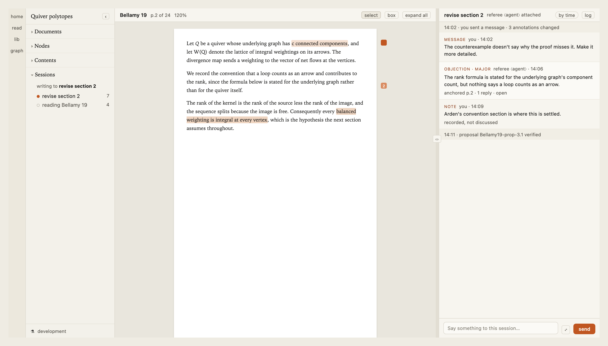
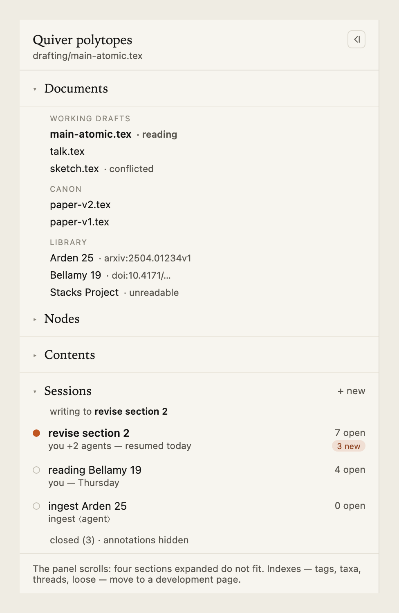
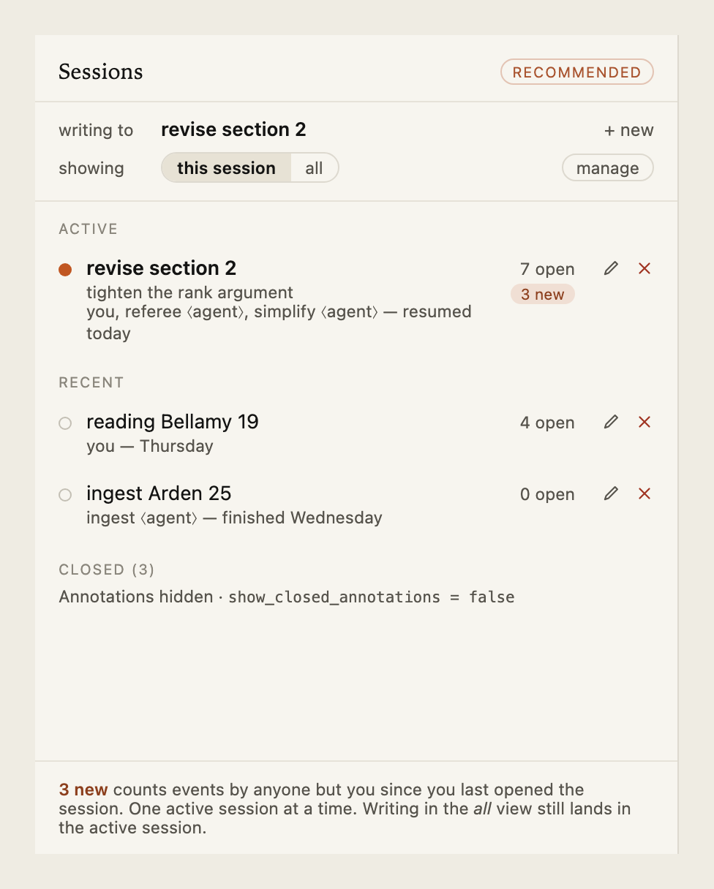
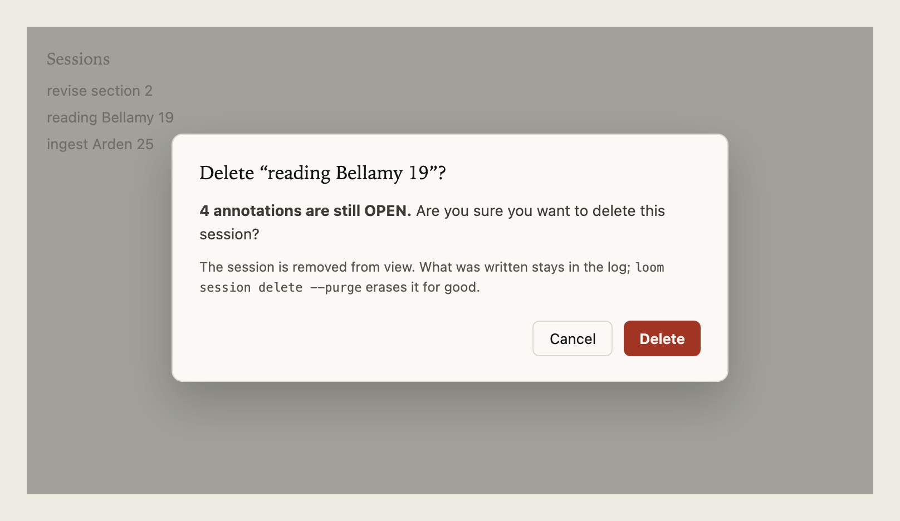
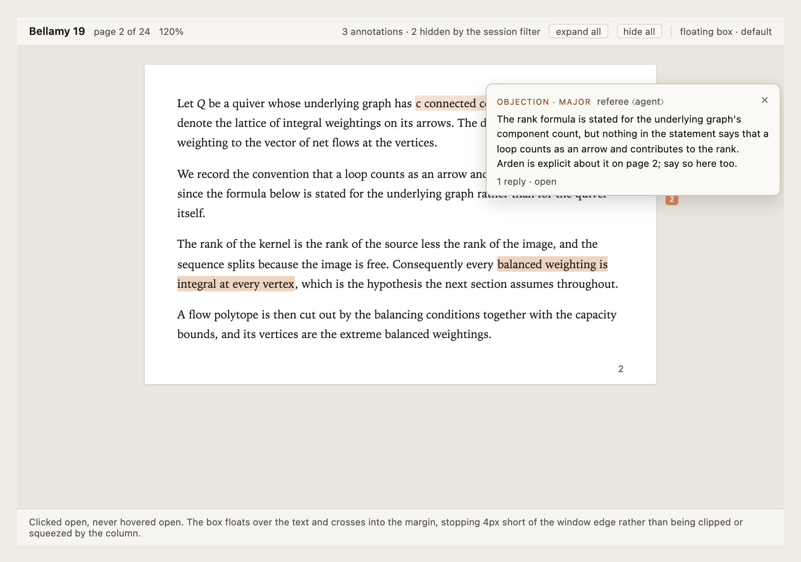
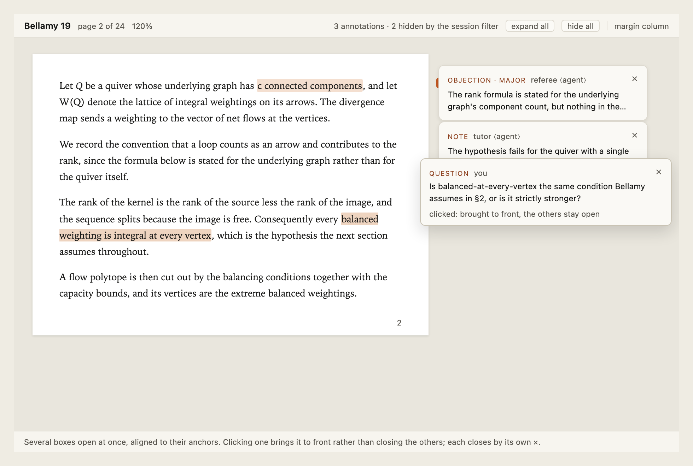
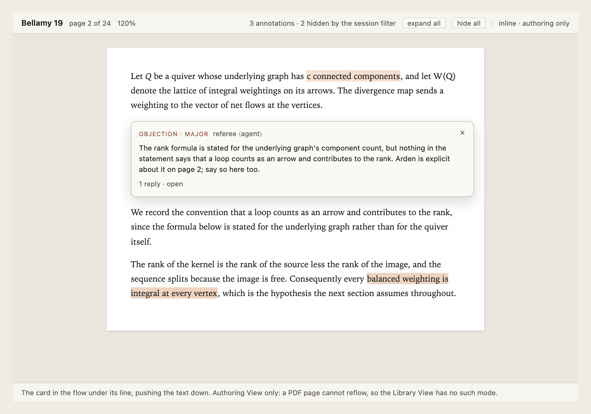

# Plan 0.13: the reading layer — the PDF, the split view and sessions

0.12 built what loom *knows* about other people's work: identifiers, fetched documents, page text, digests, proposals, links. This plan makes that work **readable and discussable in place**. A cited paper opens as the PDF it actually is, anchored to durable locators; annotations and an agent's transcript sit beside it in one pane; and a person and an agent share a named session that either can write into, with loom carrying messages between them and running no model itself.

The design is settled: **`docs/long-prompts/split-view-reading-view-overhaul.md`** holds twelve decisions with their rejected alternatives and reasons, taken in conversation on 2026-09-20. This plan does not restate them. Where a section here says "item 4", it means that document's section 4, which is the normative statement of what is being built and why.

Markers: **[decided]** settled in that conversation and to be implemented as written; **[assumed]** the drafter's default, to be implemented unless it conflicts with a decided rule or the live code; **[open]** to be resolved by the implementer against the code, or by an experiment.

---

## 1. What this is for

An author reading a cited paper today has two bad choices: read the digest, which is loom's extract of the statements and not the paper, or open the PDF outside loom, where nothing can be anchored, discussed or remembered. An agent reading the same paper has only the text layer, which for mathematics is control bytes. Meanwhile a conversation with an agent happens in a terminal while the evidence sits in a browser, and the author moves between them by hand.

After this plan: the paper opens in loom, the reader highlights a sentence or draws a box around a formula and writes a note against it, the note is in the same log as every other annotation and belongs to a named session, and the agent working alongside sees the message and the changed annotations without the author leaving the page.

## 2. The three load-bearing pieces, and the slice that tests them

Three decisions carry the rest. If any is wrong in contact with real code, much of the plan moves:

1. **The anchor schema** (item 2) — text offsets of record with geometry always carried, quads per line, the sidecar.
2. **Sessions replacing runs** (items 3, 3a) — one shared container with a stable id, a mutable title, and `.loom/sessions/`.
3. **The viewer component** (item 5) — PDF.js as a dumb renderer serving four mounting contexts.

**[decided]** Build a **thin vertical slice first**: one work, one PDF, one text anchor and one box anchor, rendered in a pane, clicked, and travelled to from a discussion item. Nothing else — no split geometry, no dispatch, no migration. It exercises all three pieces end to end in a few hundred lines, and it is the cheapest place to discover that one of them is wrong.

**Abort conditions.** Stop and redesign rather than push on if: mapping a PDF.js selection onto poppler's page text fails on ordinary prose more than rarely (the basis rule in item 2 assumes it usually succeeds); rendering plus text layer plus overlay costs more than ~150ms per page on the study corpus after virtualisation; or the session migration cannot keep existing annotations attached to their runs.

## 3. Where things live

Additions and moves only; everything else is as 0.12 left it.

```
.loom/
  sessions/
    index.jsonl              created · renamed · resumed · closed · deleted
    <id>/                    a session's own directory, made when it has content
      inbox.jsonl            messages posted to it, append-only, read by cursor
      notes.md, thread.md    what the session wrote: its report and its handoff
      log.jsonl              the commands it ran
      attached.json          who is watching: name, kind, pid, heartbeat
  serve.json                 the running server's port and pid
digests/
  storage/<scheme>/<id>/     unchanged from DR-192
  unreadable.json            declared-unreadable works, and forgotten citekeys
build/
  spans/<scheme>/<id>.json   the per-work sidecar: page table, quads, annotation bodies
```

**[decided]** `ai/runs/` folds into `.loom/sessions/`; `ai/` keeps the modes and the orientation. **[decided]** The sidecar is a build output, hashed in the manifest for cache-busting.

## 4. Part A — anchors and the store

**[decided]** Extend `Anchor` (`loom/src/loom/refs/proposals.py`) rather than replacing it: keep `kind`, `sha256`, `page`, `last`, `path`, `bytes`; add `basis` (`text` | `box`), `start`, `end`, and `quads` in place of the single `quad`. One anchor type serves results, digest nodes and annotations, with the node key optional.

**[decided]** Coordinates are **points with a top-left origin** — what `pdftotext -bbox-layout` actually emits. `Span`'s docstring in `refs/search.py` says "PDF user space", which is bottom-left, and is wrong today; fix it in the same commit that the convention is written into the spec, because anyone trusting it gets vertically mirrored highlights.

**[decided]** Mapping is server-side: a `POST` carrying `{page, rects, text}` is normalised with the hyphenation and ligature folding `refs locate` already does, and the canonical anchor is what loom records. Geometry-only anchors are legal and must never be refused.

**[decided]** The PDF invariant (item 1): `digest extract` refuses a source outside the store; `refs build`'s extract step skips a work with no PDF and reports it blocked; a lint code, never an error, reports renderable content with no readable copy; `refs build` closes the gap by fetching where consent exists. `loom refs unreadable CITEKEY --why` and `loom refs forget <citekey|hash> --why` write `digests/unreadable.json`, refuse under an agent identity, and suppress the lint while appearing in the build report's own section.

**[assumed]** Quads are computed at build time from the anchor and cached in the sidecar; nothing stores geometry in the log.

## 5. Part B — sessions

**[decided]** A session has a **stable id** (`s-YYYY-MM-DD-NNNN`) and a **mutable title**; the directory is named by the id. `author` is who wrote an event, `session` is where it belongs — the current conflation, where an agent annotation records the run id as its author, ends here.

**[decided]** `sessions/index.jsonl` is append-only: `created`, `renamed`, `resumed`, `closed`, `deleted`. A **round** is the span between `opened`/`resumed` and the next `closed`/`resumed`, which is what "changed since last time" points at. Deletion is a **tombstone**; `loom session delete --purge` really erases, is CLI-only, and warns.

**[decided]** One active session at a time, global, recorded in `.loom/` so the CLI and the viewer agree. Writing while the view shows `all` still lands in the active session. Annotating with nothing active creates a session and makes it active, for a person and an agent alike.

**[decided]** Migration: existing `ai/runs/*` and the derived `comments/<person>/<date>` threads become sessions; annotations keep their grouping. No backwards compatibility is owed beyond that the demos regenerate.

## 6. Part C — the viewer

**[decided]** `pdfjs-dist`, vendored by dynamic import as MathJax is, worker emitted by the bundler, **standard fonts and CMaps both shipped** — fetched per document, so they cost package weight and nothing at load. The `<iframe>` goes; the refusals it carries (no copy here; a different version, with a warning) stay.

**[decided]** A **dumb renderer**: props are the artifact, a page, spans to draw and a span to scroll to; events are selection made, box drawn, page changed, link followed. It serves the content pane, the modal, the proposal box and the hover preview without forking.

**[decided]** Virtualise: a window of pages rendered, canvases outside destroyed, text layers and overlays built only for rendered pages. **[decided]** Selection where a text layer exists; **box-drag** otherwise, with a toolbar carrying both tools, a modifier for the box, a tooltip naming it, automatic switch to box mode on a page with no text layer, and a click without a drag leaving a point.

**[decided]** The proposal box becomes a split of its own — the real page left, at the anchor with the quotation highlighted, and the rendering right — replacing the page-text-beside-rendering arrangement. **The `pdftoppm` image pipeline is retired**; page text stays, being what the anchor check runs against.

## 7. Part D — the frame

**[decided]** The split is a mode of a route, on the Authoring View, a node page, a work's Library View and a session permalink; absent from the graph and the review table, which navigate into it instead.



```
┌──┬──────────┬───────────────────────────┬─┬────────────────────────┐
│⌂ │ Quiver…  │ Bellamy 19  p.2  120%     │ │ revise section 2       │
│  │ ▸ Docs   │        [select][box][all] │ │ referee ⟨agent⟩ attached│
│  │ ▸ Nodes  │  ┌─────────────────────┐  │ │ ─────────────────────  │
│  │ ▸ Conts  │  │ …c connected comps▮ │■│ │ 14:02 you · 3 changed  │
│  │ ▾ Sessns │  │                     │  │ │ MESSAGE  you           │
│  │  ● revise│  │ …balanced at every  │② │ │ OBJECTION referee      │
│  │  ○ readin│  │  vertex▮            │  │◄│ NOTE you               │
│  │          │  └─────────────────────┘  │ │ 14:11 proposal verified│
│  │ ⚗ dev    │                           │ │ [ say something… ][send]│
└──┴──────────┴───────────────────────────┴─┴────────────────────────┘
   rail  panel          content          divider      discussion
```

**[decided]** One global divider ratio, a single snap at the middle, double-click to reset, arrow-key nudge, collapse chevrons on the divider; the side panel collapses independently and goes first; below ~700px the split becomes a switch. Tabs belong to the content pane only. Zoom persists per renderer kind. The composer is docked in the discussion pane's foot and expands to a full-width bar. Swap sides is a settings toggle, expected to be deprecated.

**[decided]** The side panel (item 3b) is Documents — working drafts, canon, **Library** — Nodes, Contents and Sessions, scrolling, with a collapse control and the development shelf behind `⚗`.

 ·  · 

```
▾ Sessions                           ▾ Documents
   writing to  revise section 2          WORKING DRAFTS
   showing  [this session| all ]         main-atomic.tex · reading
   ACTIVE                                CANON
   ● revise section 2   7 open ✎ ✕       paper-v2.tex
       you, referee ⟨agent⟩   3 new      LIBRARY
   RECENT                                Arden 25 · arxiv:2504.01234v1
   ○ reading Bellamy 19 4 open ✎ ✕       Stacks Project · unreadable
   CLOSED (3) · annotations hidden
```

**[decided]** In-content placements (item 9): **floating box** by default, **margin column**, and **inline** in the Authoring View only. A click opens; hovering never does; boxes keep a 4px inset from the window; clicking outside backgrounds rather than collapses; each box has an ×; `e` and `h` expand and hide all, with buttons in the content pane header.

 ·  · 

```
floating                    margin                     inline (authoring)
┌──────────────┐            ┌────────┐ ┌──────┐        ┌──────────────┐
│ text ▮▮▮  ┌──┴──┐         │ text ▮ │ │OBJ…  │        │ text ▮▮▮     │
│ text      │ OBJ │         │ text   │ └──────┘        │ ┌──────────┐ │
│ text      └──┬──┘         │ text ▮ │ ┌──────┐        │ │ OBJECTION│ │
└──────────────┘  4px→│     └────────┘ │QUEST…│        │ └──────────┘ │
                                       └──────┘        │ text         │
```

**[decided]** Syncing (item 8): panes scroll independently, double-click travels, a brief scroll then a flash, a 1.5s *nothing to travel to* notice where there is nothing, a tinted highlight plus a margin tick carrying a count.

## 8. Part E — dispatch and the API

**[decided]** Loom is a mailbox: the composer posts, loom appends, nothing is launched. A post carries the message **and the changed annotations inline**, in the same text `session next` prints. `loom session watch` tails for a person; `loom session next --wait N --json` parks for an agent and returns the moment something lands; `loom session send` writes from the terminal. Presence is a heartbeat file. A message lands even with nobody attached, and the composer says so.

**[decided]** Fine events for appends, coarse for everything else, sequence-numbered so a gap resyncs; the smallest unit is a whole message.

**[decided]** The write API gains an `X-Loom-Token` header check, an `Origin` check and a `Content-Type` requirement — CSRF protection, not a login, because a page the author merely visits can otherwise POST into their quilt. **[decided]** A `message` endpoint is permitted (DR-195) and detected like every other capability.

**[decided]** Authorship is declared: an agent names itself when it attaches, including "Agent" or "AI"; `--as`/`--author` state it explicitly; markers are a safety net, and a marker with no explicit identity refuses rather than guesses. DR-185's refusals stay, keyed on identity rather than environment, and an agent asks for an author verb by writing a `suggestion` annotation on the result.

## 9. The CLI

| Command | Status | Notes |
|---|---|---|
| `loom session new/use/close/rename/list` | new | the active session lives in `.loom/` |
| `loom session watch [ID]` | new | a person's tail; writes presence |
| `loom session next --wait N [--json]` | new | an agent's long poll, one batch, exits |
| `loom session send TEXT` | new | post from the terminal |
| `loom session delete ID [--purge]` | new | tombstone by default; `--purge` warns |
| `loom refs unreadable CITEKEY --why` | new | author's claim; refuses under an agent |
| `loom refs forget <citekey\|hash> --why` | new | stops the store re-offering an entry |
| `loom refs locate` | changed | prints span and an `open:` line when serving |
| `loom digest extract` | changed | refuses a source outside the store |
| `loom refs build` | changed | extract gated on a PDF; three-section report |
| `loom comment` | changed | `--kind confirmation` replaces `ok`; `note` added; prefixes accepted; severity refused off objection/suggestion |
| `loom serve` | changed | writes `.loom/serve.json`; token and Origin checks |
| `loom ai run` and mode commands | changed | join a session rather than minting a run |

## 10. The book, the specs and the agent documents

| Where | Change |
|---|---|
| 3 Vocabulary | Library, a work, Authoring/Library View, authoring nodes, digest nodes; retire "external node" |
| 4 The quilt | `.loom/sessions/`, `digests/unreadable.json`, `serve.json`; the `[author]` key unchanged |
| 7 Review | six kinds, `confirmation` for `ok`, severity restricted to objection and suggestion |
| 8 Digests | the Library; the PDF invariant; extraction gated on a PDF; the unreadable declaration |
| 10, 15 arras | the split view, the panel, the placements, the viewer, the session selector, the Library index |
| 11 The AI layer | sessions, dispatch, presence, the refusal list |
| 12 CLI reference | regenerate |
| `specs/manifest.md` | anchors with `basis`/`quads`, the sidecar pointer, sessions, unreadable |
| `specs/write-api.md` | the token, the Origin check, the `message` endpoint |
| `specs/diagnostics.md` | the invariant's lint code |
| `ai/orientation.md`, `ai/rules.md` | the session workflow, the attach loop, **the list of commands that refuse under an agent identity** |

**Decision records to write or amend**: DR-175 loses its PDF clause; DR-179 loses the page image and gains the page itself; DR-184 loses the separate digest view as the indexes fold into the Library; DR-162's "an annotation's run is the thread's id" becomes the session id; new records for the anchor schema, sessions, the viewer, dispatch and the API hardening. **Work queue**: close [[WQ-40]] by obsolescence; narrow [[WQ-36]], which the sidecar largely builds; revisit [[WQ-34]], which the composer touches.

## 11. Tests

**Unit** — anchor round-trip for both bases; selection-to-anchor mapping against real page text, including a hyphenated line and a ligature; sidecar generation and its hash; the session log, its cursors and a resumed round; the invariant's lint on a digest with no PDF; `unreadable` and `forget` suppressing and restoring; the token and Origin checks rejecting a forged post; `--kind` prefixes and the severity refusal.

**End to end** — annotate by selection and by box; expand all and hide all; the three placements; the divider, its snap and its collapse; the selector switching the write target without navigating; travel in both directions and the *nothing to travel to* notice; a dispatch round trip against a **fake agent** that parks on `session next` and answers.

**Performance floor** — PDF.js load cost measured once; a long book (the study's 679-page notes) virtualised, with a budget on per-page render plus text layer plus overlay; a page carrying twenty annotations.

**Hermetic as ever**: every compile in an isolated environment, no network in tests, recorded HTTP where a lookup is involved.

## 12. The showcase

`demos/showcase/` is how a feature is shown to exist, so it grows: a **reading session** with a text anchor and a box anchor on a filed PDF; a **second session** carrying a dispatch transcript with a message, its changed-annotation block and an agent's reply; a **closed session** whose annotations are hidden; annotations exercising all three placements; a work **declared unreadable**; an **orphan document** healed by the store; and a proposal shown in the new page-beside-rendering box. It regenerates offline in seconds, as it does today.

## 13. Build order

1. The thin vertical slice (§2), and the abort conditions checked against it.
2. Part A: anchors, the sidecar, the invariant, `unreadable`/`forget`.
3. Part B: sessions, the migration, the selector's data.
4. Part C: the viewer, the proposal box, retiring `pdftoppm`.
5. Part D: the frame, the panel, the placements, syncing.
6. Part E: dispatch, presence, the event stream, the API hardening.
7. The book, the specs, the agent documents, the queue sweep.
8. The showcase, the tests, the performance floor, and the **exploratory e2e harness** the study needs — a browser session an agent can steer and screenshot, rather than a scripted spec.
9. The reading study (§17), with a fix pass between iterations.
10. The report (§18).

## 14. What this plan does not build

A published static site; a model runner or any credential handling; multi-agent orchestration; OCR for scanned pages; compiling a cited paper to obtain a PDF (§1 of item 1 states the condition under which that is revisited); a request object for agent-initiated author verbs; restoring a whole working arrangement from a URL.

## 15. Open questions

- **[open]** Whether a stacked tick's list is a menu or an expansion in place.
- **[open]** Whether the sidecar should carry annotation bodies for the Authoring View too, or only for works.
- **[open]** What `--wait` defaults to, given harness tool timeouts vary.
- **[open]** Whether `loom session watch` earns its place once the viewer shows the same stream.

## 16. The worked example this plan must satisfy

The author opens `demos/showcase`, follows a `cited:` link from an objection on `sh-0009`, lands in the Library View of Arden 25 at page 2 with the quotation highlighted, drags a box around a display formula and writes a note, which lands in a session created on the spot and named by them. They type a message in the composer; an agent parked on `session next` receives it with the note attached as a changed annotation, replies, and edits an earlier objection in place. The author sees the reply arrive without the page reloading, double-clicks its anchor, travels to page 7, resolves the objection, and closes the session. Everything above is in `annotations/log.jsonl` and `.loom/sessions/`, the demo regenerates it byte for byte, and `loom status` shows none of the reading notes.

## 17. The reading study

0.12's study found mis-numbered digests, glossed statements and a preprint masquerading as a published paper — faults that reading the code would not have revealed. The same is expected here, of a different kind: an anchor two lines off, a box that opens under the divider, a message arriving while the agent is mid-compile.

**[decided]** **Two roles, both played by agents.** The plan's **executor plays the author**, in simulation, driving the viewer through the e2e harness — choosing what to do rather than following a script, and screenshotting as it goes; a **second agent attaches to the same session** as the assistant, which is what puts dispatch under test with two parties rather than one. A **short sitting** is enough — fifteen or twenty minutes of interaction, not an hour.

- **The simulated author** — annotate by selection, annotate a formula by box, resolve something, switch placement mode, collapse and restore the panes, follow a locator, travel back. Log every fault as it happens.
- **The attached agent** — discovery, legibility of refusals, whether the changed-annotation block saves round trips, whether dispatch delivers parked and busy, whether a resumed session sees its own earlier work.

**[decided]** **Three iterations, each starting from an empty quilt and a rebuilt loom**, on papers of different characters: a TeX-derived arXiv PDF, a journal PDF with a poor text layer, and one with no source at all. A loop that accumulates state stops testing the cold path, which is the path every new user is on.

Each iteration, in seven steps: **(1)** fresh scratch quilt with one paper filed and nothing else; **(2)** the simulated author's sitting; **(3)** the agent joins the same session, parked on `session next`, and is dispatched to from the composer — it answers, edits an annotation in place, and asks for a verification through a `suggestion`; **(4)** **a cold resume** — kill the agent, stop `serve`, rebuild, reattach, and check that round markers, the inbox cursor and the anchors survived, with `LOOM_FIXED_TIME` moving the clock where a date boundary matters, since nothing here needs a literal day to pass; **(5)** investigate against the questions below; **(6)** findings, a change list, and the fixes implemented; **(7)** delete the quilt.

**[decided]** **Cost discipline**, because this loop is otherwise the most expensive thing in the plan. Anything deterministic — anchors landing, travel, expand and hide, the divider, the filter — is a Playwright test and never an agent run; the loop covers only what a test cannot. The paper is **10–20 pages**, with the long book left to the performance floor, which has no model in it. **Three or four queries** per stint, the agent reading through `refs page` rather than swallowing a PDF. **Sonnet-level agents throughout**, in both roles: the loop exercises the features — can it read, anchor, answer, be refused legibly — and is not a review of anybody's mathematics, so nothing in it needs a stronger model, and the queries need not be deep. The mathematics in the paper is scenery.

**What the investigation asks.** *The anchor*: how many selections mapped to text, how many fell back to a box, did any land visibly wrong, did one survive a re-render at another zoom? *The frame*: how often was the discussion pane collapsed and reopened, did travel land where expected, what was lost when the split became a switch? *The session*: did the author write into the wrong session, did `3 new` mean anything, was a session ever needed before there was anything to name it after? *The dispatch*: latency from send to action, parked and busy; did a message ever look delivered and not be; did the changed-annotation block measurably save calls? *The agent*: did it find reading and annotating unprompted, did it act on a refusal in the same turn, did the suggestion route feel natural or like a workaround?

**[decided]** Three habits carried from 0.12: **screenshots are part of the answer, not an illustration** — "is this easy to do" is answered by looking; **kill a meandering or stalled run** rather than burning compute; and **a killed run still counts and still reports**, because whatever made it wander is itself the finding.

**[decided]** **Stop when an iteration produces no fault worth fixing.** What carries between iterations is the fault log and the tests written from it, never the data.

**What this loop cannot answer.** With no person in it, the study can show that the features **work and are legible** — an anchor lands, a box is drawable, a message arrives, a refusal is actionable — and nothing about whether any of it is *pleasant*. A simulated author does not read out of curiosity, does not wander, and is not irritated. So the loop must not be read as evidence that the divider is in a good place, that the margin column is worth its width, or that reading in loom beats a PDF viewer with a notebook beside it. Those wait on the real author's own weeks, and a green loop settles none of them.

## 18. The report

`docs/reports/0.13-reading-layer.md`, written at the end, containing:

**Figures** — the split view, the side panel, the session selector, the delete confirmation, the three placements, and the proposal box's new arrangement, as screenshots of **what was built**, in the report's own directory `docs/reports/0.13-reading-layer/`, with their text cartoons beside them so the report survives a moved image. The design mockups in `docs/long-prompts/images/` are a drawing of what was intended and are never overwritten: where the built thing differs from its mockup, the report shows both and says why.

**Tables** — (1) the twelve decisions, as designed against as built, with any that changed and why; (2) the fault log from the reading study, by iteration, with the fix and the test that now covers it; (3) performance: viewer load, per-page render, the long-book case, and the split view's re-render cost, before and after; (4) the book and spec changes with their decision records.

**Prose** — what the thin slice found, what the abort conditions nearly triggered, and what the next plan inherits.

**And it ends with experiments for the author to run**, because §17's loop has no person in it and therefore settles nothing about whether any of this is pleasant. The report closes with a short list of sittings to try, each naming what to watch for rather than what to conclude — for example: read a paper you actually want to read for half an hour and count how often the discussion pane was in the way; annotate a formula-dense page and see whether box anchors are findable a week later; work a review in the split view and note whether the divider ended up anywhere other than the middle; leave a session open across three days and see whether `3 new` was informative or noise; try the margin column on a 13-inch screen and decide whether it earns its width; follow a `cited:` link mid-thought and notice whether travel lost your place. Each entry names the decision it would overturn, so a sitting that goes badly has somewhere to land — and the list is the report's honest boundary: everything above it was tested, everything in it was not.

## 19. Implementation ledger

A scratch pad kept while 0.13 is built, so that a finding made in Part A is still in front of whoever writes §18's report. Appended to as work lands; nothing here is decided by being written down. Entries are dated, and an entry that turns into a decision moves to a DR and says so.

### Done

**2026-09-20 · Step 1, the thin vertical slice.** Built and measured; the numbers are in `docs/reports/0.13-slice-findings.md`. All three abort conditions pass: mapping places 184/185 sampled quotations and 36/36 real browser selections, a page costs 11.5–15.9 ms warm against a 150 ms budget, and the two poppler extractions agree under space- and hyphen-insensitive matching. The session-migration abort condition is untested and belongs to Part B.

**2026-09-20 · The artifact invariant, relaxed on the way in (DR-198).** Part A's `[decided]` line in §4 said a digest must have a PDF. It ships as: a digest must have an artifact, source alone is legal and reports `info`, neither is a `warning`, and `refs build` no longer skips extraction for want of a PDF. The strict rule conflated checkability with pagination.

**2026-09-20 · `refs add` files source, not only a PDF.** Gating extraction on the store left an author whose source is on disk and not on a preprint server with no way in, because `refs add` refused everything but a PDF. It now takes a `.tex` or a directory into `<work>/src/`. `digest extract`'s `SRC` became optional and defaults to the stored source, so no caller needs to know store paths.

**2026-09-20 · The demo quilt gets a real cited work (DR-197).** `loom init --demo` shipped a hand-written `method: manual` digest about Manolache's virtual pull-backs — a real paper with no copy behind it — so a fresh demo warned on the first `loom lint` a new user runs. Replaced with `demo-works/calloway-fixed-loci.tex`, an invented paper compiled and committed the showcase's way, filed by `refs scan` and digested by `digest extract`. The demo is back to its original two infos. `tests/quilts/sources/build-works.sh` now compiles both works directories rather than the showcase's alone.

**2026-09-20 · Part B: sessions, and the end of author-is-a-place (DR-199, DR-200).** `.loom/sessions/index.jsonl` append-only, stable id and mutable title, rounds, one active session, tombstone delete with a CLI-only `--purge`. Annotation events carry `session` and an author who is a person or a named agent. `ai/runs/` folded in: `loom ai start` mints a session, an agent writes under `.loom/sessions/<id>/`, and `--run` became `--session` on every command that took it. `loom session migrate` gives every existing run and every day's comments a session recording its old grouping, rewriting nothing — which is the abort condition §2 names about keeping existing annotations attached, and it holds.

**2026-09-20 · Part C: the viewer renders the paper (DR-201).** PDF.js with its standard fonts and CMaps staged into `static/pdfjs/` and fetched per document; the `<iframe>` gone and its two refusals kept; a dumb page renderer under a document view that virtualises a window of pages and sizes the rest from their own page boxes; a toolbar with select and box, Alt for a box without switching, and box forced on a page with no text layer. The proposal box is a split — the page at the anchor with the quotation marked, the rendering beside it, the page's own text in a fold. `pdftoppm`, `refs/images.py`, `build/pages/`, `page_images` and `page_focus` are gone and [[WQ-40]] is closed. The four long-stale `arras` e2e failures are fixed rather than carried: their route pattern and their expectations predated DR-192's rename, and the whole suite of 117 passes.

**2026-09-20 · Part D, first half: the frame and the box.** `Split.svelte` carries one global ratio in the preferences, a single snap at the middle, double-click to reset, arrow-key nudge, collapse chevrons on the divider, and a switch instead of a split below 700px. The `hover` placement is gone and `floating` is the default: a click opens and hovering never does. Boxes are no longer one at a time — clicking outside **backgrounds** rather than collapses, each box carries an ×, Escape closes the front-most, and a floating box keeps 4px from every edge and follows its mark as the page scrolls. 

**2026-09-20 · Part D, the sessions selector.** The side panel gains a Sessions section in both shells: what loom is *writing to*, what the page is *showing*, the active and recent sessions with their open counts and participants, and the closed ones folded with their annotations hidden. The selection governs the page and not only the panel — `annotations.on` filters by it, so a tick's count is of visible annotations. Writing always lands in the session loom says is active, whatever is being shown, because a viewer that moved the write target when the view changed would file work where it was not meant to go. Three write endpoints back it: `session-use`, `session-rename`, `session-delete`. **Purging is deliberately not among them** and never will be: it rewrites the annotation log, and the one place that should be reachable from is a terminal where the author typed the word.


**2026-09-20 · Part D complete: travel, the two states, and the margin column.** Travel is a brief scroll then a flash — not a jump, which loses the reader's place, and not a long animation, which costs time they did not ask to spend. Double-click travels both ways; where there is nothing to travel to, a notice stands for 1.5s beside what was double-clicked and **nothing moves**, because sending a reader to roughly the right place is worse than telling them there is no place. A mark on a phrase several annotations share carries the count rather than stacking translucent highlights. Expand-all and hide-all are buttons in the content pane's header with their keys named in the tooltips, and `e`/`h` fire only while the content has focus so they never reach the composer. The header also carries what is marked and what the session filter is hiding. Margin boxes push each other down, so the column's promise is *beside* rather than *level with*.

**2026-09-20 · Part E: dispatch and the API (DR-203).** `loom/mailbox.py` is the session's inbox — append-only, read and never consumed, a cursor per reader, a sequence number per event, and `attached.json` as a heartbeat that goes stale rather than being believed forever. `session send` posts, `session watch` tails for a person, `session next --wait N --json` parks for an agent and returns the moment something lands. The write API gains `message` and three checks: the token from `.loom/serve.json`, an `Origin` check and a JSON content type. Identity is declared rather than sniffed, and DR-185's refusals moved from the environment to the identity — an explicit identity wins, and a marker with nothing declared refuses. The composer is docked in the discussion pane and says honestly whether anybody is listening. The agent's own documents carry the attach ritual and the list of verbs that refuse it, because an agent that has not been told will never park.

**2026-09-20 · Step 7 and step 8: the documents, the queue, the showcase and the floor.** Six annotation kinds landed first (DR-204), because the book must describe what is implemented and chapter 7 could not be written truthfully until `confirmation` and `note` existed. Chapters 3, 4, 7, 8, 10, 11 and 15 updated; `specs/manifest.md` gains the sidecar, the coordinate convention, `unreadable` and the sessions array; `specs/write-api.md` gains eight endpoints, the three checks and the note that `session-purge` will never be among them; `specs/diagnostics.md` gains `loom:no-readable-copy`. DR-162, DR-175, DR-179 and DR-184 are amended by DR-207, DR-208, DR-201 and DR-206, and DR-205 retires "external node". [[WQ-36]] narrowed — the spans sidecar is its arrangement, built for a different payload — and [[WQ-34]] revisited, since a `message` endpoint now exists and every write carries a token a 0.11-era client would not send. The agent documents got the ten-pass review: the stale run vocabulary, a missing section on the mailbox, and the refusal list moved into `rules.md` where a mode reader sees it. The showcase grows a reading session with a note and a question anchored into a filed PDF, a message that waited in an inbox with nobody attached, a closed session, and a work declared unreadable. The performance floor is `tests/perf/reading.e2e.ts`: 441ms to open a 24-page paper and draw its first page, a worst page of 64ms render plus 37ms text layer against a 150ms budget, 3 canvases for 24 pages, and twenty overlay rectangles in 0.2ms.

**2026-09-21 · The gaps the plan named and the build had not closed.** Nine things, found by reading §5 to §12 against the code rather than against the ledger. **The Library** (DR-206) is now one route: `/digest` and `/references` listed the same papers twice under two names, an artefact of building the digest index before a work was something one could open, and `/library` is one row per work carrying what both carried. **The split is a mode of a route** as §7 decided, and not the reading pane's alone: `Beside.svelte` wraps a page's own content, the mode is in the URL so an opened split is a link, and it is on a node page, on the Authoring View and on the new session permalink `/session/<id>`, which opens split because the discussion is what a session is. The discussion pane stands where the page rail stands — two columns of context either side of a measured column is not a reading layout, and the first attempt was squeezed below the 700px breakpoint by exactly that. **Tabs belong to the content pane**: the run review had its own two-pane grid, its own divider and its tabs in the *discussion*, so it now uses the shared split, and the journal — a text read against the document — is a content tab while the findings are a stream with no tab across them. **Presence and the sequence** reach the manifest, so the picker says who is attached and a client knows it has fallen behind; **`/_api/events`** is the fine-grained answer a message arrives through, because rebuilding the manifest per message is the re-render that closed open boxes under the reader. **What changed since the last message** is keyed on the ids already sent rather than on a timestamp, because `stamp()` has second resolution and a burst inside one second reported nothing. Also: zoom in the preferences and on the toolbar, the swap toggle in Settings, the Library group and the `⚗` development shelf in the panel, and a composer that expands to a full-width bar.

**2026-09-21 · The documents that reproduce other documents had drifted.** Book 12.2 is a splice of the generated command reference and was 190 lines behind the code — it still documented `--run RUN`, which sessions replaced. Appendices C and D reproduce `ai/rules.md`, the mode templates and `ai/orientation.md` in full, and had the same fault: the shipped files were rewritten in the agent-documents pass and the book's copies were not. All three are re-spliced from their sources, and 12.1's hand-written conventions block now describes `--session`. This is pass 6 of the book's own review list, restatement that drifts, in the three places most exposed to it: the fix is that each is now produced from its source rather than edited beside it. Chapter 7 and `ai/rules.md` also said the annotation kind is "one of the five" while six ship, which regenerated the fixture quilts.

**2026-09-21 · The `open:` line, the orphan that heals, and the transcript that never was.** `serve.py` gains `open_url`, which checks the pid rather than trusting the file: `serve.json` outlives the process that wrote it, and a command that printed a dead link would send its reader to a tab that never loads. `refs locate` prints `open:` into the running viewer at the page it just located on. `refs scan` gains `adopt_orphans`: the store outlives the bibliography, an entry deleted by hand leaves a directory holding a PDF and its page text that nothing can reach, and the copy ledger will not offer the file again because it remembers copying it. The half that is easy to get wrong is adopting it **once** — a hash-named home is claimed by no identifier, so a scan checking identifiers alone re-adopts the same directory under a new key every run; the entry's `loom-source` and the ledger's `from` are what close it, and the stored copy is always `paper.pdf`, so the name a reference manager gave it survives only in the ledger. `transcript.jsonl` is dropped from §3: book 15.3.6 says plainly that there is no transcript, because loom cannot see a chat and does not transcribe one, and what a session actually has is the inbox, its notes, its thread and its command log.

### Owed

- **A source-derived digest has no committed trail.** `pages/` is committed and `src/` is not, so a collaborator can re-check a PDF-derived digest and cannot re-check a source-derived one. The cheap close is to record the source tree's hash where the digest carries it, so "same bytes" is at least checkable; it has no consumer yet, which is why it is not built. Named in DR-198 as the thing the relaxation does not close.
- **The orphan that heals is built; the showcase does not yet show one.** `refs scan` adopts a stored document no entry names, with a test for the adopt-once trap. Putting one in `demos/showcase` is part of the showcase pass, which is postponed with the rest of it.
- **The three placements are not all shown in the showcase**, nor is a dispatch transcript with a changed-annotation block and an agent's reply: a generator that plays both parties can write the message, but the reply would be a fiction written by the generator rather than a record of an agent having answered.
- **Book 14.3 names `sources/showcase-works/build.sh`,** which is now `sources/build-works.sh` and compiles every `*-works/` directory.
- **The demo's generation joined the TeX tier.** `refs scan` reads the filed PDF's first page with poppler, so `test_the_checked_in_quilt_is_what_the_generator_writes[demo]` is `@pytest.mark.tex`; under the unit tier's poppler shim the work files under a content hash instead of its DOI.
- **`demos/` is not regenerated.** The four quilts under `demos/` still carry the pre-session agent files (`--run RUN`, five kinds); `loom/tests/quilts/` and `loom/src/loom/assets/demo` are current, which is what the generator test checks. Regenerating `demos/` belongs to the postponed showcase pass below.
- **Exhaustive testing of the demo and the showcase is postponed** to after the rest of 0.13 lands, by the author's decision: both will need updating by the end anyway (sessions, placements, the proposal box).
- **`synthetic` and `edge/macro-collision` carry a digest with no artifact** and record `warning loom:no-readable-copy` in their `EXPECTED-LINT.txt`. That is deliberate for a source-contract fixture and not a fixture to fix, but it is worth a second look when the showcase is next regenerated.
- **Page placeholders use page one's size until a page draws.** A document whose pages differ in size — a scan does, by a point or two — shifts slightly as it is scrolled into. Asking PDF.js for every page's viewport at load would cost a round of work proportional to the document; correcting per page as it draws costs nothing and is wrong only briefly.
- **`ruff format` would reformat three files** nothing in 0.13 has touched: `refs/fetch.py`, `tests/unit/refs/test_scan.py`, `tests/unit/scan/test_edges_lint.py`.
- **`home_of` in `proposals.py` substring-scans every `sections.json` in the store on each call.** Out of scope for 0.13; worth a queue item.
- **`inline` is offered on every route.** Book 3 and 10 say the inline placement is the Authoring View's alone, and the setting is global: a digest node's fragment in the Library View honours it too. Nothing in `Fragment.svelte` knows which view it is in, and inventing a signal for one placement is worse than the drift until a reader complains.
- **The prerender route list is regenerated from the manifest**, so `/session/<id>` and `/library/<citekey>` are in it; a session created after a prerendered build has no page until the next one. The SPA build, which is what `loom serve` uses, is unaffected.
