# 0.13.3 - the full design specification, unified and optimized

## Why

### The five principles

Reading mode is measured against these. They came out of the work rather than preceding it, and each one has cost something to follow.

**P1 · Open on the thing itself.** The first screenful belongs to what the reader came for. What the application has to say *about* that thing goes to an edge or behind a control.

**P2 · Say it once, in the place that governs it.** Where two surfaces state the same fact, one is deleted rather than restyled, and the survivor is whichever one controls the fact.

**P3 · Claim only what is known.** Where the viewer does not know something it shows nothing rather than something plausible. A marker says the one thing that cannot be inferred and no more.

**P4 · Name the question. One element, one question.** Every element exists because a reader asks something at that moment. If the question cannot be named in one short sentence, the element goes; if two can be named, it is two elements; if two elements answer one question, one goes. Two riders: **a place is not an element** — a rail or a panel groups elements, and the test for a place is whether its elements' questions are asked at the same moment — and **the question is the reader's, not the system's**, which is what condemns a section reporting that a node is "in no document".

**P5 · Following a connection must not cost the thing you followed it from.** The viewer's subject is how texts relate; a relation has two terms; a viewer that holds one term can only show a relation by destroying the other.

### What is wrong

Reading mode is seven routes that each invented their own chrome. Measured at 1440×900 against the running showcase:

| | left chrome | content | the thing itself |
| --- | --- | --- | --- |
| a document | 296px | 1144px | prose 733×566 — **32%** of the window, beginning 334px down |
| a node | 296px | 908px + a 236px rail | the statement, 856×**69** — 12% of its own column |
| a cited work | 296px | 1144px | the paper, **73.5%** |
| the library index | 296px | 1144px | a 238px table; **66%** blank, duplicating the side panel |
| a thread | 296px | 1144px | 1092×168 — 13%; **52%** blank, and no sign of its subject |

Three faults run through all of them.

**Chrome is owned by routes.** Each route builds its own rail, head and control row, so the same question is answered in five different places with five different layouts, and no answer can be reused.

**The split holds one kind of thing.** `?beside` is a boolean and the second pane is always the discussion. A document cannot be put beside a draft; two drafts cannot be compared. Following a citation therefore consumes the only pane there is — which is why the hover preview had to be built so elaborately: it is a mechanism for avoiding a navigation whose cost is too high.

**Sections exist because the data model permits them, not because a reader asks.** "In no document", "depends on nothing", a tick column repeating marks already visible, a counts line repeating a control, a library page repeating the panel.

### What this accomplishes

| | before | after |
| --- | --- | --- |
| chrome above a document's first line | 334px | 64px |
| a document's share of the first screen | 32% | ~47% |
| places a document's controls are drawn | one per route, per pane | **one**, in the frame |
| kinds of thing the second pane can hold | 1 | every reading view |
| routes owning chrome | 7 | **0** |
| a citation's cost | the draft you were reading | nothing |

And in the codebase: five route components stop being pages and become content renderers; `Beside`, `Split`, `Tabs`, the library's tab band, the node page's rail and the thread page collapse into one workspace; four transitional props introduced by the shipped work are deleted.

---

## The architecture

### One abstraction: the item

Everything reading mode shows is an **item**: a thing with an address, a renderer, a set of controls, and optionally a set of internal views.

```ts
type ItemKind = 'document' | 'work' | 'node' | 'session' | 'context';
interface Item {
  kind: ItemKind;
  id: string;            // master path, citekey, node key, session id
  view?: string;         // an internal view: 'paper' | 'digest' | 'info', 'discussion' | 'did'
  locator?: WorkLink;    // where in it: page, span, result, annot
}
```

One registry maps a kind to its renderer, its controls and its internal views. Nothing else in the viewer needs to know what kinds exist.

| kind | renders | internal views | controls |
| --- | --- | --- | --- |
| `document` | a master or a landmark | — | annotations, PDF |
| `work` | a cited work | Paper · Digest · Info | tool pair, fit, zoom, page, PDF |
| `node` | one result | — | context, source, annotations |
| `session` | a session | Discussion · What it did | — |
| `context` | what a node is in, uses and is used by | — | — |

**Internal views are the unification that pays for the registry.** A work's `Paper / Digest / Info` and a session's `Discussion / What it did` are the same mechanism — several readings of one thing — and both belong in the control cluster rather than in a band the route draws for itself.

### One place: the workspace

```ts
class Workspace {
  panes: [Pane, Pane];          // exactly two; 'the other pane' must be well defined
  focus: 0 | 1;
  get current(): Item | null;   // the focused pane's active item
  open(item: Item, where: 'here' | 'beside'): void;
  reveal(item: Item): void;     // already open: focus its pane, activate, scroll to locator
  move(pane: 0 | 1, id: string): void;
  close(pane: 0 | 1, id: string): void;
}
class Pane { items: Item[]; active: string }
```

`current` is **the** definition of "the current document". The panel's contents tree, the rail's control cluster, the `context` and `discussion` links and the preview's `open here` all read that one value. Nothing computes it independently.

### One surface: the popover

A button that opens a dismissible surface appears six times — `Settings`, `DevShelf`, `LocalGraphPanel`, `HelpDot`, `DeleteSession`, `PdfViewer` — each with its own markup around the same `dismiss` action, and the session picker makes seven. One `Popover` component takes a trigger and a body.

### What collapses into what

| these | become |
| --- | --- |
| `Beside`, `Split`, `BesideToggle`, `Tabs`, the library page's `.top`, the thread page | the workspace: `Workspace`, `Pane`, `PaneHead` |
| `master/[stem]`, `canon/[stem]`, `node/[...key]`, `library/[citekey]`, `thread/[id]` | item renderers, with no chrome of their own |
| `ReadingRail` (Part A) | the frame's global rail |
| the node page's right rail and `LocalGraphPanel`'s rail usage | a `context` item |
| `PdfView` (Part B), `PdfTools` | the `work` kind's control state and cluster |
| `LinkPreview`'s per-target branches | an item rendered small |
| six popover call sites | one `Popover` |

The preview is the neatest of these: **a hover card renders an item**, so it stops having its own node, reference and work cases and asks the registry like everything else.

### What is deleted

- **`?beside` as a boolean**, and `rail.beside` — the hack that hid a page's rail while the split was open.
- **`beside=0`** appended to citation links by Part C. That parameter exists to stop a citation dragging a discussion pane along; a citation now opens beside by construction.
- **Four transitional props** that the shipped work introduced precisely because chrome was already migrating out of components: `Beside.control`, `Fragment.head`, `Reading.toolbar`, `PdfDoc.toolbar`. Parts A and B were the first two steps of this refactor without naming it.
- **`Fragment`'s `content-head`** — the `expand all` / `hide all` / counts row, already gated off the document view.
- **The thread route's page**, the **library index's list**, the **node page's rail**, and the **annotation tick column** (already retired, DR-220).
- **`.page.reading`'s full-height rules** in the library route: a pane manages its own height.

### The URL

The two **active** items, one per pane, and their locators — the arrangement a reader would send someone. The rest of each pane's list is session-local and does not survive a reload. A shared link reproduces what the sender was looking at rather than their whole working set; the alternative is a URL that grows without bound. This is a deliberate loss, recorded so it is not discovered later.

### The boundary

`/review`, `/graph`, `/problems`, `/tags`, `/taxa`, `/loose`, `/threads`, `/library` and `/` are **not** reading mode. They render full width, outside the workspace, with no panes and no tabs. Reading mode is the set of things a reader reads: documents, works, nodes, sessions and a node's context.

---

## The design

### The frame

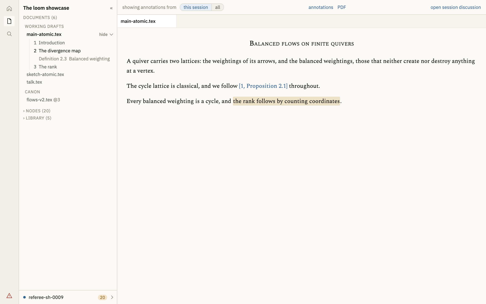

**F1.** Four regions, left to right: a 44px icon rail; the side panel at 232px, collapsible; the workspace. Above the workspace, one 34px global rail.

**F2.** The global rail holds exactly three things: the annotation filter at the left, the **control cluster** for `workspace.current` in the middle, and `open session discussion` at the right. Nothing else is global.

**F3 · The filter.** `showing annotations from [this session | all]`. It governs which annotations are drawn, which is a fact about documents, not about the panel.

**F4 · The control cluster** renders the controls and internal views of `workspace.current`, from the registry. It is drawn once. Two panes each carrying a control row would be the same widgets twice, permanently, for a document only one of which is being read.

**F5 · `open session discussion`** opens the selected session as an item beside. It is gated on `writable()` — the same precondition as the composer — and reads `select a session first` when refused, so the viewer declines in one voice.

### The side panel

**S1 · One scrolling column**, in order: the corpus name with its collapse control; **Documents** with Working Drafts and Canon; **Nodes**; **Library**. No tab strip and no view switcher: every section answers a question asked while reading, so there is nothing to switch between.

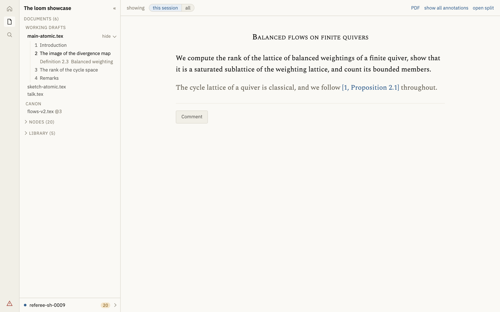

**S2 · The contents are open.** The current document's contents hang under its row, expanded by default, with `hide ⌄` / `show ›` on the row. *Where am I in this* is the question asked most often while reading and should not cost a click.

**S3 · The panel follows `workspace.current`.** The tree belongs to a document, and which document is whichever the focused pane holds. When `current` is not a document, no tree is drawn.

**S4 · A click in the panel opens in the focused pane.** Choosing what to read is not a connection between texts, and splitting must never be a side effect of it.

**S5 · The footer is pinned and states the write target** — a state dot, the session's name, its unread count, a chevron — outside the scroll region, because writes land in the selected session whatever is shown and a reader must never go looking for where their work will go.

**S6 · The footer's tone is `writable()`'s answer.** Empty means writable: no fill, blue dot, name in ink. Anything else means refused: amber fill, hollow ring, name in warning ink. The footer carries **only the state**; the sentence belongs beside the refused control.

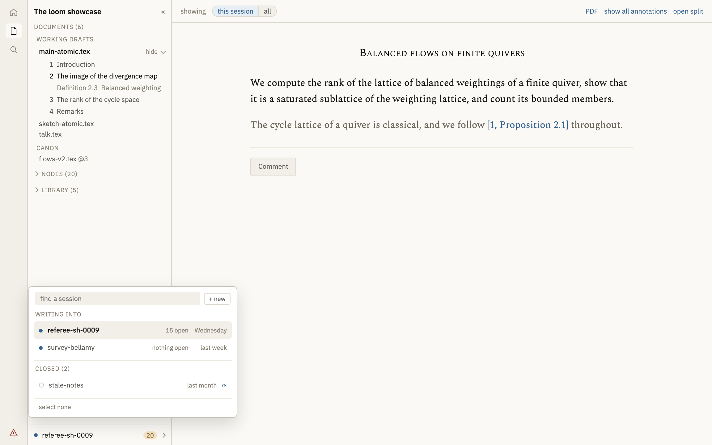

**S7 · The footer opens the picker**, a `Popover` 320px wide — wider than the column, because a session row carries a name, a count and a date and 232px cannot hold three. It contains a find field and `+ new`; `WRITING INTO`, most recently touched first; `CLOSED (n)`, folded, whose rows carry `⟳`; and `select none`.

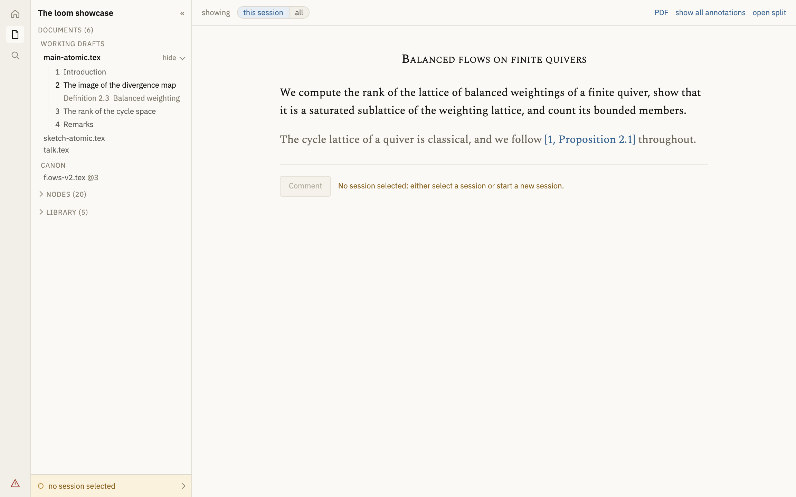

**S8 · `⟳` reopens and selects.** The refusal's wording promises this path and nothing else performs it.

**S9 · Two deletions.** The paragraph explaining what `N new` counts — documentation inside a control is the book's job done badly. The `44 nodes · 1 errors · 4 warnings` line becomes a link on the icon rail's warning glyph.

### A pane


**W1 · Two panes of equal rank.** Both hold the same kinds of item and behave identically; neither is primary. *What I am working on* is a fact about the reader's intent, not a property of a document, and a layout that encodes it asserts something only the reader knows. Default 50/50; the divider is draggable and its ratio remembered.

**W2 · A pane head carries its tab strip and nothing else.** One question: which item am I looking at. Everything about the item is in the global rail.

**W3 · Tabs are a fixed 124px**, so a target does not move as its neighbours open and close. The strip clips and scrolls horizontally on hover, with `scrollbar-gutter: stable` so revealing the bar shifts nothing.

**W4 · A tab's controls sit over it.** `⇄` and `×` are absolutely positioned at the tab's right behind a gradient in the tab's own colour, shown always on the active tab and on hover or keyboard focus for the others. A tab that grew on hover would move the thing the pointer was travelling towards.

**W5 · Controls appear only where they can act.** The single tab of a single pane shows neither: moving it would empty one pane and refill the other with the same thing; closing it would leave nothing.

**W6 · `⇄` moves a tab to the other pane and focus follows it.** With exactly two panes there is one destination, so nothing has to be aimed at and no drop target is drawn. Moving the last item of a pane closes that pane; the other takes the full width.

**W7 · Everything adds; the only question is which pane.**

- a **link inside an item** opens in the other pane — it is a connection between two texts, so both ends survive it;
- a **click in the side panel** opens in the focused pane.

A link's destination is a fact about the pane it lives in, not about what had focus a moment ago.

**W8 · An item is opened once.** Where the target is already open in either pane, that pane takes focus, that tab becomes active, and the view scrolls to the locator. A second tab of one document is one document in two states.

**W9 · Tabs accumulate and the author closes them.** No eviction, no cap. A viewer that closed a reader's tabs by a rule it invented would be guessing which of them mattered.

**W10 · Focus is taken by any interaction with a pane** — clicking its text, scrolling it, or tabbing into it — on `pointerdown` in the capture phase, so that anything relative to the focused pane reads the new value in the same frame.

**W11 · The focused pane is marked** while both are open: a soft lift, a white head, an accent line above it. The unfocused pane's content is **not** dimmed — making a document harder to read in order to say it is not the current one is the wrong trade in a reading tool.

### An item: a document

**D1.** A master or a landmark, rendered in a measured column, with each result's id and state in the left gutter and no tick column in the right. A landmark's step — `landmark @3 (flows-v2)` — stands in its tab, because it is the document's identity rather than a note about it; its path and commit message do not.

**D2 · The gutter is off by default**, behind **Settings ▸ Show ids**: a reader reading the paper does not need every key beside it, and the reader who does is working on the corpus rather than reading it.

**D3 · Controls:** `annotations` — open or close every annotation at its mark, the label naming what the click gives — and `PDF`, a plain link, the cheap escape from a manual latexmk. **`e` and `h` do the same two things from the keyboard and must survive**: they are the affordance for a reader who does not want a control at all.

**D4.** No document-level annotation block and no document-level composer. An annotation is defined by its anchor; one whose anchor is "the whole document" renders at the top and reads as a comment on the title. The capability stays and those annotations are read in the session's discussion.

### An item: a cited work

**K1 · Internal views `Paper · Digest · Info`**, paper first. A work in the Library is a document a reader came to read; the digest is a derived index of it and never what you meant when you clicked the title.

**K2 · Controls:** the internal views, then the tool pair (select, box), then fit-width, zoom and page, then `PDF`.

**K3 · Page and zoom are typed into**, as a desktop viewer's are. Enter commits, Escape restores, out-of-range clamps.

**K4 · The paper is full bleed** inside its pane, with no gutter of its own.

**K5 · A pane holding a work needs roughly 420px** for its cluster to be usable; the divider has a floor.

### An item: a node


**N1 · The statement leads**, at reading size, alone. Its proofs follow, then its annotations in the flow.

**N2 · No right rail.** A node's context is an item you open beside it.

**N3 · Controls:** `context`, `source`, `annotations`.

**N4 · No filter row above the annotations.** Three selects over a single annotation is the system asking a question the reader has not got.

### An item: a node's context

**C1.** What the node is in, what uses it, which discussions touched it, and the local graph — in one column, opened beside the node by `context`.

**C2 · Absences are omitted, not reported.** A node that no document reaches shows no `IN` heading; a node nothing depends on shows no `DEPENDS ON` heading. Nobody asks whether a thing is in nothing.

### An item: a session

**E1 · Internal views `Discussion · What it did`.** Two errands: a session read while working is a conversation beside its subject; a session read on its own is being audited.

**E2 · `Discussion`** is the transcript in a measured column: targets as chips under the title, a date gutter carrying **relative dates**, findings marked by a coloured edge in the flow, attachments as an entry, the composer at the foot. No raw ISO timestamps anywhere.

**E3 · `What it did`** is what happened in a sentence; the still-open findings as a scannable list carrying kind and target; what it touched; what settled; the report.

**E4 · The discussion is scoped by session, not by document.** One selected session is one place you are talking, which is why the control that opens it is global rather than an attachment of a document.

### The hover preview

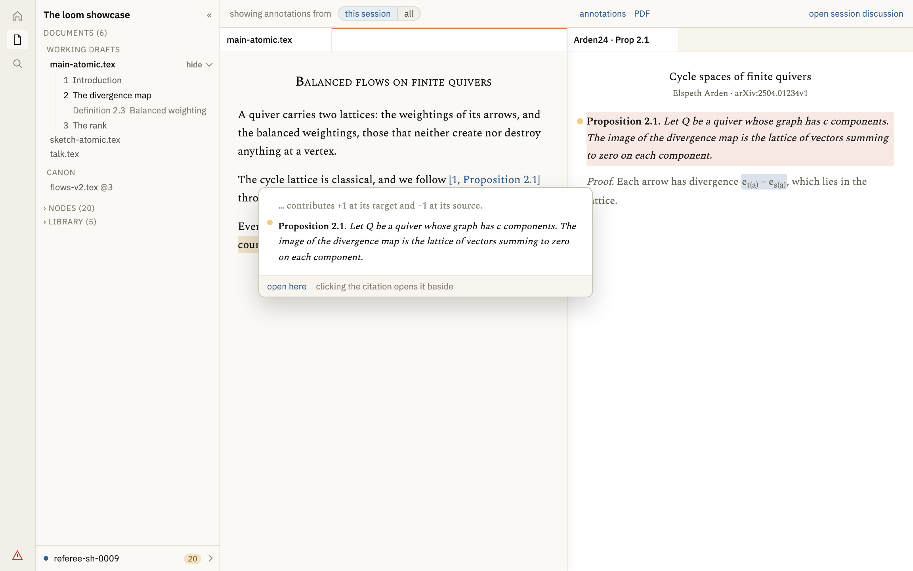

**H1 · Hover**, with a 300ms delay and a 200ms grace to travel into the card, which stays while the pointer is inside it. Escape or any scroll dismisses. Absent on touch. This is P5's cheapest form: the reader has not acted at all.

**H2 · Positioned against the viewport**, never inside a pane. A pane clips, and a card a divider can cut in half is worse than no card.

**H3 · A citation previews the paper, not the transcription of it**, cropped to the statement with two lines either side, scrolling when the statement is longer, the page drawn at 115% of the card's width and running to the rounded edge.

**H4 · The place is marked by a translucent amber dot** at the start of the first line, sized from the mark's own height. A box asserts an extent the reader can already see; the dot marks the one thing they cannot infer.

**H5 · Where the place is not known, nothing opens.** A postnote naming a page opens there; a postnote naming a place that cannot be found opens no card at all; a bare citation names the work, so its front page stands.

**H6 · One action, always drawn: `open here`**, which opens the target in the pane the link is in — the other destination from the one a click gives. It is P5's own remedy, and a remedy revealed only once the pointer is inside the card is one most readers never find.

**H7 · A click on the link opens beside.** `open here` and a click differ only in destination pane.

### A proposed text

**T1.** A suggestion's payload opens as **source**: what is proposed is text to be written into a document, so the thing a reader judges is the source, character for character.

**T2 · The control names the destination** — `rendered latex` / `verbatim code` — not the current state.

**T3 · Rendered means rendered.** Math typeset and `\emph`, `\textit`, `\textbf`, `\texttt` turned into markup; anything unrecognised left exactly as written, so a reader who sees a command still in its braces knows to read the verbatim instead. It is not a LaTeX engine and must not pretend to be one.

**T4.** No copy controls. Selecting text is how anyone copies text.

### Settings

**G1.** Every row is one segmented control; separate pills read as separate settings.

**G2.** The rows are Type, Size, Width, Theme, Format, Comments, **Show ids** (default no), **Discussion Pane** (`Left | Right`, in that order, so the control is a picture of the choice).

---

## Delivery

Three phases. Each gets its own plan-mode plan before implementation; the full code specification belongs there, not here.

### Phase 1 · The side panel

Self-contained, independently valuable, and it builds the shared surface the rest uses. `Popover` extracted; `SessionFooter` added; `SessionPicker` becomes the popover's body; `IconStrip` loses the session section, the explanatory paragraph and the counts line; contents open by default; the annotation filter moves to the existing `ReadingRail`.

Touches: `sessions/`, `shell/IconStrip.svelte`, `shell/ReadingRail.svelte`, and the six existing popover call sites.

### Phase 2 · The workspace

The large one. `Item`, the registry, `Workspace`, `Pane`, `PaneHead`, the global rail with the control cluster, focus and its rules. The five reading routes become item renderers. `Beside`, `Split`, `BesideToggle` and `Tabs` go; the four transitional props go; `ReadingRail` becomes the frame's rail; `?beside` becomes item addresses and the URL takes its new shape.

Ships with: documents, works and sessions as item kinds; tabs; the split; `open here` in the preview.

### Phase 3 · The remaining kinds, and the subtractions

`node` and `context` kinds, retiring the node page's rail and `LocalGraphPanel`'s rail usage. The session's two internal views, retiring the thread route's page. `/library` leaves the workspace and renders the ledger. `LinkPreview` moves onto the registry. Delete `beside=0`, `rail.beside`, `Fragment`'s `content-head`, and the library route's full-height rules.

## What the book owes

The book records decisions, not truth, so the rules above are only half of the change. Nothing here ships until its record does.

### Decision records

- **Reading mode is items in panes.** A reading view is an addressable item with a renderer, controls and optional internal views; routes stop owning chrome. Carry the reason: five routes each invented a rail, so one question was answered in five layouts and no answer could be reused.
- **The panes are of equal rank.** Neither is primary, because *what I am working on* is a fact about the reader's intent rather than a property of a document, and a layout that encodes it asserts something only the reader knows. Record that ranked panes were built and rejected — the argument is the useful part.
- **A link opens beside; a panel click opens here.** With the corollary that nothing replaces, so there is no trail and no back affordance to maintain.
- **An item is opened once**, and an already-open target is revealed rather than duplicated.
- **The session list leaves the side panel**, with what a session is — a chat in its lifecycle, a unit of recorded work in its content — which is why the list is somewhere you go rather than something kept open.
- **A discussion is scoped by session, not by document.** This changes what the pane shows; it is not a rename.

### Chapters

- **15.8** describes the navigation shell and the panel as holding Sessions; **15.2** describes the shells. Both are rewritten around the frame, the workspace and the pinned footer.
- **15.3.1** describes the read view's rail and gutters; **15.3.2** the node page and its context rail, which becomes an item; **15.3.6** the hover preview, which gains `open here`; **15.5.1** the local graph, which moves into the context item.
- **10.4.1** describes links into a cited work: the locator keys stand, but what a link *does* changes.
- **15.7** gains **Show ids** and the renamed **Discussion Pane** row.
- Wherever the book says the split holds the discussion, it now holds an item.

### Specifications

- `?beside` changes from a boolean to a pair of item addresses; `specs/manifest.md` is unaffected, and the work-link keys of Part C — `page`, `span`, `box`, `annot`, `result` — stand unchanged.

### Deviations

One row each for: the panel's contents; the split's second pane; the node page losing its rail; the thread route losing its page; `/library` leaving reading mode.

---

## Known risks and open questions

Recorded so they are decided rather than discovered.

- **Tab width against real names.** 124px holds `Arden24 · Prop 2.1` and truncates `sketch-atomic.tex` at about twelve characters. The number wants choosing against real filenames and citekeys, and it may argue for a work's tab carrying its citekey rather than its title. Whatever is chosen, tabs stay a **fixed** width: the property that matters is that a target does not move.
- **This design is mouse-first, deliberately.** `⇄` and `×` are roughly 12px targets in a 30px head, under the 44px touch guidance, and the preview is hover-only and absent on touch. Acceptable for the two readers this is being built for; it is a choice, not an oversight, and a tablet reader would need a different answer for both.
- **Narrow windows are unspecified.** The panel already collapses. What two panes do below roughly 760px — collapse to one, or scroll — has not been decided. A work needs ~420px for its control cluster, which sets the floor on the divider but not on the window.
- **The URL's encoding is unresolved.** Two item addresses, each of which may carry its own locator keys, must survive round-tripping, and the arrangement must stay linkable — that property exists today and is worth keeping. Probably one opaque encoded parameter rather than nested query strings. A phase-2 decision, but the constraint belongs here.
- **The annotation filter moves twice.** Phase 1 puts it in the existing `ReadingRail`; phase 2 replaces that rail with the frame's. This is deliberate — it keeps phase 1 independently shippable — and phase 2's planner should expect it rather than treat it as a mistake.
- **`LinkPreview` is already `position: fixed` at `z-index: 60`.** H2 is a constraint to preserve, not a change to make.

---

## Behaviour that must survive

Fine-grained behaviour is mostly unwritten here, and mostly that is fine: it lives in code this plan does not touch. What matters is behaviour that is unwritten **and** owned by a component this plan rewrites or moves — that is what a rebuild loses silently.

Where a test already guards a behaviour, the test is its specification and is cited rather than paraphrased; restating it here would be a second copy to drift. Where nothing guards it, a test is owed.

| behaviour | owned by | moved or rewritten in | guarded by |
| --- | --- | --- | --- |
| the divider drags, snaps at the middle, resets on double-click, nudges by key, and collapses | `split/Split.svelte` | phase 2, deleted | test of that name |
| clicking away closes an open annotation box rather than backgrounding it | `fragments/expand.ts` | phase 2 | `inline, a mark expands its comment…` |
| a mark opens its box on click; hovering never does | `fragments/mount.ts` | phase 2 | `a mark opens a box over the page…` |
| selecting text leaves the selection and offers to annotate it | `pdf/Reading.svelte` | phase 2, becomes an item | `selecting text leaves it selected…` |
| changing where comments stand re-wires without re-typesetting | `fragments/Fragment.svelte` | phase 2 | `changing the placement re-wires…` |
| the session view filters annotations rather than the list | `sessions/` | phase 1 | `one selection governs the page…` |
| the Nodes section folds and narrows by what is typed | `shell/IconStrip.svelte` | phase 1 | `the panel has a Nodes section…` |
| the contents bar follows the reader's scroll, marks exactly one entry, and compares on the published element id | `shell/IconStrip.svelte` | phase 1 | **DR-112 only** |
| a scroll *inside* the preview card does not dismiss it | `components/LinkPreview.svelte` | phase 3 | **nothing** |
| the preview waits for its mark to exist before scrolling to it, rather than landing at the top of the page | `pdf/PdfDoc.svelte` | phase 3 | **nothing** |
| renaming a session is immediate, not a round trip | `sessions/SessionPicker.svelte` | phase 1 | **nothing** |

The last four are the ones to watch. The preview's scroll exception in particular was a long bug hunt: the listener is capturing, so it hears the scroll a PDF preview makes when it scrolls its own column to the page it was asked for, and closed the card in the frame it opened. It is a comment in the file and nothing else.

### Behaviour not specified anywhere, and deliberately

- **No animation.** Tabs, panes and the preview appear and disappear without transition. This is a choice: motion in a reading tool draws the eye away from the text, and nothing here needs to explain itself by moving.
- **Hover opens only the preview.** No other surface in reading mode opens on hover; marks, tabs and panel rows all require a click. A surface a pointer summons cannot be read without holding the pointer still.

---

## Tests

Each principle gets assertions that **fail if it is violated**, with measured thresholds where we have them. Names are the e2e test names.

### P1 · Open on the thing itself

- `a document opens on the paper` — the first line of prose begins **≤ 100px** from the top of the content area, and the prose column is **≥ 45%** of the window's area on the first screen.
- `a work opens on the paper` — the rendered page occupies **≥ 70%** of the window.
- `a pane head carries tabs and nothing else` — the head's children are the tab strip alone.
- `no route draws a rail` — no element with a rail or toolbar role exists inside a pane's content.

### P2 · Say it once, in the place that governs it

- `the write target is stated once` — exactly one element in the document names the selected session.
- `annotations are filtered from one control` — exactly one control sets the session view.
- `a document is opened once` — opening an already-open item yields exactly one tab for it, and focuses the pane holding it.
- `a document's controls are drawn once` — with two panes each holding a work, exactly one zoom control exists.
- `the library list has one home` — the route renders no list of works.

### P3 · Claim only what is known

- `an unlocatable citation previews nothing` — hovering `[1, Lemma 5.9]` opens no card.
- `a citation with a page previews that page` — `Corollary 3.2, p.~2` opens at page 2.
- `a node in no document says nothing about it` — no `IN` section renders.
- `a lone tab offers no controls` — one pane, one tab: neither `⇄` nor `×`.
- `the contents tree is absent for a non-document` — focusing a pane holding a work removes the tree.
- `a refusal names its condition` — with no session selected, the composer is disabled and the sentence `writable()` returns is shown.

### P4 · Name the question. One element, one question

- `the global rail holds three things` — the filter, the cluster, the session discussion; nothing else.
- `every control names its target` — each control in the cluster has an accessible name identifying the item it acts on.
- `a control names the destination, not the state` — the annotations toggle reads `show all annotations` while closed; the payload toggle reads `rendered latex` while showing source.
- `the session picker is not in the column` — the panel's scrolling region contains no session list.

### P5 · Following a connection must not cost the thing you followed it from

- `a link opens beside and leaves its source rendered` — after clicking a citation in a pane, that pane still renders the document it was clicked in.
- `a panel click does not split` — with one pane open, clicking a document in the panel leaves one pane.
- `the preview is not clipped` — with the split open, the card's bounding box is not contained by either pane's.
- `open here and a click differ only in pane` — the same item, the same locator, the other destination.
- `focus follows interaction` — scrolling the unfocused pane, then using the cluster, acts on the pane that was scrolled.

### Behaviour carried over

Tests owed because the behaviour exists only as code and its component moves:

- `a scroll inside the preview does not dismiss it` — with a card open on a PDF, the renderer scrolling its own column to the requested page leaves the card open.
- `the preview lands on its mark` — a card opened at a result shows that result, not the top of its page.
- `the contents bar follows the reader` — scrolling a document moves the marked entry in the panel, and exactly one entry is marked.
- `a session rename shows at once` — the new name appears without waiting for a round trip.

### Regression

- the four existing suites pass: `npm run check`, `vitest`, `playwright test`, `test:write`, `test:reading`;
- `docs/work-queue/check.py` passes;
- no test asserts a behaviour this plan retires.

---

# 0.13.3 — the reading views, made to open on what the reader came for, tabs, design sketches

## Context

A revision session on reading mode: the views a reader is in while reading mathematics, which are `/master/[stem]` and `/canon/[stem]` (one component, two routes), `/node/[...key]`, `/library/[citekey]`, `/library`, `/thread/[id]`, and the `?beside=1` split that is a mode of the first three rather than a route of its own. The review page, the graph, the problems page and the home page are out of scope.

The audit measured each view at 1440×900 against the running showcase rather than reading it off the stylesheet. Every one carried the same 296px of left chrome — a 44px icon rail and a 252px side panel — so a fifth of the window was spent before a view drew anything of its own; and beyond that the views differed by a factor of six in how much of the remainder reached the reader. The library work page gave 73.5% of the window to the paper. The node page gave 12% of its own column to the result the reader had navigated to.

Three principles came out of the work and are what the rest of this plan is measured against.

**P1 · Open on the thing itself.** The first screenful belongs to what the reader came for; what the application has to say *about* that thing goes to an edge or behind a tab.

**P2 · Say it once, in the place that governs it.** Where two surfaces state the same fact, one is deleted rather than restyled, and the survivor is whichever one controls the fact.

**P3 · Claim only what is known.** Where the viewer does not know something it shows nothing rather than something plausible, and a marker says the one thing that cannot be inferred and no more.

---

## Part A — the document view (done)

**Before**, six bands stood between the top of the window and the document's own title, totalling 334px: a full-width band whose only content was one right-aligned link; an "About this document" block; a `Comment` button; the source path in faint monospace; and a row of annotation controls beside a count of them.

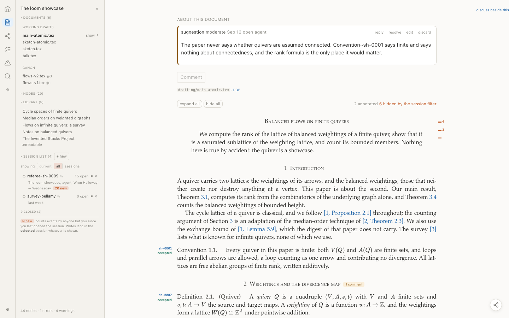

**After**, one 36px rail, flush to the top edge, and the paper begins at y=65. Its share of the first screen goes from 32% to 47%.

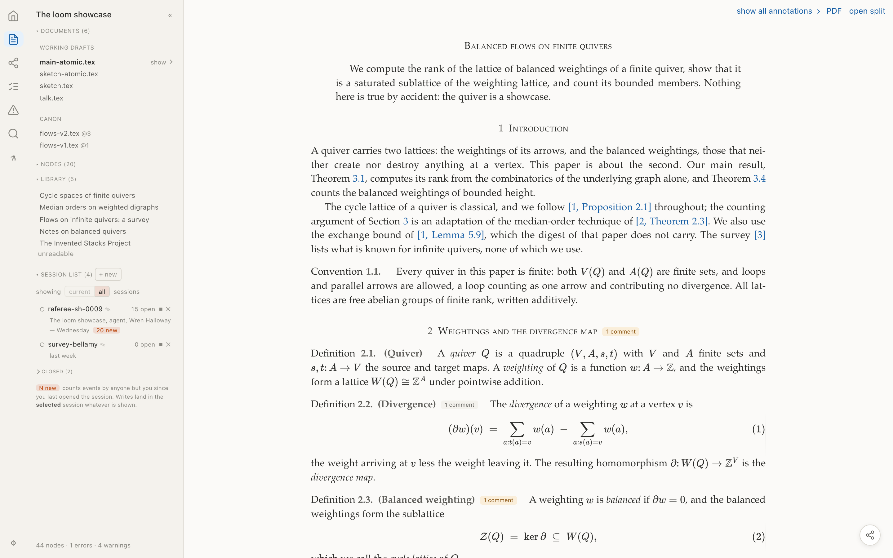

- **The document-level annotation block is gone.** An annotation is defined by its anchor; one whose anchor is "the whole document" renders at the top, which reads as a comment on the title. The capability stays — `loom comment` has always taken a master path — and the discussion pane already lists those annotations, so nothing became unreachable. The `Comment` button went with it: nobody wants to comment on a document, they want to comment on a selection, which is what the annotate chip is for.
- **The counts line is gone.** `6 hidden by the session filter` was the only place a reader learned the filter was concealing something, which is why it could not have been deleted six weeks ago. It can be deleted now because the panel's `showing [current | all] session(s)` toggle states it continuously, in the place that controls it (P2).
- **`show all annotations` / `hide all annotations`** stands in the rail with a drawn chevron, present only when the document has annotations. `e` and `h` still work.
- **The PDF link stays**, as a plain blue link with no icon: it is the cheap escape from a manual latexmk, and it had been styled as punctuation appended to a file path.
- **The left gutter stays.** It holds each result's id and state, which is content, not decoration — but it is now off by default behind **Settings ▸ Show ids**, because a reader reading the paper does not need every key beside it and the reader who does is working on the corpus rather than reading it.

Canon takes the same rail, keeping `landmark @3 (flows-v2)` — a landmark's step is its identity rather than a note about it — and dropping the path and the commit message.

## Part B — the library work view (done)

The tabs, the reading controls and the split control are one line of 38px, where three bands took about 92px.

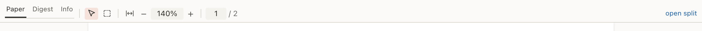

- **The page and the zoom are typed into**, as a desktop viewer's are: `+` twelve times is not how a reader reaches page 12. Enter commits, Escape restores, out-of-range clamps.
- **The work's title left the rail.** It is on the paper, and the entry is behind *Info*.
- **`open split`** is the control's name in every view now, rather than one phrasing per page.

Two faults found by exercising it rather than by reading it: typing `150` over `140` yielded `500%`, because a derived `value=` and a focus handler that rewrote the text as it selected it were both writing the field, so the digits appended and clamped to the maximum; and Escape committed, because leaving a box commits it and cancelling dropped focus. Both now have tests naming the symptom.

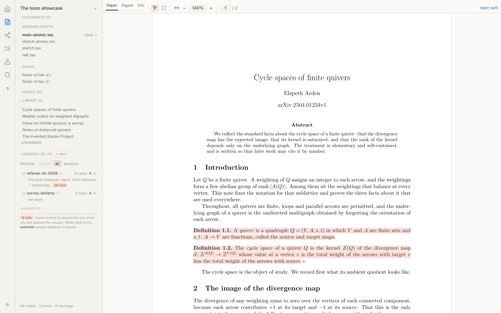

## Part C — what a citation opens (done)

`[1, Proposition 2.1]` names a proposition in a paper, so where a copy is filed the link opens **the paper at that result** rather than loom's transcription of it. The digest node's page renders the record — the LaTeX, the provenance, what depends on it — which is a thing to go and look at and not what the citation names.

This needed a `result=` key in the work-link syntax. The result's rectangles are already in the work's sidecar under that id, so the link resolves with no publisher answering and moves when the result is re-anchored. The link ends `beside=0`: a work opened at a page opens split by default, because the link that form was built for is one written *in a discussion* (plan 0.13 item 6), and a citation came from no discussion and asks for no pane.

Where the reader lands, the place is marked by a translucent amber dot at the start of the first line, sized from the mark's own height so it holds at every zoom.

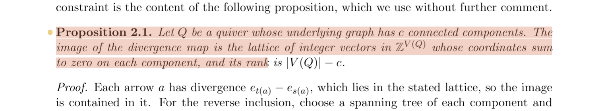

## Part D — the hover preview (done)

Three cases were collapsed into one. A citation with a digest node previews that result, cropped to the statement with two lines either side and scrolling when it is longer. A citation carrying a postnote that names a page — `Corollary 3.2, p.~2` — now opens at page 2, which the viewer had been discarding although the author wrote it down. A citation whose place cannot be found opens **nothing**: `[1, Lemma 5.9]` was opening a card on the front page of Arden24, title and abstract, as though that were the lemma (P3). A bare `\cite{Arden24}` still shows the front page, because that citation names the work rather than a place.

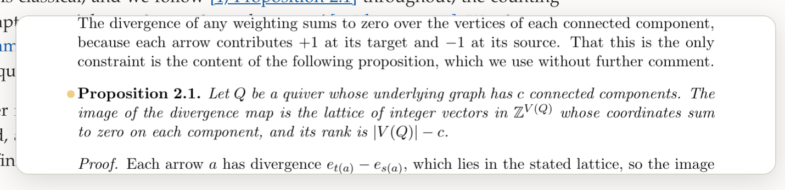

The card is the frame: the page runs to the rounded edge, with no inner border, and the page is drawn at 115% of the card's width, because a paper's margins are not what the reader hovered.

## Part E — a proposed text (done)

A suggestion's payload opens as **source**, because what is proposed is text to be written into a document and the thing a reader judges is the source, character for character. The control names what a click gives — `rendered latex` / `verbatim code` — rather than what is on screen.

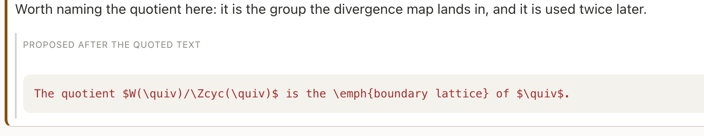
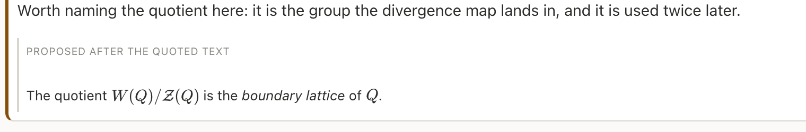

The mangled box had a cause worth recording: `SourceToggle` was mounted *inside* `.payload-head`, which carries `text-transform: uppercase`, so its `<pre>` inherited the uppercasing and its three buttons were squeezed into a flex row with no width, one letter per line. It was also showing the same text the block below already showed, which is why "rendered" was not rendered. The component was the wrong one for the job — the text is already in hand — and the payload now has its own toggle, with `TexProse` typesetting the math and turning `\emph`, `\textit`, `\textbf` and `\texttt` into markup. It is deliberately not a LaTeX engine: anything it does not know is left exactly as written, so a reader who sees a command still in its braces knows to read the verbatim instead.

## Part F — subtractions (done)

- **The annotation tick column**, from both surfaces (DR-220). Beside prose it repeated what the eye already had at the same scroll position, and it was the only layout in the reading view that could not be expressed in CSS — laid out in JavaScript against measured mark positions, recomputed after typesetting, after every write, and from a `ResizeObserver` on every reflow. Beside a page it stood 12px outside the page box and was the stray bar in the left margin of the Library view: a mark on nothing, which the reader took for a rendering fault.
- **`copy` and `copy for chat`**, and `forChat` with them. Selecting the text is how anyone copies text; the second wrapped it in a tag syntax nobody asked for; and three controls where one was wanted is what made the row unreadable when it was narrow.

## The settings panel

Every row is one segmented control rather than a row of pills — the options are the values of a single setting, and separate pills read as separate settings. `Panes` became **Discussion Pane** with `Left | Right` in that order, so the control is a picture of the choice rather than a list of it.

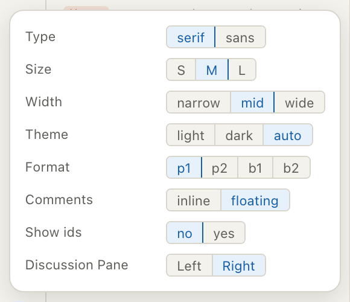

---

## Part G — views 2, 4 and 5 (proposed)

Measured, and unreformed. Demos for each are on the canvas that accompanies this plan; what follows is the recommendation.

### View 2 · the node page

**Today.** Left chrome 296px, content 908px, right rail 236px. Nine stacked bands in the column, of which the statement is one at 856×69 — 12% of the 580px the page uses, with 39% of the column empty below the fold. Five sections in the rail, of which the top one is a 211×241 graph widget with Dot/Box toggles, and two exist to report *absences*: "in no document", "depends on nothing".

**Recommended: a rail that earns its width.** Keep a right rail, narrowed, carrying only facts that exist — what the node is in, what uses it, which discussion touched it — with the local graph behind a disclosure. The statement and its proof take the column; the annotations follow in the flow, without a three-select filter row above a single annotation.

A more radical option was considered and declined: make a node open **the document scrolled to it**, lit with the landing dot, since the node already exists inside the master and rendering it twice in two arrangements is the duplication P2 keeps deleting. It breaks on the case that most needs a page — an atomized node that no live document reaches has no document to open in — so the treatment is worth borrowing when the reader arrives *from* a document, and not worth betting the view on.

### View 4 · the library index

**Today.** A heading and a 238px table in a 900px window: 66% blank, listing the works the side panel is already listing. The page lost its reason to exist when library navigation moved into the panel, and nothing sends a reader here.

**Recommended: retire the page into the panel, and keep a ledger at the route.** The panel's Library section grows a filter, a filed/unfiled dot and a count of results used, and `/library` navigated to deliberately renders a working table: copy filed, digest size, results used here, proposals nobody has vouched for, unresolved findings, with a `needs work` filter. That table earns a page because it answers questions no other surface answers; the *list* does not, because the panel is the list.

### View 5 · the thread

**Today.** 52% of the window blank, a raw ISO timestamp, a `targets:` label with nothing after it, and no indication of what the discussion is about — a discussion is read beside the thing discussed, and on its own page it has no subject.

**Recommended: two arrangements, because there are two errands.** A session read on its own page is being *audited*: what it did in a sentence, the still-open findings as a scannable list carrying kind and target, what it touched, what settled, and the report, with the transcript as a second tab. A session read while working is a *conversation beside its subject*, which is what `open split` already gives. The transcript inside either takes a measured column with relative dates; the ISO timestamp should not survive in any arrangement.

---

## Verification

```
cd arras && npm run check && npx vitest --run && npx playwright test
cd arras && npm run test:write && npm run test:reading
cd ..    && uv run --project loom python docs/work-queue/check.py
```

Parts A–F are done and green: 100 unit, 128 e2e, 12 reading, 6 write. Four tests were rewritten rather than deleted where behaviour changed deliberately, and three were added for behaviour that had none — the citation's destination, the typed page and zoom, and the proposed text's two views.

## Documents

- **DR-220** — the margin tick column is retired from both surfaces, with the reason on each.
- **`docs/deviations.md`** — one row for the tick column.
- **Book 10.4** and **15.3.1/15.6** — corrected where they described the ticks as present.
- Still to record when Part G lands: what a node page is for, what `/library` is for, and that a session has two readings.

---

## Part H — the side panel (proposed)

### What is wrong with it

One 252px column, 17.5% of every window in every view, holding six lists — Documents, Contents, Nodes, Library, the Session list with its view toggle and closed section — plus a paragraph explaining what `N new` counts and a line reading `44 nodes · 1 errors · 4 warnings`.

Measured against the three principles it fails mostly on a fourth, which this revision session added:

**P4 · Name the question. One element, one question.** Every element exists because a reader asks something at that moment. If you cannot name the question in one short sentence, the element has no purpose and goes. If you name two, it is two elements. And if two elements answer the same question, that is P2 and one of them goes. Two riders make it usable: **a place is not an element** — a rail or a panel is a place that groups elements, and the test for a place is whether its elements' questions are asked at the same moment — and **the question must be the reader's, not the system's**, which is what condemns "in no document" and "depends on nothing".

The panel's six sections answer questions asked at six different moments. `Which document do I read?` is asked on arrival and rarely after; `where am I in it?` constantly while reading; `which session am I writing into?` when starting or switching work and never while reading a proof. Stacking them in one column guarantees that whichever is wanted is squeezed by five that are not — which is the overlap fault we treated with `flex: 0 0 auto` rather than curing.

One element is in the wrong place outright. `showing [current | all] session(s)` sits in the session list but answers *what am I looking at?*, not *which session am I in?*. It governs the document, so it belongs in the reading rail.

### Sessions are chats, not projects

There is exactly one quilt, so nothing here is a project selector: the project is the application. Sessions are many per quilt, cheap to make, casually named, closed rather than deleted, one selected at a time, and they own no content — the nodes exist without them. That is the chat model, and the navigation should be the chat model.

They are more than chats in one way that matters: a session scopes what is shown, carries a report and a pipeline, and an agent attaches to one independently of the author. That is why a session read on its own page wants view 5C — *what it did* — rather than a transcript.

The consequence is the design. In a chat application the list is primary because the chat *is* the content; here the document is the content and the session is a mode over it. So the session list is not a thing to keep open. It is a thing to go to.

---

## Part I — the reading workspace (proposed)

### What is wrong with it

The split exists so a reader can see a connection with both its ends on screen, and it can hold exactly one kind of second thing: `?beside` is a boolean and the right pane is always `Discussion`. A document cannot be put beside a draft. Two drafts cannot be compared. And following a citation out of a draft consumes the only pane there is, so the draft is gone — which is why the hover preview had to be built so elaborately in the first place: it is a mechanism for avoiding a navigation whose cost is too high.

Those are one fault seen twice. **The viewer has one place to put a text, so every navigation is a replacement, and a replacement destroys one end of the relation the corpus exists to record.**

**P5 · Following a connection must not cost the thing you followed it from.** The viewer's subject is how texts relate; a relation has two terms; a viewer that holds one term can only show a relation by destroying the other.

The rules this argument produced, the files they touch and the tests that hold them are specified at the head of this document.
