# 0.17 — documents an agent edits, and compare

Two things, settled with the author on 2026-09-26: documents that a person and an agent both edit, living beside the person's own and crossing back by a reviewed adoption; and **compare**, the rail's control for reading two documents against each other, which plan 0.16 drew disabled. Canon folds into the history on the way, since the copy across the border takes `loom draft`'s name and a landmark becomes what canon was. The design is in two studies, which carry the reasoning and every rejected alternative: [ai-drafting-study.md](../reports/ai-drafting-study.md) and [compare-study.md](../reports/compare-study.md). The screenshots of the final compare designs are in [images/0.17/](images/0.17/), with the demo page as `demo.html`.

Work is on the branch `ai-documents`, which 0.16 shares. Each phase is implemented, verified with `scripts/verify full`, recorded under Delivery, and summarised before the next begins, stopping only on a halting question.

## Context

**An agent has nowhere to write a document.** An agent's permission file allows edits under `.loom/sessions/` and `build/` and nowhere else (`loom/src/loom/ai/layout.py:46`), so an agent drafting prose writes it into a session and the person copies it by hand. Nothing records where a copied passage came from, nothing tells the person what an agent changed in a document they also edit, and nothing reviews the change back in. [WQ-24](../work-queue/WQ-24-ai-quilt.md) proposed a nested quilt for it; the study replaces that with a second drafting directory and a reviewed adoption.

**Two documents cannot be read against each other.** Review compares one key's accepted and current text, and the Incoming view one collaborator revision's nodes; nothing compares two documents, a landmark with today, or an agent's copy with its source. 0.16 put **compare** on the rail as a placeholder for this.

**What the code reading found** (2026-09-26), which the design meets:

- `zk-0001-ai` is not an id to the scanner. `is_id_shaped` (`scan/labels.py:25-33`) splits it into `zk` and `0001-ai`, which fails `LOOMLOCAL` (`labels.py:10`), so `\label{zk-0001-ai}` is an alias on a positional key: not versioned, dropped by `recorded_ids` (`history/ledger.py:270`), relabelled by `loom id` (`reshape/ids.py:52`), and a second definition is `loom:duplicate-label` rather than `duplicate-id` (`scan/nodes.py:675`). The allocator already reserves the number, since `\bzk-([0-9A-Z]{4})\b` (`scan/alloc.py:14`) matches inside `zk-0001-ai`.
- `loom history show` and `loom history restore` do not exist: `history` takes a key or `verify` (`cli/history_cmds.py:740-791`).
- The agent permission file is the same bytes for every quilt (`permissions_json`, `ai/layout.py:126-142`, compared byte for byte by `loom doctor`, `doctor.py:459-470`), and its read-only list names `drafting` and `canon` literally (`layout.py:49`) rather than the configured directories.
- The only word diff is loom's (`render/review_compare.py:22-37`); `review-changed` and `review-change-point` are emitted by the renderer (`render/convert.py:489-511`) and arras only styles them.
- The annotation filter has two values, `'current' | 'all'` (`arras/src/lib/sessions/sessions.svelte.ts:23`), persisted in `arras.session-view`, and one predicate decides what is drawn (`visible`, `:99-104`).
- A landmark's fragment carries `id=` on its nodes and no `data-id` or `data-key` (`tests/e2e/workbench.e2e.ts:25`), so compare cannot find its nodes by the attributes a draft carries.
- arras routes a document by its file stem (`arras/src/lib/nav.ts:12-19`, `workspace/item.ts:86`), and loom writes a document's PDF to `build/<stem>/` (`render/manifest.py:284`), so `drafting/main.tex` and `drafting-ai/main.tex` would collide.

## The decisions

From the two studies; the numbers in brackets are their sections.

**Two directories and a border** (ai-drafting §1–§3)

1. **`drafting/` holds the documents only the person edits; `drafting-ai/` those the person and an agent both edit.** Each has its own setting, `[quilt] drafting` and a new `[quilt] drafting_ai` (default `drafting-ai`). Nothing in `drafting-ai/` is reviewed, accepted or published; the scan reads it as a second drafting directory whose documents are live. It is the author's content, not loom's, so it is not under `ai/`.
2. **The border is the permission file:** `Edit` under `drafting-ai/` is the whole of an agent's write access to documents.
3. **A document crosses the border by copying**, and both copies stay live.
4. **Every node a copy defines takes a derived id**, `zk-0001-ai` for `zk-0001`. References to the person's nodes stay plain; the person's documents never cite a derived id. A node the agent writes takes a number from the person's allocator and wears the suffix. A derived id cannot be accepted.
5. **One agent copy per document.** `loom draft DOC --ai NAME` refuses when a copy of `DOC` exists.
6. **The copy is flat**, every inclusion expanded, **and records a base per node**: `zk-0001-ai` began from `zk-0001@3`.

**History, staleness and adoption** (ai-drafting §4–§8)

7. **Identity and history belong to nodes.** No link between two documents is needed; the correspondence is in the ids and the bases.
8. **A copy is stale** when the person's side has moved past a node's base, the text between its nodes, or the preamble. `loom ai drafts` lists each copy and what moved. **Refreshing is adoption in the other direction.**
9. **Adoption never supersedes.** Retiring a document stays the person's separate act.
10. **`loom adopt aidoc.tex` is a new version of the documents it came from** (§8.5, 2): reviewed node by node in Review's Incoming view, with take, keep and a lazy take-all; Finish writes each taken node's text where it lives, merges the changes between nodes, adds new nodes where the copy placed them, and removes deleted ones from the document, their node files staying. **Arras writes in place under Incorporate pull's contract; the command line writes a patch.** Either way the history records each taken node's new version and the copy's bases move forward.
11. **`loom adopt aidoc.tex --as drafting/talk.tex` is a new document** (§8.5, 3): changed and new nodes take fresh ids recorded as forks; unchanged nodes in node files are shared by `\input`; unchanged inline ones are forked; nothing of the person's changes.
12. **A taken node defined in a document other than the copy's source is offered only as a fork**, with the reason (§8.5, 4); moving definitions waits for the node manager.
13. **Open annotations follow the text the person takes**; settled ones and those on kept nodes stay on the copy. **A node the agent deleted is a change like any other**, offered as take or keep (§8.6).
14. **Loom is not an editor.** It writes the person's files only where a change is exact and was reviewed, and it always shows what it is about to write.

**Canon folds into the history** (ai-drafting §10)

15. **Canonizing and stamping become one act:** `loom stamp [DOC] -m "name"` stores the document's flat text in its step, and a named stamp is a landmark. The flat text of any landmark is printed on demand.
16. **The panel's Canon subsection lists landmarks**, the start of the history view of [WQ-25](../work-queue/WQ-25-history-view.md).
17. **`loom init --from paper.tex` and `loom import` stamp the paper as received and draft it at once.**
18. **`draft` loses its everyday job and takes a new one:** starting a document from an old version is `loom history restore`; `draft` is the copy across the border.

**Arras** (ai-drafting §9, compare-study)

19. **The panel's Documents section** lists `drafting-ai/` as a subsection under Working drafts. **Review** never gives a `drafting-ai/` document a tab and never lists a derived id; an adoption appears in the Incoming view.
20. **Compare** is a mode of the two panes, toggled on the rail, comparing their focused items: documents, landmarks and nodes. It ends when either pane's focused tab changes.
21. **Nodes pair by id**: the same id, an agent copy and its source (`zk-0001-ai` and `zk-0001`), or two versions of one key. The prose between nodes is not marked.
22. **With a base — an agent copy against its source, a landmark against today or another landmark, two versions of one key — the marks are a git gutter** (R1): an 18px gutter at each pane's left edge; `−` in red on the lines that differ on the base side and `+` in green on the other, the changed words washed to match; a node only one side has marked on every line and tagged, with a wedge in the other pane where the base places it; `↕` and a grey wedge for a node moved unchanged; Review's amber and `~` for a node changed on both sides since the base.
23. **Without a base — two of the author's documents — only presence and order are marked** (R2): a shared node is one node file and so the same text; a dashed rule and "not in talk.tex" for a node only one side has; a dotted rule and "order differs" on both sides where the order differs.
24. **The annotation filter gains `off`.** Pressing compare chooses it; releasing compare restores what was chosen before; the reader may choose again while comparing.
25. **The rail while comparing:** the filter, then "N differences ‹ ›", then compare, pressed. Stepping brings both panes to the pair at the same height and reads "2 of 6"; keys `[` and `]`. No document names on the rail.
26. **Double-click a node** and its partner comes to the same height in the other pane and flashes; the selection the double-click makes is cleared. Hover lights the partner. The panes never scroll together.

## The adoption analysis

The study requires this plan and the book chapter to carry the analysis that produced decisions 9–12 whole. It is ai-drafting-study §8, unchanged.

### The fact that decides it, and four examples

A node's text lives in exactly one file: inline in a live document, where only that document can show it, or in a node file (`nodes/zk-0001.tex`), which any number of documents can `\input`. "The adopted version becomes the head" means that one file comes to hold the new text; what happens to `draft1.tex` is a question about where each adopted node lives.

- **E1, a revision.** A single-file paper `draft1.tex` defines every node inline. An agent rewrites section 2 in its copy, and the person wants the paper improved.
- **E2, a shared lemma.** `main.tex` and `talk.tex` both `\input nodes/zk-0003.tex`. An agent improves the lemma in its copy of `main`, and the person wants both documents to have it.
- **E3, a derivative.** The person asks for a talk version of the paper. The copy cuts proofs and shortens lemmas, and the person wants a new document with the paper left alone.
- **E4, more than one document defines the nodes.** `part1.tex` and `part2.tex` each define nodes inline. In its copy of `part1`, an agent pulls in a lemma from `part2`: `zk-0040-ai`, where `zk-0040` is inline in `part2`.

### Four candidate resolutions

- **S1, supersede every definer.** The adopted document replaces every file that defined a node it took.
- **S2, supersede only the source.** It replaces `draft1`; nodes defined elsewhere become new ids in it.
- **S3, incorporate into the nodes' homes.** The agent's copy is an incoming revision: each taken node's text goes where that node lives, and the changes between nodes go into `draft1`. No new document.
- **S4, a new independent document.** Changed and new nodes take fresh ids, recorded as forks of their originals; nothing of the person's is touched.

### Each resolution against each example

| | S1 | S2 | S3 | S4 |
|---|---|---|---|---|
| **E1 revision** | works, but the paper is renamed every round (`draft2`, `draft3`, …), the default document moves, and every record naming `draft1` breaks | as S1 | **works**: `draft1` keeps its name, and nothing needs to follow a rename | wrong: a duplicate paper, and its acceptances lost |
| **E2 shared lemma** | **breaks `talk.tex`**: the lemma's file is superseded out from under it | splits the lemma: the paper gets the new text, the talk keeps the old | **works**: the node file changes, and both documents see it | wrong: the improvement goes nowhere |
| **E3 derivative** | **retires the paper** unless the person declines | as S1 | **wrong**: applies the talk's cuts to the paper | **works** |
| **E4 several definers** | **supersedes all of `part2`** to take one lemma | duplicates the lemma under two ids | needs a definition moved between documents | works, as a copy rather than a move |

### Critique

- **S1 and S2 were the first proposal, and nothing favours them.** S3 handles E1 as well and E2 better; S1 and S2 fail E2 and E4 and bring the stale-record defect (fixed by 0.16) into every adoption. They were borrowed from `linearize`, whose output genuinely replaces its inputs; adoption is not that once a node is shared or defined elsewhere. Superseding a document stays what it is today: the person's deliberate act, never a side effect.
- **S3 is how loom already treats a collaborator.** Review's Incoming view already reviews an incoming revision block by block, with comparisons, and Incorporate pull writes it into the person's files under a contract: the exact revision, refused over uncommitted edits, stopped by a conflict before anything changes, committed. An agent is a collaborator and its copy is an incoming revision. S3 also removes the need to copy anything into `drafting/` to be reviewed, so neither a `draft2` nor stripping its labels in place is needed.
- **S3's cost** is that it writes the person's files, a larger exception than stripping labels in a file loom made; its precedent is Incorporate pull, which the author accepted. The text between nodes — prose, order — is merged as text and can conflict, as a pull's source diffs can.
- **S3 is wrong for E3 and S4 is wrong for E1.** They are different intentions — a new version of this, and a new document from this — and loom cannot tell them apart, so the person names which.
- **E4 is a move.** A node can appear in two documents only as a node file, so pulling `part2`'s inline lemma into `part1` moves a definition. That is the node manager's work ([WQ-29](../work-queue/WQ-29-node-manager.md)), not adoption's.

### Final recommendations

1. **Adoption never supersedes.** Retiring `draft1` stays the person's separate, explicit act.
2. **`loom adopt aidoc.tex` is a new version of the documents it came from** (E1, E2). Finish writes each taken node's text to its home, inline in `draft1` or in a node file; merges the changes between nodes into `draft1`; adds new nodes (`zk-0012-ai` as `zk-0012`) where the copy placed them; removes deleted nodes from the document, their node files staying since loom never deletes. Arras writes it in place under Incorporate pull's contract; the command line writes a patch.
3. **`loom adopt aidoc.tex --as drafting/talk.tex` is a new document** (E3). Changed and new nodes take fresh ids recorded as forks; unchanged nodes that live in node files are shared by `\input`, and unchanged inline ones are forked too. Nothing of the person's changes.
4. **A taken node defined in a document other than the copy's source** (E4) is offered only as a fork, with the reason shown; moving definitions waits for the node manager.
5. **Records that name a document follow it across a rename**, whatever else is decided (built in 0.16).

The workflow as the author first posed it, under these recommendations: `loom draft draft1.tex --ai aidoc.tex` copies `draft1.tex` into `drafting-ai/` with every node suffixed; the person and an agent both edit `aidoc.tex`; `loom adopt aidoc.tex` opens the copy's changes in Review's Incoming view; the person takes some nodes and keeps others; Finish writes the taken texts into `draft1.tex` (in arras) or prints the patch (at the command line); `zk-0001@4` is recorded for each taken node; `draft1.tex` keeps its name and acceptances, and `aidoc.tex` stays with its bases moved forward. Had the person wanted a talk rather than a revision, the step is `loom adopt aidoc.tex --as drafting/talk.tex`.

### What adoption does to annotations and deletions

- **Open annotations follow the text the person takes.** An open annotation on a node the person takes moves with it, by an event appended to the log, re-anchored against the adopted text — identical once the suffix is stripped, so its quote and recorded version hold (DR-284-ikmartin). An annotation on a node the person keeps stays on the copy, and settled annotations stay on the copy either way. The adoption review shows each node's open annotations beside its take and keep. The alternatives were weighed and refused: staying on the copy hides an open objection from the text it is about (A3); closing treats a file operation as an answer; copying gives one record two marks (A2).
- **A node the agent deleted is a change like any other**, offered as take or keep. Taken, it leaves the document and its node file stays, since loom never deletes; kept, the person's node stays where it is.

## The final compare design

From compare-study §4–§8.

**With a base** (R1): `main.tex` against its agent copy.

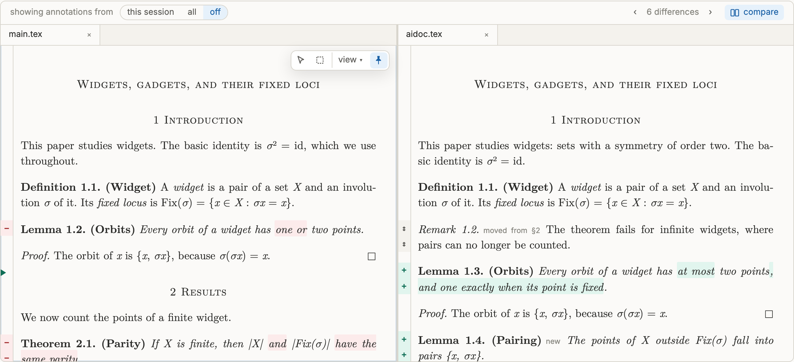
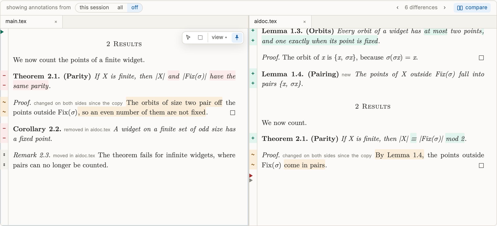
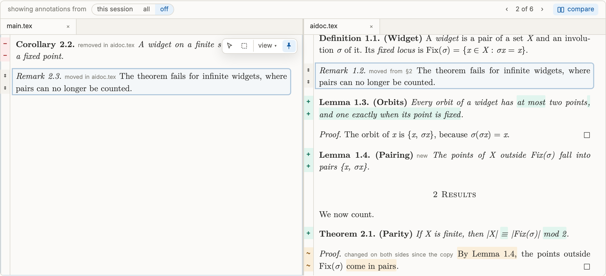
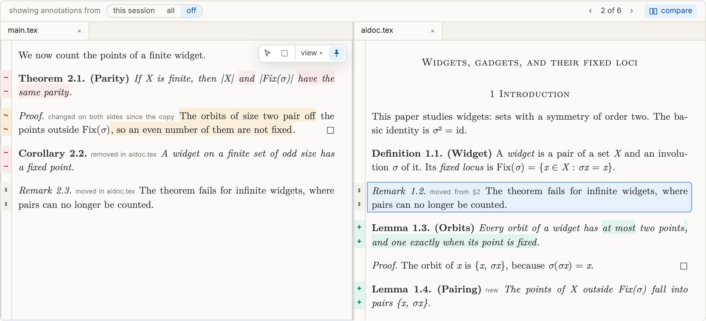
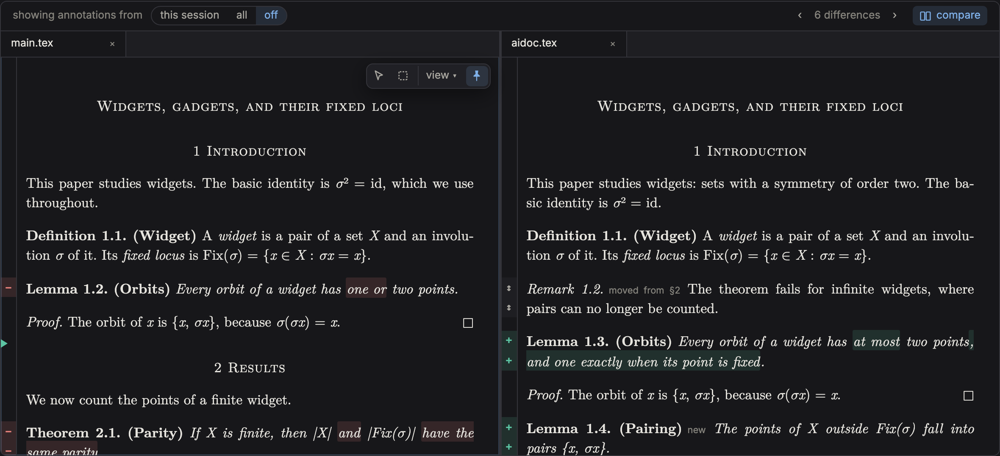
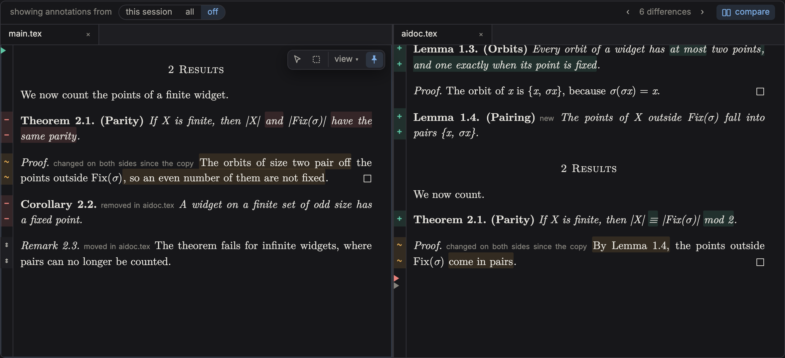

**Without a base** (R2): `main.tex` against `talk.tex`.

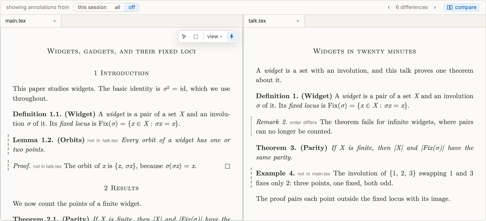
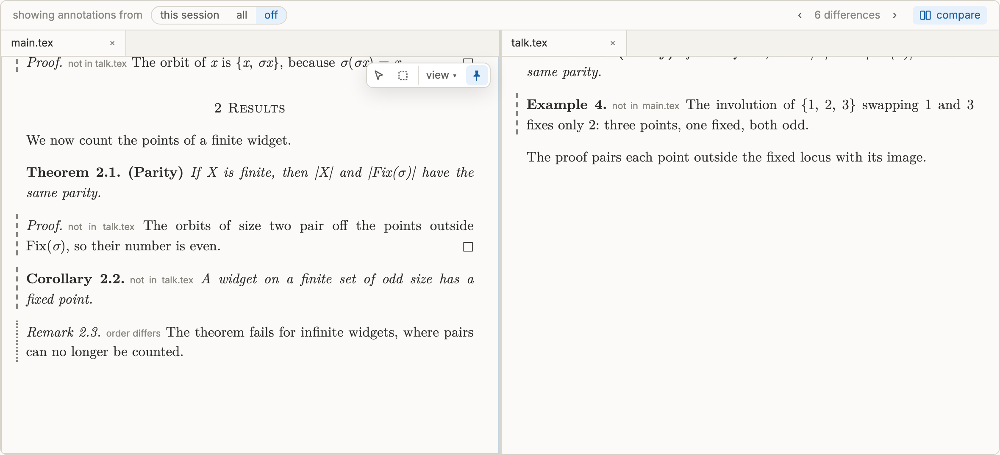
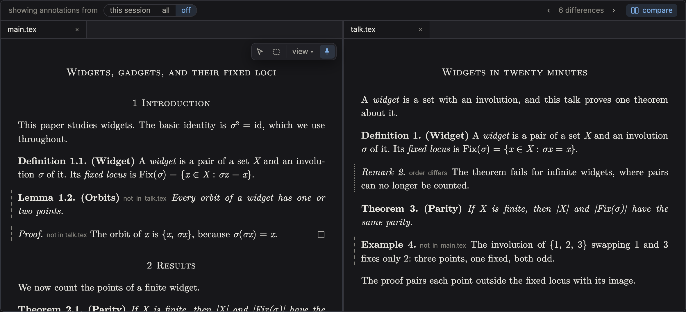
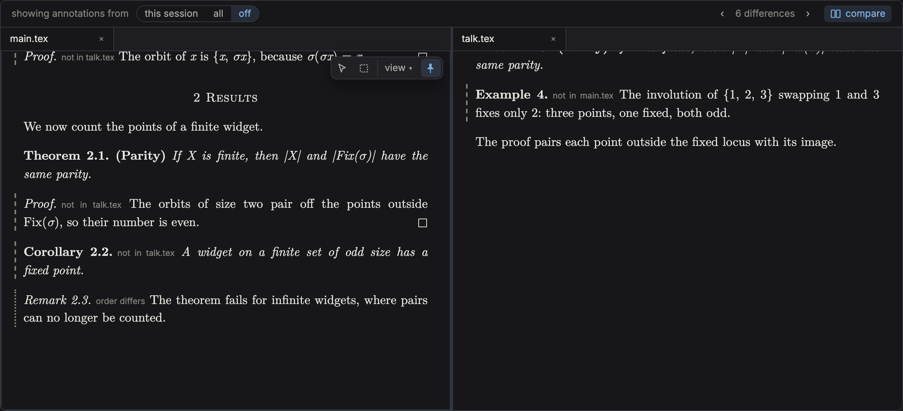

**Annotations and leaving:**

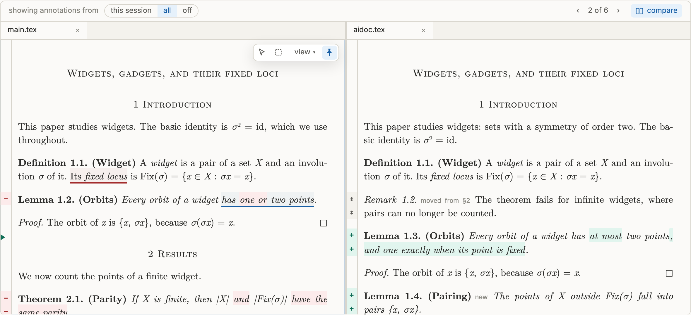
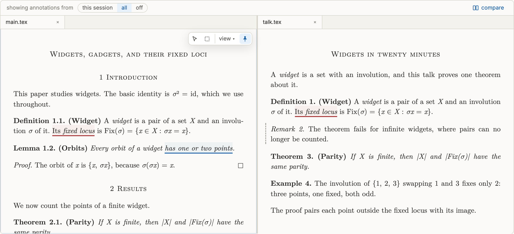

The demo page itself is `images/0.17/demo.html`.

## Settled in planning

Decisions the studies left to the plan. The first six were made here and not yet seen by the author; each is flagged in its phase so it can be overturned before it is built.

- **Derived ids are ids to the scanner, not to the history** *(planning)*. `labels.py` learns the form `<prefix>-<LOOMLOCAL>-ai`: `split_id` returns the plain id it derives from, `is_id_shaped` accepts it, and `NodeRec` (`scan/nodes.py:52-91`) gains `derived_of`. So `duplicate-id` covers derived ids (`_conflicted_ids`, `nodes.py:209-224`), `loom id` leaves them alone (`reshape/ids.py:52`), and references resolve (`scan/edges.py:128-161`). They are never versioned (`history/steps.py:41-47` skips them) and `recorded_ids` leaves them out, since `drafting-ai/` is never stamped or accepted: a derived node's history is its base. The `-ai-01` numbering for several copies (study §2) is not built.
- **One diagnostic for a derived id where it may not be**, `loom:derived-id-in-drafting`: defined or cited by a document in `drafting/`, in `lint()` (`scan/lint.py:61`) beside the reference check.
- **The copy writes a step** *(planning)*. A base must be a text loom can read back, for refreshing, for adoption's merge and for compare's "changed on both sides". So `loom draft DOC --ai NAME` freezes, as a stamp does (`plan_freeze`, `history/steps.py:50-94`), every reached key whose text no step records yet, and writes a `copy` step (`STEP_ACTIONS`, `history/ledger.py:19`) whose `document_text` is the flat source text (`write_step`, `steps.py:125-158`) and whose ledger line maps each derived key to its base `{key, step, hash}`. A copy's current bases are the latest `copy`, `adopt` or `refresh` line naming it, one `History` method beside `current_document`.
- **The command line's adoption finishes in a second step** *(planning)*. A patch that is printed and never applied must not move the bases. `loom adopt DOC [KEY…]` prints the patch (or writes it with `--to`), pinned under `build/adopt/` as `sync patch` pins a pull (`sync.py:279-349`); after `git apply`, `loom adopt --finish DOC` checks the tree holds exactly the patched text (`_expected_blobs`, `sync.py:392-405`) and records the step. Arras's Finish does all three at once and commits once. The patch is `git apply` style, with `a/` and `b/` headers as `sync.incoming_patch` makes, not the `-p0` of `reshape/ids.py:79-84`.
- **`canon/`, `[quilt] canon` and `loom canonize` go** *(planning)*. Once a stamp stores the flat text, the canon file is derived and nothing needs it; the no-backwards-compatibility rule applies, and the fixtures and demos are regenerated. The export `canonize` served, the paper without `\usepackage{loom}`, is `loom history show DOC@STEP --plain` (`to_canon`, `reshape/linearize.py:89-94`).
- **A live document's stem is unique across both directories** *(planning)*. arras routes by stem and loom writes PDFs to `build/<stem>/`, so a new diagnostic `loom:document-stem-taken` reports two live documents with one stem, and `draft --ai` refuses a `NAME` whose stem is taken. Path-based routing would be the larger change and gains nothing the refusal does not.
- **Refreshing is `loom ai refresh DOC`**, an agent command, since it writes only `drafting-ai/`: it takes the person's changes to nodes the copy has not changed and merges the preamble and the prose between nodes; a node changed on both sides since its base is reported and left; the bases of what it took move forward.
- **Adoption is planned by one module**, `loom/src/loom/adopt.py`: it pairs each derived node with its counterpart by stripping the suffix, and classifies each pair from the base as unchanged, changed by the agent, changed by the person (not offered: refreshing takes it), changed by both (offered, shown as a conflict), new, deleted, or defined outside the source's closure (offered as a fork, E4). Arras and the command line both call it.
- **The prose between nodes is merged by `git merge-file`**: base the copy step's document text, ours the source flattened now, theirs the copy, each with every node's body reduced to one placeholder line naming its key, so only prose and order merge; the result is written back with each placeholder restored to the node's own form in the source, inline or `\input`. A conflict is shown and stops Finish.
- **An adoption appears in the Incoming view as a second source.** The manifest gains `adoptions`, built beside `incoming` (`render/incoming.py:64-159`, called from `render/build.py:462-464`) from `adopt.py`'s plan, each change in `IncomingChange`'s shape (`arras/src/lib/manifest/types.ts:123-133`) plus its class, its base and its open annotations. Take and keep live in the page until Finish, which sends the taken keys and the pins to a new write endpoint `adopt-finish` beside `sync-incorporate` (`render/api.py:38, 99-115`).
- **Sync never selects a `drafting-ai/` document**: `_selection` (`sync.py:125-138`) and `update_documents` (`:620-646`) refuse it, and pull renames stay within `drafting/` (`:337`).
- **The permission file takes the quilt.** `permissions_json(quilt)` builds the `Edit` allow list from `AGENT_WRITES` plus the configured `drafting_ai`, and the read-only list from the configured `drafting` rather than the literal; its callers (`vendor_files`, `init_layer`, `upgrade_layer`, `settings_deny_paths`, `ai/layout.py:171-327`) and `check_permissions` (`doctor.py:459-470`) pass it. `loom ai check` stops reporting `drafting-ai/` as an outside write (`ai/check.py:10`).
- **Compare's texts are rendered by loom** at build, since the word diff and the change marks are loom's. Every node element in every fragment — draft, agent copy, landmark — gains `data-pair`, its key with any derived suffix stripped, and `data-hash`, its text's hash; landmarks still carry no `data-key` or `data-id`, so no live wiring reaches them. The manifest gains `compare.pairs`, one entry per pair of differing texts that some comparison can form — each derived node against its counterpart, each key's recorded versions against each other and against today — keyed by the two hashes, each with its two highlighted fragments (`review_compare._render`, `:40-57`), its direction (which side is the base, or both changed, or none) and its macro sets. Identical text pairs are rendered once. A copy's master entry gains `copy_of`, its source document, so a move can be named.
- **Compare composes in arras.** For the two focused items it pairs nodes by `data-pair`, looks up each differing pair by its hashes, and swaps the node's body in each pane for the pair's highlighted rendering, typeset with its own macros (`isolatedMacros`, `Fragment.svelte:187-197`). Presence and order it computes itself, from the order of `data-pair` in the two documents (a longest common subsequence). The gutter is drawn per pane over the pane's scroller (`PaneContext`, `workspace/state.svelte.ts:43-59`).
- **The filter's `off`** is a third value of `sessionView.view` (`sessions.svelte.ts:23`), kept by `load()` (`:34`) and answered by `visible()` (`:99-104`), with a third button in `SessionFilter.svelte`. The value compare displaced is saved in the same record, so a reload while comparing still restores it on leaving; compare itself is in the workspace's URL beside `?beside` (`store.svelte.ts:169-176`).
- **Compare is disabled below the narrow width** (`Workspace.svelte:21`), where only one pane is drawn, and while either focused item is a paper, a session or a node's context; its title says which.
- **Keys `[` and `]`** are bound by the rail while comparing, ignoring modifiers and typing, since `e`, `h` and `s` live in the focused fragment (`Fragment.svelte:293-302`) and a step concerns both panes.
- **Double-click** is handled on each fragment's root while comparing: the node is `closest('[data-pair]')`, a double-click on `mark.annotation` keeps its own meaning (`mount.ts:229-238`), and the flash is `travel.ts`'s `flash` (`:18-21`).

## Phase 0 · Record the plan

This file, the two studies and `docs/plans/images/0.17/`. Nothing else.

## Phase 1 · A second drafting directory, and derived ids (loom, arras's panel)

Decisions 1, 2, 4 and 19's panel half.

- **Config:** `drafting_ai` in `CONFIG_KEYS` and `USER_QUILT_KEYS` (`scan/quilt.py:27, 47`), `QuiltConfig` (`:54`), `from_dict` (`:97`), a `drafting_ai_dir` property (`:135-145`); `loom init`'s template (`cli/quilt.py:22`) and `write_minimal_quilt` (`:206-207`) create the directory.
- **Scan:** documents directly in either directory are live (`scan/scan.py:161`), and `ScanResult` records each master's directory. Only `drafting/` documents count for `loom:no-live-document` (`scan/lint.py:74-86`), acceptance (`records/store.py:88-90`) and Review.
- **Derived ids** as settled above; `loom:derived-id-in-drafting`; `loom:document-stem-taken`.
- **Accept:** explicit keys (`cli/review.py:246-270`), the target filters (`:191-197`, `:227`) and the write API's review-finish (`render/api.py:144-151`) refuse derived ids; `_acceptance_master` (`cli/review.py:68-75`) never picks a `drafting-ai/` document.
- **Sync:** never selects `drafting-ai/`.
- **Permissions:** as settled above; `CLAUDE_LINE` (`ai/layout.py:60`) names both places an agent writes.
- **Manifest:** a master's `directory` (`render/manifest.py:277-283`) and a node's `derived_of` (`:300-323`); `docs/specs/manifest.md` §2a and §3.
- **Arras:** the Documents section groups masters by `directory`, `drafting-ai/` a subsection under Working drafts (`shell/IconStrip.svelte:170-175`); Review gives no tab to a `drafting-ai/` document and lists no derived id.
- **Book:** 3 (the two directories, derived ids), 4.1 (layout and the key; 4.1.2's exclusion of `ai/` stated beside `drafting-ai/`), 5 (the two diagnostics), 7.3 (a derived id cannot be accepted), 11 (the border), 15 (the panel). A decision record for §1 and one for §2.
- **Tests:** `tests/unit/scan/test_labels_hashing.py` (a derived id is id-shaped and names its plain id), `test_conflicts.py` (two definitions of a derived id are `duplicate-id`), `test_lint.py` (the two diagnostics), `test_ids.py` (the allocator skips a number a derived id holds; `loom id` leaves a derived label), `records/test_review_commands.py` (accept refuses), `test_sync.py` (never selects `drafting-ai/`), `test_ai_layer.py` (the allow list holds the configured `drafting-ai/`, and a renamed one; the read-only list the configured `drafting/`), `test_doctor.py`, `test_init.py`; `tests/e2e/workbench.e2e.ts` (the subsection).

## Phase 2 · The copy, and keeping it fresh (loom)

Decisions 3, 5, 6 and 8. *Planning decisions to confirm: the copy writes a step; refreshing is `loom ai refresh`.*

- **`loom draft DOC --ai NAME`** (`cli/history_cmds.py:62-140`, rewritten): author-only; refuses a `DOC` that is not a live `drafting/` document, a `NAME` that exists or whose stem is taken, and a `DOC` that already has a copy, naming it. Flattens with `flatten` (`reshape/linearize.py:31-76`), derives every defined id and rewrites the references to them (`fork`'s `_relabel` and `_rewrite_refs`, `reshape/fork.py:63-78`, over the whole document), writes `drafting-ai/NAME`, and writes the `copy` step. The canon-to-drafting job goes (phase 4 replaces it).
- **Bases:** the `History` method; `loom history verify` checks `copy`, `adopt` and `refresh` lines (`history/checks.py:145-175`); `_detail` prints them (`cli/history_cmds.py:794-813`).
- **`loom ai drafts`** (`cli/ai.py`): each copy, its source, and when stale what moved on the person's side — nodes, the prose between them, the preamble — against the copy step's document text. `--json`. An agent command (`AGENT_COMMANDS`, `ai/layout.py:31-45`).
- **`loom ai refresh DOC`**, as settled above. An agent command.
- **The orientation** (`assets/ai/orientation.md` §2 `:15-32`, §5 `:52-95`): `drafting-ai/` in the layout, as a path read from the quilt; check `loom ai drafts` before a large instruction and suggest refreshing a stale copy. `assets/ai/rules.md` and the draft mode (`assets/ai/modes/draft.md`).
- **Book:** 4 (the copy; one copy per document), 7 (bases; staleness), 11 (the agent's commands and the orientation), 12 (generated). The worked example of ai-drafting §6, the copy half.
- **Tests:** `tests/unit/history/test_commands.py` — the copy is flat, every id derived and every reference to it rewritten, references to uncopied nodes plain; the step freezes the unrecorded keys and records every base; a second copy is refused; a taken stem is refused. `ai drafts` fresh, then stale after an edit to a node, to the prose, to the preamble. `ai refresh` takes a person's change, leaves a node changed on both sides, moves the bases. `test_json_output.py`'s table; `test_ai_layer.py` (both are agent commands, `draft` is not).

## Phase 3 · Adoption (loom and arras)

Decisions 9–14. *Planning decision to confirm: the command line finishes in a second step.*

- **`adopt.py`** as settled above, with unit tests over the four examples E1–E4.
- **`loom adopt DOC [KEY…]`**: prints the patch of the taken keys (all offered keys when none is named), `--to FILE`, `--json`; `loom adopt --finish DOC` records. Refuses a `DOC` outside `drafting-ai/`, a patch whose affected files have uncommitted edits, and one that does not apply (`git apply --check`).
- **`loom adopt DOC --as drafting/NEW.tex`**: writes the new document and the forks (`plan_fork`, `reshape/fork.py:81-162`), refusing an existing path.
- **History:** an `adopt` step freezing each taken key's new version, its line naming the copy, the taken and kept keys, and the moved bases.
- **Annotations:** open annotations on taken nodes re-targeted by an event appended to the log.
- **The Incoming view** (`arras/src/routes/review/+page.svelte:177-216`): each copy with offered changes is a source beside a collaborator's pull, its changes in the same pair layout (`.incoming-pair`), each with take and keep, its class (a conflict drawn as one), its open annotations, and a take-all; Finish shows the exact change first, then calls `adopt-finish`, and reports the commit as `incorporation-result` does. An E4 node offers only "take as a fork", with the reason.
- **Book:** 7 (adoption and its records), 10 (the write endpoint), 12, 15 (the Incoming view's second source), and the worked examples: §8.1's four cases with what each mode does to them, and §6 followed from copy to adoption. Decision records for §7 and §8.5; deviations rows.
- **Tests:** `adopt.py` over E1–E4 and every class; the CLI patch applies with `git apply` and `--finish` records only a tree that holds it; `--as` forks; a conflict in the prose stops Finish before any file changes; annotations follow a taken node and stay on a kept one; the write endpoint refuses stale pins (`tests/unit/render/test_write_api.py`); `tests/e2e/review.e2e.ts` for the adoption source, take, keep, take-all and Finish.

## Phase 4 · Canon folds into the history (loom, arras's panel)

Decisions 15–18. *Planning decision to confirm: `canon/`, its key and `canonize` go.*

- **`loom stamp [DOC] -m NAME`** stores the flat text (`cli/history_cmds.py:336-338` passes `document_text`); a named stamp is a landmark.
- **`loom history show DOC@STEP [--plain]`** prints a landmark's text; **`loom history restore DOC@STEP --to drafting/NEW.tex`** writes it as a new document, author-only, refusing an existing path, and records a `restore` line (`history/versions.py:25-68`, `History.resolve_step`, `ledger.py:103-111`).
- **`loom init --from` and `loom import`** (`cli/quilt.py:275-383`, `cli/paper.py:114-193`) draft at once, the work `plan_draft` does today (`reshape/canon.py:88-137`).
- **Removed:** `loom canonize` and its aliases (`cli/history_cmds.py:146-296`), `[quilt] canon` (`scan/quilt.py:27`), `canon/` from `init` (`cli/quilt.py:206-207`) and the scan's skip list (`scan/scan.py:97-99`).
- **Manifest:** landmark entries built from stamp steps (`render/canon.py:184`, `render/build.py:413-426`), keeping `CanonDoc`'s shape so arras's landmark item is unchanged; `docs/specs/manifest.md` §2.
- **Arras:** the panel's Canon subsection is headed Landmarks (`shell/IconStrip.svelte:176-181`).
- **Book:** 4 (no `canon/`), 7 (a landmark is a named stamp), 12, and 13's account of canon wherever it names the directory. A decision record for §10; WQ-25 carries the full history view.
- **Tests:** `tests/unit/history/test_commands.py` — a stamp stores the text; `show` and `--plain`; `restore` writes and refuses an existing path; `init --from` and `import` leave a drafted document with ids and a landmark of the original. `tests/e2e/workbench.e2e.ts` (the Landmarks subsection; a landmark still carries no `data-key`).

## Phase 5 · Compare (loom and arras)

Decisions 20–26, as settled above.

- **loom:** `data-pair` and `data-hash` on every node element (`render/fragments.py:358-422`); `compare.pairs` built at render; a copy's `copy_of`; the dialect whitelist (`docs/specs/tools/validate-dialect.py:21-27`, `tests/tools/validate_dialect.py`); `docs/specs/manifest.md`.
- **The filter:** `off`, its button, and the displaced value saved with it.
- **The rail:** `GlobalRail.svelte` draws the counter and compare, enabled as settled; the placeholder's `0.17` tag and title go.
- **The comparison:** pairing, the swapped highlighted bodies, the R1 gutter and wedges, the R2 rules and tags, moves and order, hover, double-click, stepping, `[` and `]`, and ending when a focused tab changes.
- **Book:** 15 — a section for compare (both kinds, with the screenshots), 15.2.5 (the rail's compare is live), the filter's `off` wherever the filter is described, 15.10 (the counter's and the gutter's accessible names). A decision record for compare's two kinds of marks and one for the filter's `off`; deviations rows.
- **Tests:** unit — pairing, presence, the longest-common-subsequence order marks, direction from a pair entry, the filter's three values and `visible()` under `off` (`tests/unit/sessions.spec.ts`); e2e in `tests/e2e/workspace.e2e.ts` — the rail's compare enabled with two comparable items and disabled otherwise with its reason (replacing `:119-135`), the filter goes to `off` and comes back, stepping brings both panes to one height, double-click finds the partner, a changed tab ends compare, narrow disables it (`:482-506`); `tests/e2e/panel.e2e.ts:219-249` for the third filter value; a based and an unbased comparison of the fixture, with a landmark against today.

## Phase 6 · Figures, fixtures and the finish

- Re-shoot the book's figures (`tests/shots/shots.spec.ts`, `report.spec.ts`, `shots-minimal/floor.spec.ts`) and after-screenshots of the built compare, both kinds, beside the design's in `docs/plans/images/0.17/`, compared against them.
- Regenerate the quilts, the conformance fixture (`docs/specs/tools/refresh-fixture.sh`) and the demos; rebuild and re-vendor arras.
- The work queue: WQ-24 closes into this plan; WQ-29's fork and merge and WQ-33's apply step are recorded as absorbed; WQ-25 inherits the landmarks; a new item for several simultaneous copies (`-ai-01`), triggered by a person wanting two agent versions side by side.
- `scripts/verify full`.

## What the book owes

- **3** the two directories; derived ids.
- **4** the layout and `drafting_ai`; the copy; no `canon/`.
- **5** `loom:derived-id-in-drafting`, `loom:document-stem-taken`.
- **7** derived ids are never accepted; bases and staleness; adoption and its records; a landmark is a named stamp.
- **10** the `adopt-finish` endpoint.
- **11** the border; the agent's new commands; the orientation.
- **12** `draft --ai`, `adopt`, `ai drafts`, `ai refresh`, `history show`, `history restore`; `canonize` gone.
- **15** the panel's two subsections and Landmarks; the Incoming view's adoption source; compare; the filter's `off`.
- The worked examples the study requires: §6's scenario followed from copy to adoption, and §8.1's four cases with what each mode does.
- Decision records for ai-drafting §1, §2, §7, §8.5 and §10, and for compare's marks and the filter's `off`; deviations rows for each `[decided]` they change.

## Behaviour that must survive

- A quilt with no `drafting-ai/` behaves exactly as today, apart from the removal of `canon/`.
- Every existing acceptance stays as fresh as it is.
- Overleaf sees the same documents; nothing in `drafting-ai/` is ever published.
- A collaborator's pull is reviewed and incorporated exactly as today.
- An agent still cannot write in `drafting/`, accept, stamp or adopt.
- Every landmark in the regenerated fixtures still opens, with its own macros, and carries no live wiring.
- The annotation filter's `this session` and `all` behave as today.

## Risks

- **The prose merge** is the least tested part: a spine whose nodes the copy both reordered and edited may conflict often. A conflict stops Finish, so the failure is a refusal, never a wrong write.
- **Compare's pair count** grows with every key's versions: each key contributes a fragment pair per pair of distinct recorded texts. Identical pairs render once, and `demos/relloc` (57 keys, five referee runs) is the measure; if it is too many, pairs between two old versions are rendered on demand by the serving publisher instead.
- **Removing `canon/`** touches every fixture and demo; they are regenerated rather than migrated.
- **The stem rule** refuses a name a person might want (`drafting-ai/main.tex` beside `drafting/main.tex`); the refusal names the collision and the fix.

## Verification

After each phase `scripts/verify full`, plus: phase 2, a copy of the demo quilt's `main.tex` edited on both sides reports stale as expected; phase 3, the §6 scenario end to end on a scratch copy of the demo quilt, once in arras and once with `git apply` and `--finish`, and `loom lint` clean after; phase 4, `loom init --from` on `tests/fixtures/relloc`; phase 5, the built compare screenshotted at 1440×900 in both kinds and both themes and compared with `docs/plans/images/0.17/`.

## Delivery

*(filled in as each phase lands)*
