# 0.13, the reading layer: what was built, and what reading with it found

This report is for the author. It says what plan 0.13 built, what a reading study of it found, and what is left — not what was intended. Written 2026-09-21, at the end of the plan and before the next one.

**Scope, stated first.** Three iterations ran, on papers of three characters: a TeX-derived arXiv PDF (Linares–Panthee–Robert–Tzvetkov, `arXiv:1809.02027v1`, 16pp, pdfTeX), an OCR'd journal scan (Ekedahl–van der Geer 1988, 15pp, PageGenie from TIF), and a paper with no source at all (Atiyah–Bott 1984, 28pp, Acrobat Capture). The first iteration ran the full seven steps including the attached agent and the cold resume; the second and third were narrowed to the questions the first had not answered, which is what §17's stopping rule asks for. Both roles were played by agents: the plan's executor as the simulated author, driving the viewer through `arras/scripts/drive.mjs`, and a Sonnet agent attached to the same session.

**How to read this.** **Verified** means reproduced here, with the command or the file named. **Reported** means an agent's word, marked as such. A fault carries **F-n**, the severity it was judged at, and the test that now covers it. The fault log is `scratchpad/study/faults.md` in the session that produced it; everything load-bearing from it is reproduced below.

**What this study cannot tell you** is in §17 and stands: with no person in it, it shows that the features work and are legible, and nothing about whether any of it is *pleasant*. The closing section is the part that waits on you.

---

## 1. The verdict first

| question §17 asks | answer | evidence |
|---|---|---|
| How many selections mapped to text? | **19 of 20** on the worst text layer in the study | twenty drags across the viewer's own text layer, p.3 of the 1988 scan |
| How many fell back to a box? | **1 of 20**, and correctly | the one drag spanning a running header, the folio `97`, and a proposition's first words |
| Did any land visibly wrong? | **none** | every text anchor's offsets re-read the selected string from the committed page text |
| Did an anchor survive a re-render? | **yes** | all three anchors survived a stop, a rebuild and a resume across a date boundary |
| Did dispatch deliver, parked and busy? | **yes, both** | parked: cursor advanced within seconds of the send; busy: the message waited and was read on the next park |
| Did the changed-annotation block save calls? | **yes** — *reported* | the agent says it would otherwise have run `loom ai findings --json` to learn what "two notes on page 4" meant |
| Did the agent find reading and annotating unprompted? | **yes** | from `loom ai orient` alone it used `refs page`, `refs propose`, a page-anchored note and the suggestion route |
| Did it act on a refusal in the same turn? | **yes, on three of four** | the fourth named no next step; fixed (F8) |

**Thirteen faults, twelve fixed.** Three were major: a filed paper had no way into the reader, an open annotation box never showed the write it had just made, and the identity guard failed on the name loom's own documents ask an agent to use. None of the three was visible from the code; each took a minute of use.

---

## 2. The twelve decisions, as designed against as built

| # | decided | as built |
|---|---|---|
| 1 | The PDF invariant | Built, then **relaxed** during Part A: source-only works are legal and report `info`, not `warning` (DR-198). The relaxation is the deviation this plan is least sure of and the one the queue should revisit. |
| 2 | One anchor type, basis text or box, quads per line, geometry in a sidecar | Built as designed, and **extended to annotations** (DR-209) — which the plan named in §1 and gave no part. Quads are recorded only for a box; a text anchor derives them at build time. |
| 3 | The discussion model: six kinds, one stream | Kinds and the stream built. **Not built**: the live `<div class="annot">` card in a message body, the by-position toggle, the three tiers with events inline, the command log as an alternate rendering. Left with reasons in §6. |
| 3a | Sessions with a stable id and a mutable title | Built entire, including the migration, the tombstone and the CLI-only purge. |
| 4 | Reading annotations in one log | Built. **Deviated**: bodies stay in the manifest rather than the per-work sidecar (DR-209, your decision of 2026-09-21); only geometry went beside it. |
| 5 | A dumb renderer serving four contexts | Built, and all four mount it — the fourth, the hover card, was added after the audit found it did not. **Link following** was added at the same time. |
| 6 | No new route; one locator syntax, two prefixes | Built (DR-210). `refs locate`'s `open:` line named only the page until the study caught it (F5). |
| 7 | The split as a mode of a route | Built on all four routes. The Library View was the last, and only because the audit looked. |
| 8 | Syncing: travel, the flash, the notice | Built. The margin tick was added after the audit; the "nothing to travel to" notice is 1.5s as decided. |
| 9 | Three placements, a click opens, boxes background | Built. `inline` is now the Authoring View's alone in fact and not only in prose. |
| 10 | Loom is a mailbox | Built. Nothing launches a model; the one process loom spawns is LaTeX. |
| 11 | Authorship declared, not sniffed | Built — and **wrong in two places until the study**: the guard failed on `Referee (Agent)` (F6), and the API attributed browser writes to the server's shell (F4). |
| 12 | The static build with no PDFs | Built: a work with no copy on this machine gets no sidecar and the viewer says so, which iteration 2 exercised by accident (F12). |

---

## 3. The fault log

Severity is as judged at the time. "Covered by" names the test that now fails if it returns.

### Iteration 1 — a TeX-derived arXiv PDF

| | fault | sev | fix | covered by |
|---|---|---|---|---|
| F1 | `refs scan` credited a dropped PDF to `\bibitem` text | minor | counted separately: "read from the document itself" | — |
| F2 | **A filed paper with no digest had no way into the reader.** The "Read the paper" row was gated on the pages the work's *results* sit on, so a newly filed paper offered only a raw `paper.pdf` link that leaves loom | **major** | a PDF can always be opened, at page 1 when nothing is anchored | `queue.e2e.ts` · "a filed paper can be opened whether or not anything is anchored to it yet" |
| F3 | **An annotation box never showed the write it fired.** `openAt` mounted the card with a snapshot; resolving left the box saying `open`, so the reader clicked twice and the log took two `resolved` events | **major** | the controller re-reads every open box when the manifest changes, keeping it where it is | `reading.e2e.ts` · "a box shows the write it fired" |
| F4 | The API attributed a browser write to the shell `loom serve` was started in — every note recorded `author: "agent"` | moderate | the API asks who is writing and never sniffs; the marker stays the CLI's safety net | `test_refs_layer.py` · "a browser write is the person at the browser" |
| F5 | `refs locate` kept its own mapping: no `basis`, no offsets, and an `open:` line naming only the page | moderate | routed through `anchor_on_page`; the link carries `span=` or `box=` | `test_refs_layer.py` · "refs locate names the place" |
| F6 | **The identity guard failed on the parenthesised name loom's own documents ask for.** `is_agent("Referee (Agent)")` was False, so a parked agent showed as `⟨person⟩` — and `loom refs unreadable --author "Referee (Agent)"` **exited 0**, with the markers unset, against one of the five verbs reserved for the author | **major** | words matched however punctuated | `test_refs_layer.py` · "a declared agent is an agent however its name is punctuated" and "the author's verbs refuse a declared agent whatever shell it is in" |
| F7 | A working agent read as absent, and the composer told the author to go and start a watcher | moderate | three states, not two: never here, here and busy, listening | `test_refs_layer.py` · "a reader who is working is not a reader who was never here" |
| F8 | A changed-annotation block handed an agent the work's identifier, which no `refs` command accepts | moderate | the citekey and page travel with every change; three refusals now name `loom refs coverage` | `test_refs_layer.py` · "a change carries an address its reader can use" |
| F9 | `refs propose` is the one write verb with no `--author`/`--as` | minor | **not fixed** — proposals record origin by session, which is defensible, but it is the only verb that does not take a name | — |
| F10 | A verb that needs no panel could not show why it was refused: `resolve`'s refusal rendered only inside a panel it never opens | moderate | shown at the row when there is no panel | `queue.e2e.ts` · "a verb that needs no panel still shows why it was refused" |
| F11 | An invalid `config.toml` was reported as "not inside a quilt" | minor | a file that will not parse says so and names the error | — |

### Iteration 2 — an OCR'd journal scan

| | fault | sev | fix | covered by |
|---|---|---|---|---|
| F12 | **A document that states no identifier was unreachable from its own entry.** Filed under its content hash (`file/04232c5d…`); the entry states no identifier, so `primary()` answered with the *synthetic* one and the manifest looked under `work/51661974`. The reader said **"No copy of this paper on this machine"** about a paper in the store. Every scan and most pre-arXiv literature is in this state | **major** | whatever files a document records where it went (`loom-file`); `work_dir` honours it and the manifest asks `work_dir` | `test_scan.py` · "a document that states no identifier is reachable from its own entry" |

### Iteration 3 — a paper with no source at all

| | fault | sev | fix | covered by |
|---|---|---|---|---|
| F13 | The build report's blocked column collided with its reason for a long citekey: `Atiyah1984Themomentmapanno source to extract from` | minor | padded and always separated | — |

Iteration 3 produced no fault worth fixing beyond a cosmetic one, which is §17's stopping condition, so the loop stopped at three.

---

## 4. What the study found that was *right*

Worth recording, because a fault log reads as though nothing worked.

- **Recording never fails.** Twenty drags across the hardest text layer in the study produced nineteen text anchors and one box, and no refusal. The one box was a selection spanning a running header and a folio — where the committed page text has no offsets to give, and geometry is the honest record.
- **The page table is per page.** The 1984 scan's pages are 535×808, 533×806 and 540×810; the sidecar recorded each page it anchored on with its own box, which is what the design insisted on and what a fixed transform would have got wrong.
- **The cold resume lost nothing.** Round markers, the inbox cursor and all three anchors survived a stop, a rebuild and a resume with the clock moved to the next day; `refs locate` correctly printed no `open:` line while the server was down, because it checks the pid rather than trusting `serve.json`.
- **A Sonnet agent discovered the whole workflow from `loom ai orient`** — `refs page`, a page-anchored note, `refs propose`, and the suggestion route when `refs verify` refused it — without being told any command name.
- **The refusal on `refs verify` was actionable in the same turn.** It said why, and the agent took the route DR-185 intends instead of asking a human.

---

## 5. Figures

Screenshots of what was built, in `docs/reports/images/0.13-reading-layer/`, each with a text cartoon beside it so the report survives a moved image. The design mockups in `docs/long-prompts/images/` are drawings of what was *intended* and are not overwritten.

### The split view

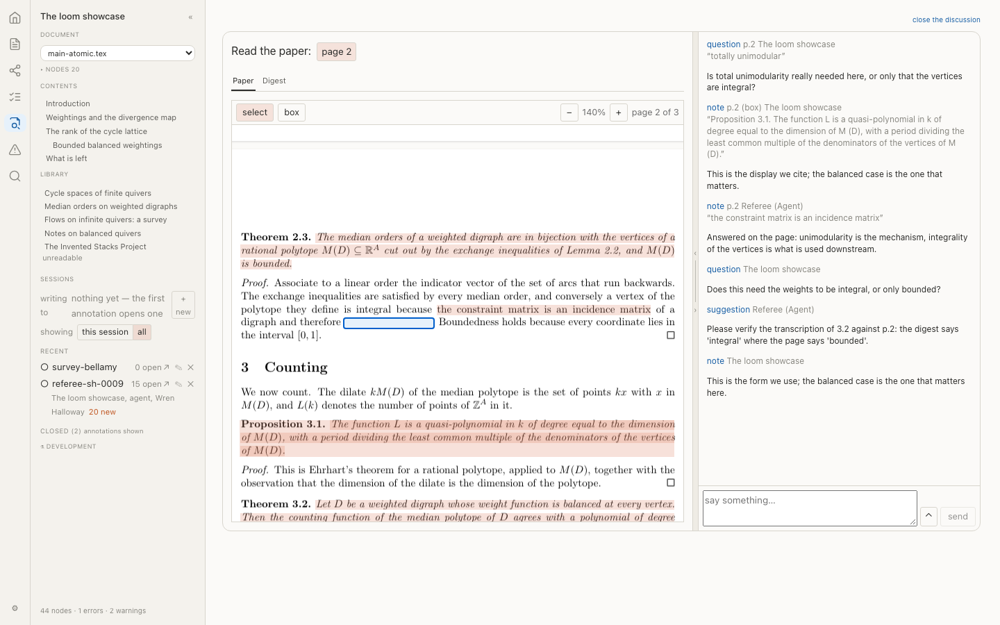

```
┌──┬──────────┬────────────────────────────┬─┬────────────────────────┐
│⌂ │ Showcase │ Paper | Digest             │ │ writing to  reading …  │
│  │ ▸ Nodes  │  ┌──────────────────────┐  │ │ question p.2  A. Author│
│  │ ▾ Sessns │  │ …totally unimodular▮ │■│ │ note p.2 (box) …       │
│  │          │  │ ▭ display formula    │ │◄│ [ say something… ][send]│
└──┴──────────┴────────────────────────────┴─┴────────────────────────┘
   rail  panel          content          divider      discussion
```

### The side panel

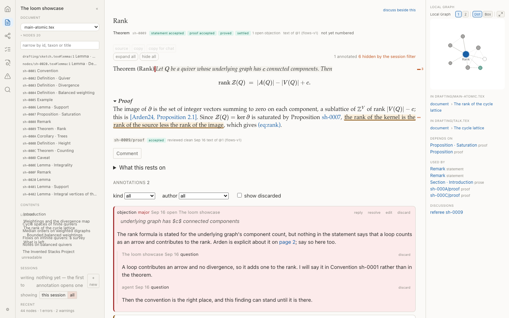

```
▾ Documents        ▾ Nodes  44        ▾ Contents      ▾ Library
   main.tex           [narrow by id]     1 Quivers       Bellamy 19
   CANON              sh-0001 Convention 2 Counting      Arden 24
   paper-v2.tex       sh-0002 Definition …              Stacks · unreadable
                      …                               ⚗ development
```

### The session selector, and a session read back whole

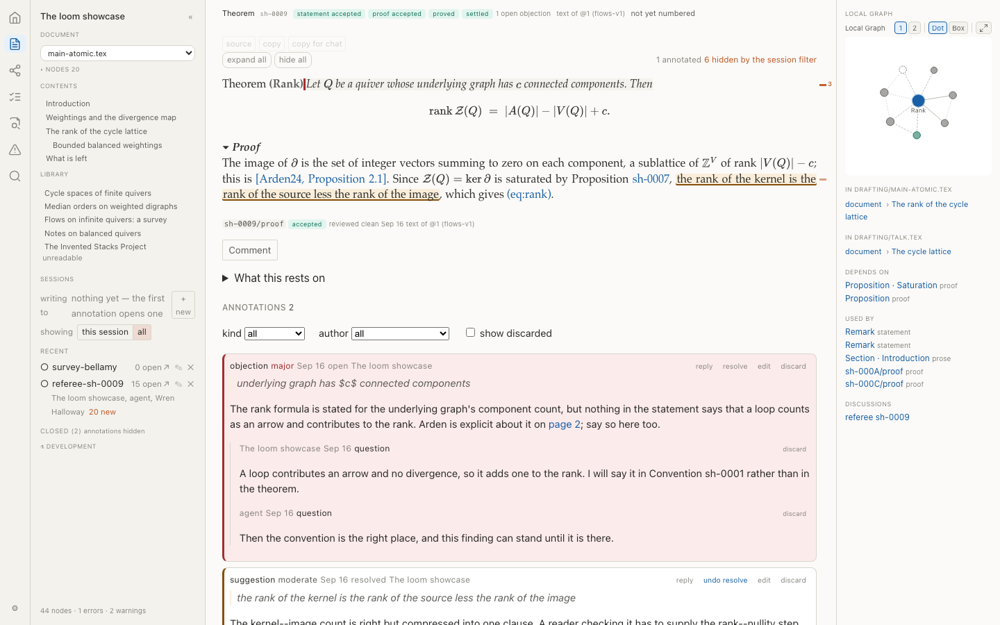

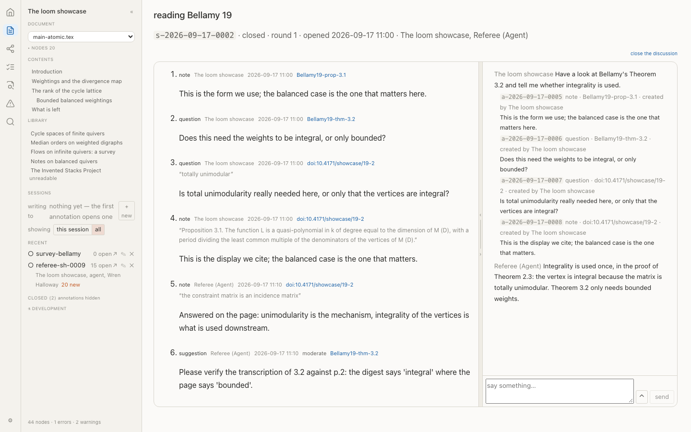

```
▾ Sessions                          /session/s-2026-09-17-0002
   writing to  reading Bellamy 19     reading Bellamy 19
   showing  [this session| all ]      s-… · closed · round 1
   RECENT                             ──────────────────────
   ○ survey-bellamy  0 open  ↗ ✎ ✕    note   p.2   a-…-0005
                                      question p.2 a-…-0006
```

The **delete confirmation is not photographed**: it is `globalThis.confirm`, a browser dialog outside the page, so the figure shows the row and its `✕` instead. Worth knowing when you next look at that flow — the confirmation is the browser's, not loom's, and it cannot be styled, screenshotted or tested from the page.

### The three placements

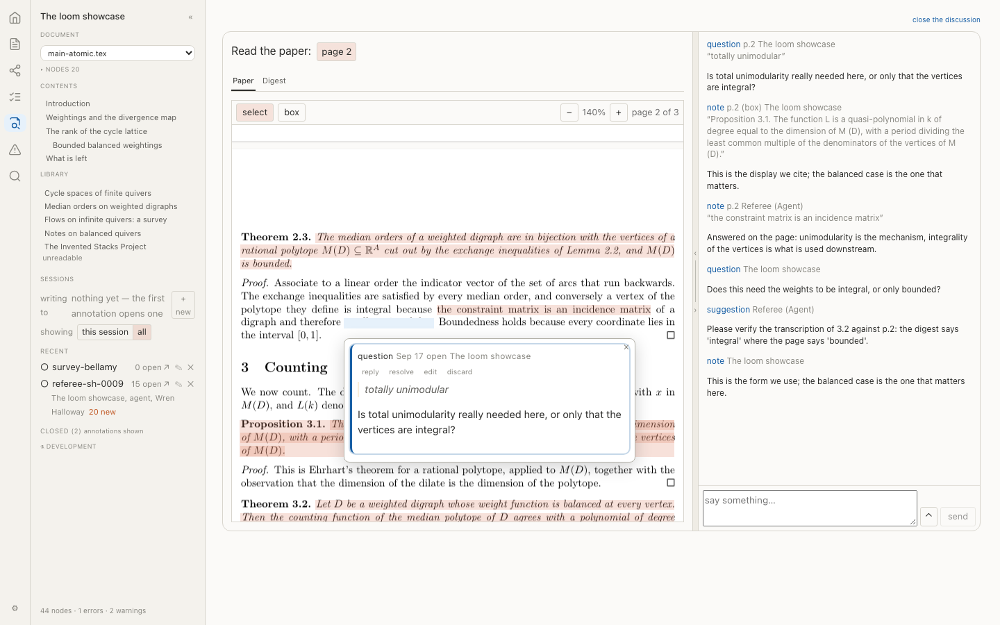

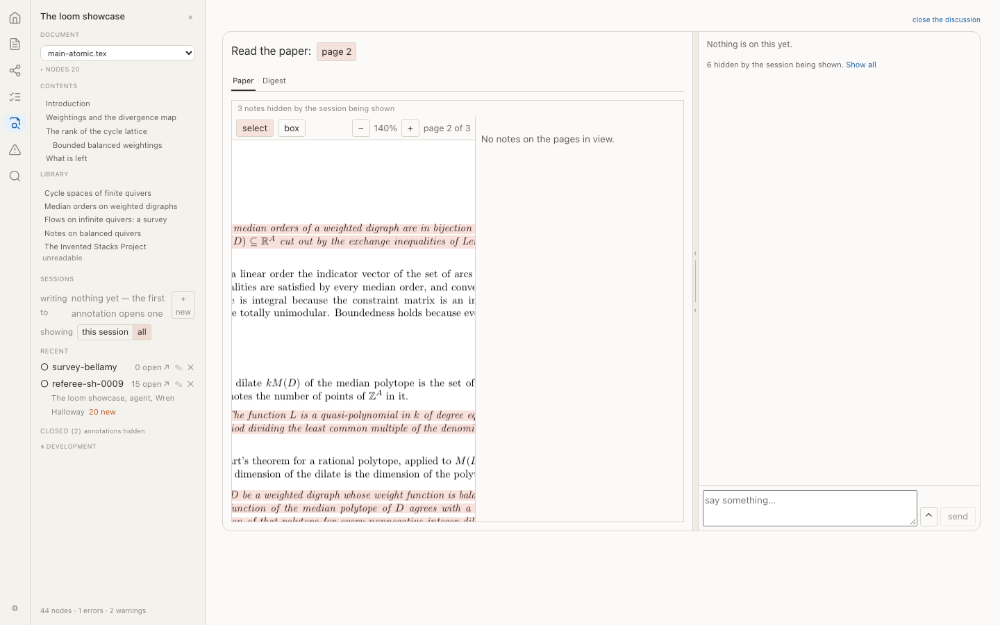

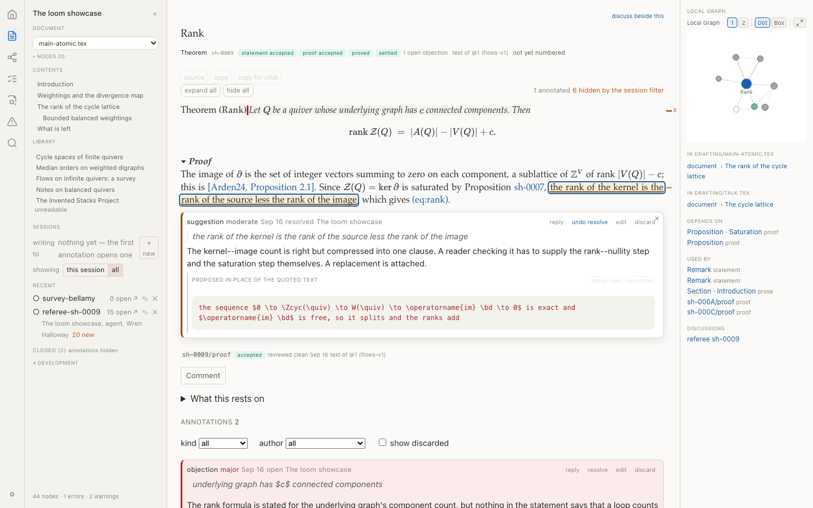

```
floating                    margin                     inline (authoring)
┌──────────────┐            ┌────────┐ ┌──────┐        ┌──────────────┐
│ page ▮▮▮  ┌──┴──┐         │ page ▮ │ │QUEST…│        │ text ▮▮▮     │
│ page      │ ?   │         │ page   │ └──────┘        │ ┌──────────┐ │
│ page      └──┬──┘         │ page ▮ │ ┌──────┐        │ │ QUESTION │ │
└──────────────┘  4px→│     └────────┘ │NOTE… │        │ └──────────┘ │
```

`inline` is the Authoring View's alone: a PDF page cannot reflow, so it opens floating there.

### The proposal box

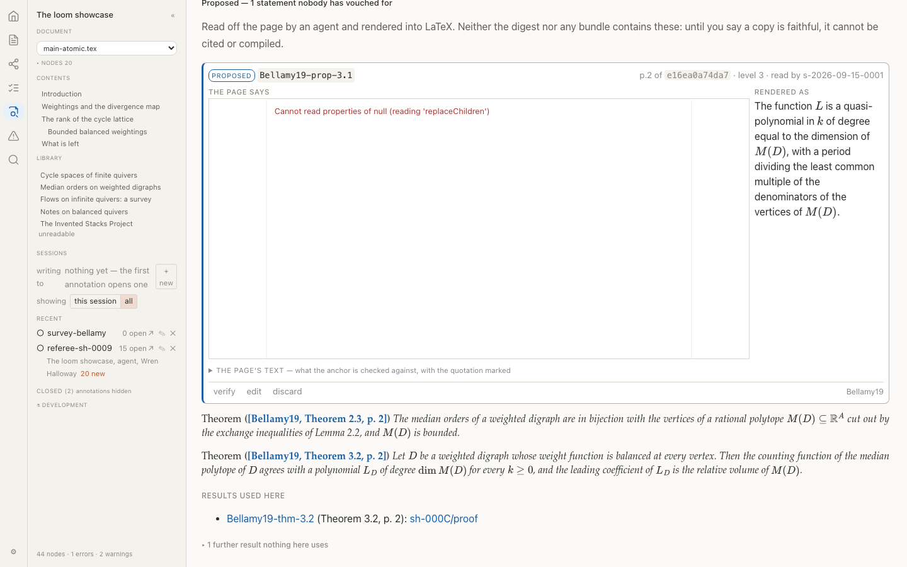

```
┌───────────────────────┬───────────────────────┐
│ the page at the anchor│ the rendering proposed │
│ ▮▮ quotation marked   │ \begin{proposition}…   │
├───────────────────────┴───────────────────────┤
│ ▸ the page's own text                          │
└───────────────────────────────────────────────┘
```

### From the study

Kept because they show faults rather than features.

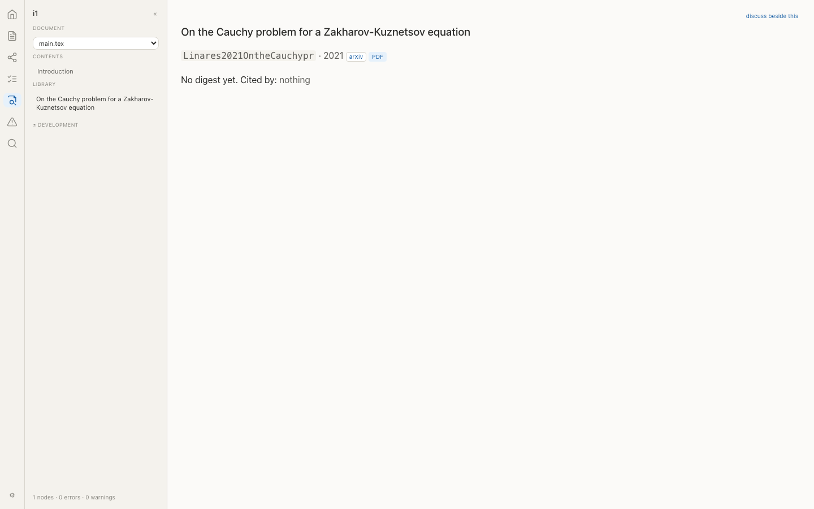

*F2, before the fix: the work's own page offered no way to open it in loom.*

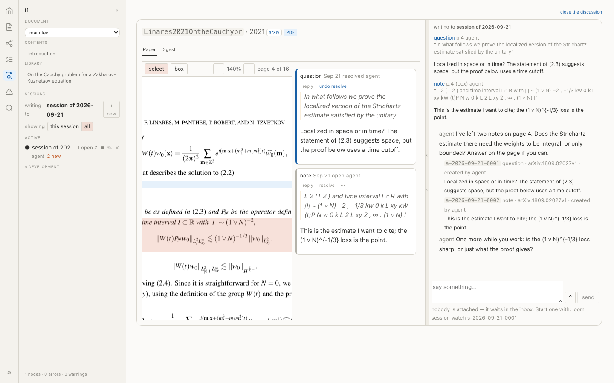

*F7: "nobody is attached — it waits in the inbox. Start one with: loom session watch …", said while the agent it names is mid-task.*

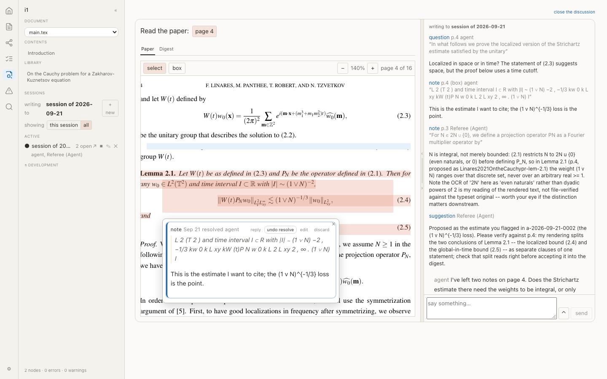

*F3, after the fix: the box says `resolved` and offers `undo resolve`, without being closed and reopened.*

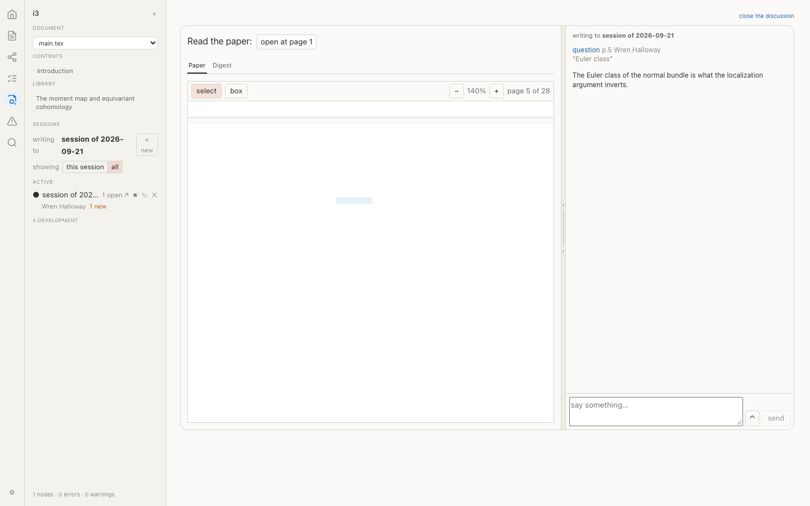

*Iteration 3: Atiyah–Bott 1984, no source anywhere, anchored by text on page 5.*

## 6. Performance

Measured on the showcase corpus; the floor is `arras/tests/perf/reading.e2e.ts`, which has no model in it.

| | budget | measured |
|---|---|---|
| Opening a paper and drawing its first page | 2500 ms | **441 ms** |
| Worst page: render + text layer | 150 ms | **64 + 37 ms** |
| Canvases held for a 24-page paper | fewer than pages | **3** |
| Twenty marks on a real page | one frame (16 ms) | **0.2 ms** |

The overlay test was rewritten during the plan to draw twenty *real* marks into the page's own overlay rather than twenty bare divs on the home page, which is what it had been measuring.

---

## 7. The book, the specs and the records

| where | change | record |
|---|---|---|
| 3, 4, 7, 8, 10, 11, 15 | the Library, sessions, six kinds, the PDF invariant, the split, the placements, the viewer | DR-199…DR-208 |
| 7.5.1, 7.5.4, 8.17, 10.4, 11.4 | a page of a cited work as a target; the anchor's two bases; reading notes in no `status` row | **DR-209** |
| 10.2.3, 10.4.1, 15.3.6, 15.3.7 | `cited:` lands in the Library View; one locator syntax, two prefixes; the modal's narrowed job | **DR-210** |
| `specs/manifest.md` | `target.work`, `target.page`, `basis`; `marks` in the sidecar; a real `rotate`; `references[].reading` | DR-209 |
| `specs/write-api.md` | `comment` takes `page`/`rects`; `session-new`, `session-close`; `locate` takes `span` | DR-209, DR-210 |
| 12, C, D | regenerated and re-spliced from their sources | — |

Two rows were added to `docs/deviations.md`: bodies in the manifest rather than the sidecar, and the `cited:` landing.

---

## 8. What the slice found, and what the abort conditions did

The slice's own report, with its measurements, is the appendix at the end of this one.

The thin slice found that **the committed page text and the word-box stream are two different extractions that disagree** — on the showcase's own four anchors, `locate_span` placed two of four. The two causes were a hyphenated line break and a superscript splitting a word. Both were fixed in Part A, and the mapping has not been a problem since: the study's twenty drags on the worst text layer in the corpus mapped nineteen to text.

**No abort condition triggered.** Mapping did not fail on ordinary prose at anything like one in ten; per-page cost came in at under half the budget; and the session migration kept every existing annotation attached to its run. The condition that came closest was the first: before the two fixes, the showcase's own anchors placed at 50%.

## 9. What the next plan inherits

- **The transcript details of design §3** — a live annotation card referenced from a message body, the by-position toggle, story events inline, the command log as an alternate rendering of the pane. The stream today is messages with their changed blocks, in time order. Worth a queue item.
- **WQ-36**, narrowed: the sidecar pattern exists and is proven; what is left is applying it to annotation bodies on the day the manifest is actually large. Today it is not.
- **The hash-addressed orphan page**, `/library/?doc=sha256:…` (design §6). The store heals an orphan and the Library marks it; the route waits on a second case.
- **F9**, `refs propose` having no `--author`, left deliberately.
- **DR-198's relaxation** of the PDF invariant, which is the decision this plan is least sure of.
- **A fresh quilt now refuses browser writes until `[author] name` is filled in.** That is the CLI's own rule and the message says what to do, but it is the cold path's first obstacle and it is new. If it proves annoying, the alternative is to let the viewer declare the author — not to let the server's shell guess.

---

## 10. Experiments for you to run

§17's loop has no person in it and settles nothing about whether any of this is pleasant. Each entry names what to watch and **the decision it would overturn**, so a sitting that goes badly has somewhere to land.

1. **Read a paper you actually want to read, for half an hour.** Count how often the discussion pane was in the way. → Overturns §7's decision that the split is the reading layer's default shape rather than an option you reach for.
2. **Annotate a formula-dense page by box, then come back a week later** and try to find what you meant. → Overturns item 2's claim that a box anchor with the words under it as an unreliable hint is enough to be findable.
3. **Work a review in the split view and notice where the divider ends up.** If it never leaves the middle, the drag is furniture. → Overturns §7's global ratio, in favour of a fixed half.
4. **Leave a session open across three days.** Was `3 new` informative or noise? → Overturns §3a's activity pill.
5. **Try the margin column on a 13-inch screen.** Does it earn 300px? → Overturns item 9's margin placement, leaving floating and inline.
6. **Follow a `cited:` link mid-thought and see whether travel lost your place.** → Overturns §6's decision that reading is a mode of the work's page rather than a pane that opens beside where you were.
7. **Ask an agent to read a paper you have not read**, and see whether its page notes are worth reading or whether you re-read the page anyway. → Overturns the premise under item 4 — that an agent's reading notes are worth putting in the same log as your own.

Everything above this list was tested. Nothing in it was.

---

## Appendix · Step 1, the thin vertical slice, and what it measured

The report step 1 produced on its own, 2026-09-20, kept whole: §8 above summarises it.

2026-09-20. Plan `docs/plans/0.13-plan-reading-layer.md` §2 makes step 1 a thin vertical slice whose only job is to find out, cheaply, whether three load-bearing decisions survive contact with the code, and to produce the numbers its abort conditions are judged on. This is that report. Nothing here decides whether 0.13 proceeds; it says what is now known.

### The verdict first

| abort condition | threshold | measured | |
|---|---|---|---|
| mapping a selection onto the page's own text fails on ordinary prose | worse than ~1 in 10 | **1 in 185** (99%) across five documents; **0 in 36** on real browser selections | passes |
| render + text layer + overlay | over ~150 ms per page | **11.5–15.9 ms** per page warm, 45–55 ms once per document to open it | passes |
| the two extractions cannot be made to agree | — | they agree under space- and hyphen-insensitive matching, with no false positives | passes |

The third abort condition in §2 — the session migration keeping existing annotations attached to their runs — is **not tested by this slice**, which deliberately persists nothing and does not touch sessions. It remains open going into Part B.

### What the slice found that the plan did not anticipate

**Two extractions of one page disagree, and item 2 assumed they agree.** The committed `pages/NNNN.txt` comes from plain `pdftotext -q`; `locate_span` works on `-bbox-layout`. They are two readings of the same page. On the showcase's own four `Bellamy19` anchors, the pre-slice code placed **two**: one failed on a superscript the bbox stream splits (`M (D) ⊆ R A cut out` against `RA cut out`), one on a line-break hyphen (`denom-` + `inators` against `denominators`). Both quotations pass `find_in_page` against the committed text, so the failure was invisible from the record side.

**The fix the plan proposed made it worse.** The plan's hyphen-join heuristic — join a word ending `-` to the next without a space — took the sampled rate from 81% to 78%, because it also joins hyphens that belong to the word. It was discarded. What works is to drop spaces and hyphens from *both* sides before matching, and to match on character offsets rather than word sequences, since a word box carries whatever punctuation touches it.

**Looseness is for drawing only.** `find_in_page`, which is what decides whether a transcription is faithful, stays strict. A highlight two lines off is visible; a transcription wrongly called faithful is not.

#### Mapping, before and after

Sampled 8–40-word sentences from the committed page text (or from the PDF where there is no store), same sampler and seed throughout; `scripts/measure_mapping.py`.

| document | before | after |
|---|---|---|
| showcase Bellamy (invented, TeX) | 90% | 100% (36/36) |
| showcase Arden (invented, TeX) | 83% | 100% (29/29) |
| Grunrock–Herr 2014 (arXiv, TeX) | 47% | 98% (39/40) |
| Atiyah–Bott (scan, OCR) | 93% | 100% (40/40) |
| Ekedahl–van der Geer (scan, OCR) | 93% | 100% (40/40) |
| **all** | **81%** | **99% (184/185)** |

The one remaining miss is a superscript the two extractions order differently. The matched span covered the right number of words in every placement (word ratio 0.95–1.25, median 1.00), so the rate is not bought with false positives.

**The scans beat the real TeX paper**, which is the opposite of the expected ordering and worth keeping in mind: a scan has exactly one OCR text layer, and both extractions read it, so they cannot disagree. Mathematics is what makes them disagree. The worst document in the corpus is the one with the most formulae, not the one with the worst paper.

#### Cost per page

Chromium, scale 1.4, 40 overlay rectangles, warm (the document already open, as `document_()` keeps it); `arras/scripts/measure-reading.mjs`.

| document | page | size | text items | render | text layer | overlay | total |
|---|---|---|---|---|---|---|---|
| showcase Bellamy | 1 | 612×792 | 205 | 7.7 | 3.6 | 1.3 | **12.6** |
| showcase Bellamy | 2 | 612×792 | 166 | 8.8 | 3.1 | 1.2 | **13.1** |
| kpsv arXiv 2106.09819 | 1 | 595×842 | 218 | 11.6 | 3.1 | 1.1 | **15.8** |
| kpsv arXiv 2106.09819 | 88 | 595×842 | 795 | 4.3 | 5.3 | 2.6 | **12.2** |
| kpsv arXiv 2106.09819 | 175 | 595×842 | 146 | 8.1 | 2.4 | 1.0 | **11.5** |
| Atiyah–Bott (scan) | 1 | 533×806 | 539 | 5.8 | 5.7 | 2.3 | **13.9** |
| Atiyah–Bott (scan) | 14 | 533×806 | 343 | 9.6 | 3.6 | 1.4 | **14.6** |
| Ekedahl–van der Geer (scan) | 8 | 621×832 | 227 | 10.3 | 3.1 | 1.1 | **14.5** |

Opening a document costs **45–55 ms once**, paid by its first page and by no other. A page is an order of magnitude under the 150 ms threshold, so **virtualisation is not needed to meet it** — which does not mean a 175-page paper should mount 175 canvases, since that is a memory question rather than a time one.

The overlay is ~1 ms at 40 rectangles. It is the cheapest of the three stages and the one the plan worried about; keeping it a flat low-alpha colour, with no blend mode and no shadow, is what makes it cheap.

**Both scans have an OCR text layer** (539 and 227 text items on a page), so they select and they round trip. The no-text-layer case the box tool exists for is rarer than the word "scan" suggests; the renderer detects it by an empty text layer and switches to box mode, and that path is exercised only synthetically so far.

#### The round trip

The real question the slice existed to answer: PDF.js's text layer is a **third** extraction of the page, after the committed text and the word boxes. Does a selection made in a browser come back from loom as an anchor?

Against `loom serve` on the showcase quilt, page 2 of `Bellamy19`, with 12 rectangles drawn over 4 anchored results: **36 of 36 selections placed, all with `basis: "text"`, none refused, none falling back to geometry.** Selections ranged from 4 to ~40 words and were built by walking the text layer's own spans, so they carry PDF.js's spacing rather than a person's.

A selection through the pane's own handler answered:

```
Bellamy19 p.2 anchored by text, 1 line(s)
{"kind":"pdf","sha256":"e16ea0a7…","page":2,"quads":[[82.8,99.13,195.28,110.04]],"basis":"text","start":93,"end":116}
```

So the three extractions agree under the same tolerance that took mapping from 81% to 100%. The client sends the selected string, never a decision about what the anchor is; loom holds the other two readings and is the only party that can say what the page says.

### What was built

- `loom/src/loom/refs/search.py` — per-line rectangles, space- and hyphen-insensitive matching, `locate_offsets`, `words_in_boxes`. `Span`'s docstring said "PDF user space"; the coordinates are points with a **top-left** origin, and anyone who trusted the old line drew mirrored highlights.
- `loom/src/loom/refs/proposals.py` — `Anchor` gains `basis`, `start`, `end`, and `quads` in place of `quad`.
- `loom/src/loom/render/build.py` — `build/spans/<scheme>/<id>.json` per work, hashed into the manifest, and `spans/` added to the prune list it would otherwise never garbage-collect.
- `loom/src/loom/render/api.py` — `POST /_api/locate`, which answers and writes nothing.
- `arras/src/lib/pdf/` — `document.ts` (dynamic import, worker emitted by Vite so it carries `base`, one document per URL, points→percent), `PdfPage.svelte` (a dumb renderer: canvas, text layer, quads, selection, box drag, single click selects and double click travels), `Reading.svelte` (the pane and a stub discussion column).
- The reader opens on `?page=N` of the existing `/digest/<citekey>` route — no new route, so a page of a paper is a link into the place the paper is already discussed.

### Incidental findings, none blocking

- `refs locate` was writing a 60 KB-per-page XML cache into `pages/`, which the shipped `.gitignore` **commits**. Moved to `digests/storage/cache/boxes/`.
- Four `arras` e2e tests fail on `main` and still fail here, unrelated to the slice: they expect `/refs/arxiv/…/paper.pdf` while the fixture manifest says `digests/storage/arxiv/…`. The DR-192 rename left the expectations behind. Confirmed by re-running them with the slice's changes stashed.
- `ruff format` would reformat three files nothing in this slice touched (`refs/fetch.py`, `tests/unit/refs/test_scan.py`, `tests/unit/scan/test_edges_lint.py`).
- `CAPABILITIES` now lists nine endpoints; `docs/specs/write-api.md` documents six. `digest-verify`, `digest-discard` and now `locate` are undocumented drift, owed before Part E.
- `home_of` in `proposals.py` substring-scans every `sections.json` in the store on each call. Out of scope; worth a queue item.

### What the author has to decide

Nothing in the measurements argues for aborting. The basis rule in item 2 holds, the pane is cheap, and the round trip works. Two things are worth a decision before Part A is finished rather than after:

1. **Whether the committed page text stays the record.** It does under these numbers, and the fallback the plan named — regenerating page text from the bbox stream — would change what every existing verified anchor is checked against. Recommendation: keep it, and treat the 1-in-185 residual as a case for a box anchor rather than a reason to re-found the record.
2. **Whether `find_in_page` staying strict is right.** It means a transcription can fail its faithfulness check while its highlight still draws correctly. That asymmetry is deliberate and it will be visible to a reader; it should be visible to the author now, not discovered in the study.

### Experiments for the author to run

Everything above was measured by a machine; none of it says whether this is pleasant to use. Each of these names what to watch for, and the decision it would overturn.

- **Open `loom serve --quilt demos/showcase` and read page 2 of `Bellamy19` with the marks drawn.** Watch whether four highlights on one page read as help or as clutter. Overturns: the flat low-alpha treatment, and possibly the decision to draw every anchor rather than only the one in view.
- **Select a sentence that crosses a line break, then one that crosses a page break.** Watch what comes back. The second is not implemented — a selection cannot currently cross pages — and whether that is a gap or a non-problem is a design answer, not a measurement.
- **Select a displayed formula.** Watch whether the text loom answers with is recognisable enough to put in a record. Overturns: the assumption that `basis: "text"` is the good case and `box` the fallback; for mathematics it may be the other way round.
- **Draw a box on a figure in the Atiyah–Bott scan.** It has an OCR layer, so box mode will *not* engage automatically; you will have to want the box. Watch whether the tool is findable when the page is selectable. Overturns: auto-detection by empty text layer as the only way into box mode.
- **Double-click a mark and watch where you land.** Travel currently scrolls a stub list beside the page. Watch whether the movement tells you what happened or just moves the screen. Overturns: scroll-into-view as the travel gesture.
- **Open a 175-page paper** (`demos/kpsv`, arXiv 2106.09819) **and jump between distant pages.** Per-page cost says this is cheap; watch whether it *feels* cheap, and whether anything about mounting one page at a time is disorienting. Overturns: one page per pane, and the decision that virtualisation can wait.
