# New features, 0.9 to 0.11

What the three plans added, written 2026-09-18 for someone picking the project up rather than for whoever executed them. Every screenshot is of the viewer rendering the conformance fixture or a real corpus, taken by `arras`'s own shot harness (`npm run shots:report`, `npm run shots:floor`) and stored in `docs/reports/images/`. Nothing here is a mock-up.

The three plans are one movement: **0.9 gave the work a history, 0.10 gave it a record, and 0.11 gave the record a reader.** Before 0.9 a quilt had no versions; before 0.10 an agent's findings could not be edited or queried; before 0.11 none of it could be read anywhere but a terminal.

---

## 0.9 — the workbench

*Status: executed 2026-09-17. Specification: Chapter 17.*

A quilt gained **two states and a history**. Documents live either in `drafting/`, where they are worked on, or in `canon/`, where they stand as flat, self-contained landmarks of how the work looked at a moment. Placement is the declaration — a file cannot say whether it is being worked on, and a list of live documents is a second source of truth (DR-132).

- **`loom draft`, `loom canonize`, `loom stamp`, `loom fork`, `loom revert`, `loom live`** — the conversions between those states, each recording what it superseded so the input becomes inert rather than needing an ignore line written into the author's file.
- **The identity test** — every conversion compiles the document before and after and refuses if the typeset text differs. It is what makes these safe to run on a paper about to be submitted.
- **Keys carry versions.** A key whose current text is one the history recorded says so, which is what "the text of @2" is built from.
- **A node is defined once** (DR-135). Two files defining one id leaves it `conflicted` — no text, no winner, both files named — rather than resolved by walk order, which is the one outcome nobody can debug.

## 0.9.5 and 0.9.6 — the boundary becoming real

*R1 done 2026-09-17 (DR-143); R2a done in 0.9.6 (DR-146); R2b in 0.11; R3 declined.*

Two publishers are coming — **weft** and the author's **sitegen** — and these plans are loom making room for them and arras ceasing to assume its corpus is loom's. Neither adds a feature; both make a boundary real before anything leans on it.

- **The reference crawl left loom for weft** (DR-144): three commands, the `[crawl]` table, 1,406 lines of corpus machinery removed from a paper's tool.
- **Where the app is served and where the corpus is served became two settings** (DR-143), so one bundle can point at a corpus anywhere.
- **An absent manifest section means an empty one** (DR-146). Before this, a manifest omitting any top-level section threw at boot and blanked the app. `docs/specs/fixture-minimal/` — a manifest written by nobody's publisher, eleven sections omitted outright — is the fixture that holds that floor.

## 0.10 — annotations as a log

*Status: built 2026-09-18, five commits.*

Three things were wrong at once and they were one thing: loom recorded what an agent did, and the recording was per-file, unqueryable, and wrapped in a process it should not own.

- **`annotations/log.jsonl`** — one append-only, event-sourced table replacing a JSON file per review. Events are `created`, `replied`, `edited`, `resolved`, `discarded`; current state is a replay. A re-check that finds the same fault still standing now **edits** its finding instead of replying to itself, so three passes leave one restatement rather than three.
- **Severity, payloads and placement.** A finding grades the *fault* — major, moderate, minor — not the enthusiasm. A payload is proposed text the author previews and copies; nothing applies it.
- **Anchors that survive an edit** (DR-152). A last-seen cache lets loom freeze the text an annotation was written against at the moment the author edits under it. An annotation against a text loom never saw says it is unanchored rather than pretending.
- **`loom ai start` stopped launching the agent** (DR-149). The runner was declined as WQ-15; a `CLAUDE.md` line already said the same thing, and loom no longer sits in the process tree for a whole session.
- **Record intent, derive fact** (DR-150). `run.toml` holds `created`, `name`, `discarded` and nothing else. Which modes a run applied is derived from the files it wrote.
- **`loom bundle` went; the closure document stayed** (DR-148). Reading a result and its dependencies is `loom source KEY --closure`, which prints — no file to clean up, none to gitignore, and none to go stale against the author's next edit.
- **Review mode, and quick mode restored** (DR-153).
- **`CLAUDE.md` is the author's file with one line of loom's in it** (DR-151). `loom upgrade` used to overwrite it.

## 0.11 — reviewing a run

*Status: built 2026-09-18, six gated commits, DR-156 to DR-163.*

0.10 built a record worth reading and nothing read it. An agent's report landed as `*.notes.md` in a run directory, and the one surface built for reading listed it **by filename** — you could see that `referee-dm-0003.notes.md` existed, not what it said. The terminal could not help, because no agent CLI typesets mathematics.

### The split view

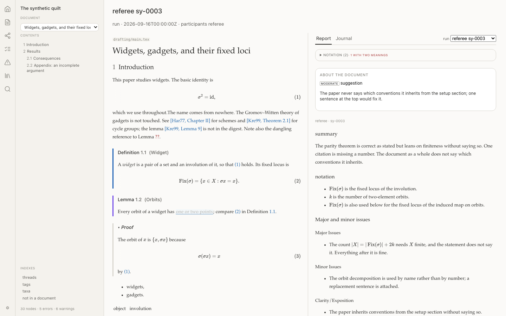

`/thread/[id]` gained a second rendering rather than a second route (DR-159). The document on the left, the run on the right. **The panes point at each other, and that is the whole reason this is one page**: clicking a finding scrolls the document to the sentence it is about, clicking a mark scrolls the report to the finding that made it.

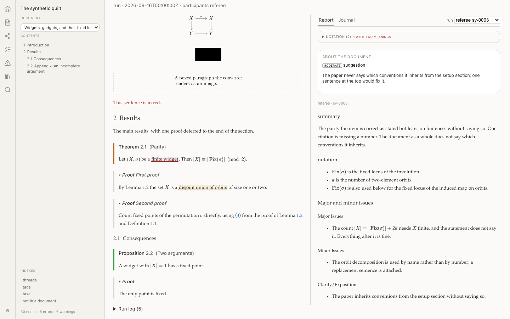

*The left pane was scrolled to the bottom, then the first finding clicked; the document jumped to Theorem 2.1 with the quoted phrase marked.*

Findings about the document as a whole come first, in a section of their own. The tabs are **Report** and **Journal** — `thread.md` under its real name. There is no transcript: loom cannot see a chat and does not transcribe one.

### The report, parsed

The agent writes exactly what it always wrote. `ai/rules.md` has always said *"write each block under a heading with its name in brackets"*, every finding has always ended with its annotation id, and **nothing read either** (DR-158). The publisher now parses both: each notes file becomes a fragment of named blocks with every finding carrying an anchor. The brackets and the raw ids are carried as attributes and never shown as prose.

Rendering gained a **math pass** — `$...$` lifted out before Commonmark sees it, because Commonmark has no math and was losing both subscripts of `$a_i b_i$` to emphasis. That defect affected annotation bodies and thread messages too, not only reports.

### Reading a result three ways

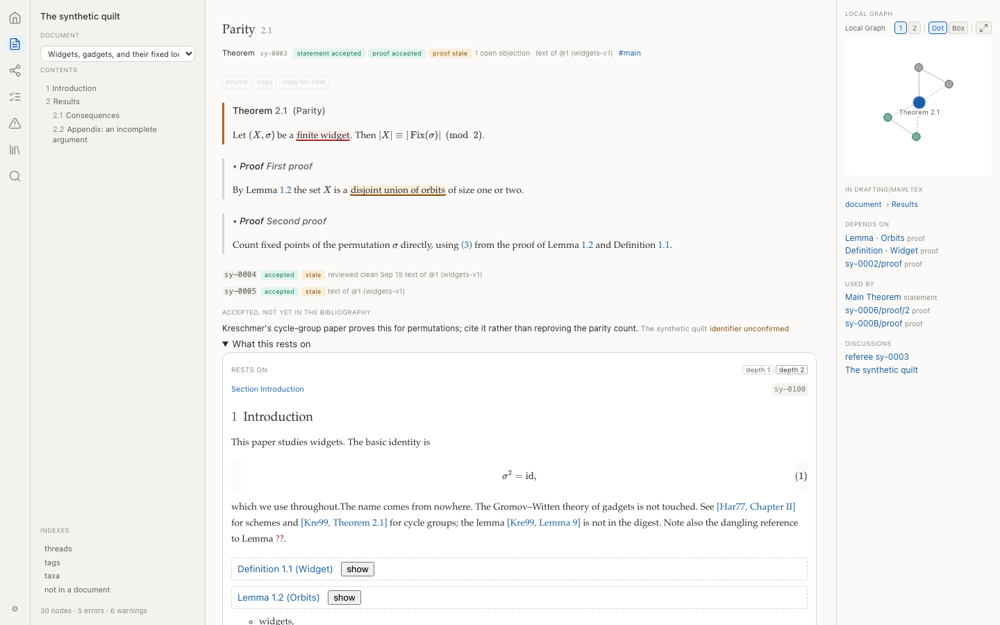

The node page answers **both** closure questions without leaving it (DR-160): the local graph, now navigable, for what a change would disturb; and *what this rests on*, stacked in dependency order at depth 1 or 2, for what the result stands on. Neither is a route — a closure is a way of looking at a node, not a place to go. The stack seeds from the result **and its proofs**, because in most quilts a statement's own dependencies are all declared inside its argument.

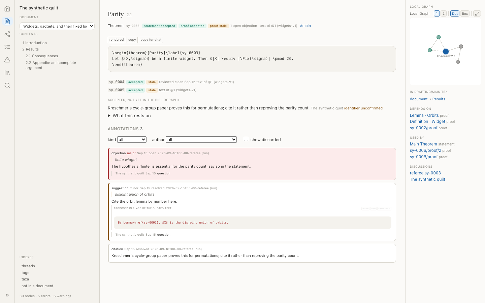 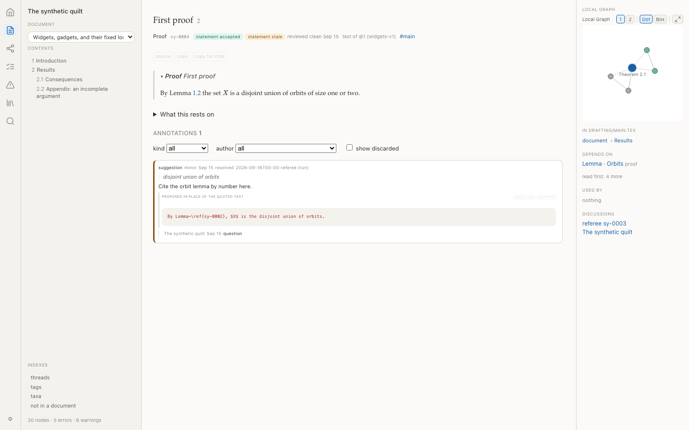

A **verbatim toggle** shows a node's LaTeX before macro expansion, fetched one key at a time from `build/source/`, with copy and *copy for chat*. A suggestion's **payload** is shown in red where its placement says it would go — preview and copy only.

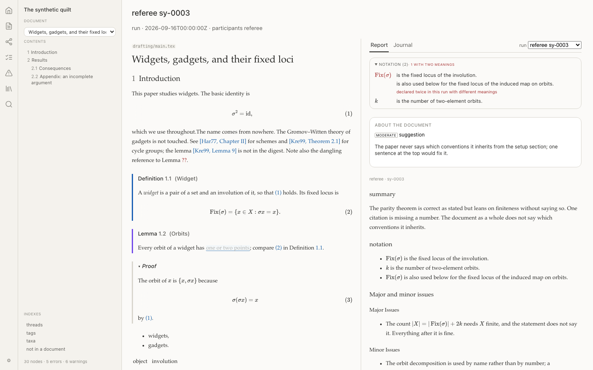

A **notation panel** lists the symbols a run introduced and flags a symbol given two meanings inside one run, because nothing downstream can tell which one a formula meant. Notation belongs to an agent's prose and never to the corpus's own text, so the panel is on the run.

### arras stops being read-only

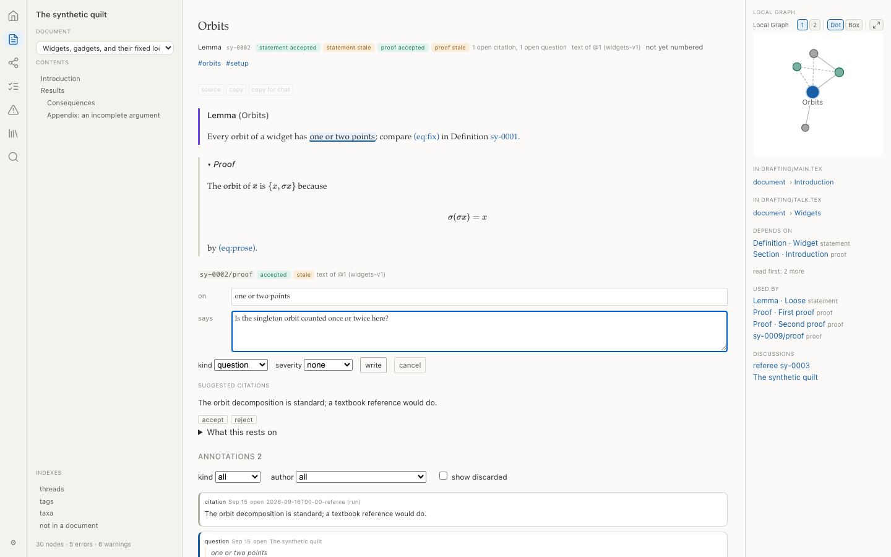

The write API is built (DR-161): `GET /_api` says what the publisher serves, and six endpoints wrap the same library functions the CLI calls. **Every affordance is detected, not assumed** — against a static host there is no composer and no sign there might have been, which is how one bundle reads a deployed site and edits a served quilt with no build-time flag.

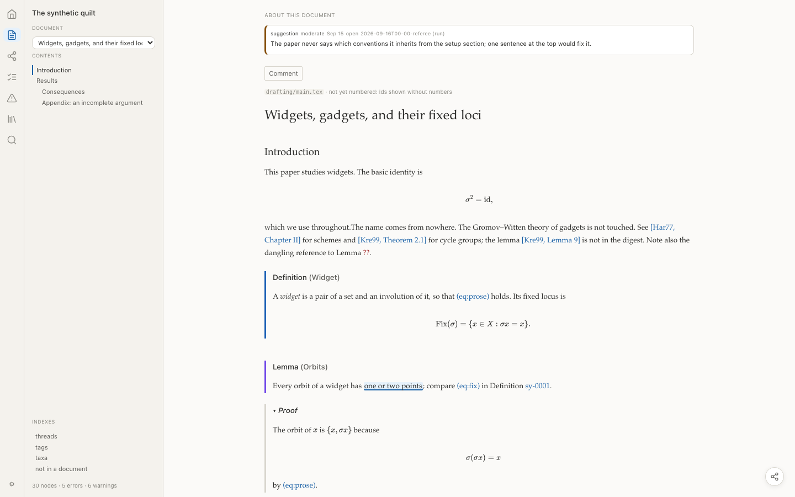

Annotations whose target is the **document itself** now appear at the top of the read view. loom has been able to write them since 0.6; no viewer had ever shown one.

### R2b: arras stops speaking one publisher's vocabulary

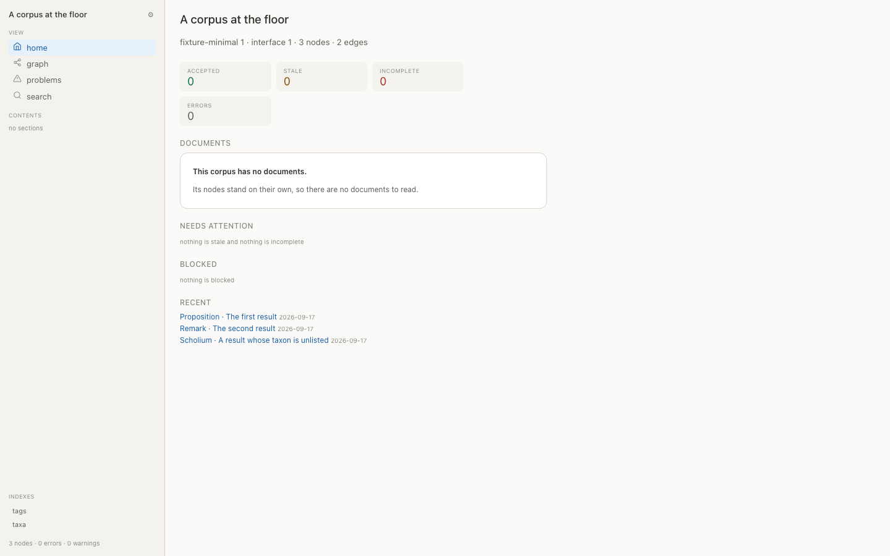 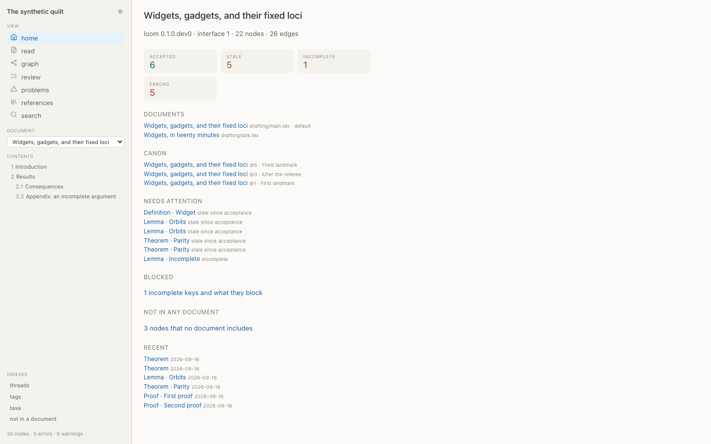

*The same viewer, two corpora.* The manifest gained `publishes` (DR-156), four booleans saying what a corpus *has* — never what to draw. A capability answers what the data cannot: emptiness cannot tell "not yet" from "never", and since the manifest is re-polled every second, furniture derived from emptiness moves while you work.

"not yet compiled" said LaTeX where the manifest says `numbering_known`; "loose" was one publisher's word for a node no document reaches. Both are gone, along with a diagnostic code in loom's namespace that the *viewer* was raising. arras's tokens moved off `:root` onto a class the host applies (DR-163), so it no longer styles a page it does not own.

---

## From `running-requests.md`

Three open items were completed alongside the plan; the fourth is marked FOR HUMAN and was left.

### The viewer is faster, and the reason was not what it looked like

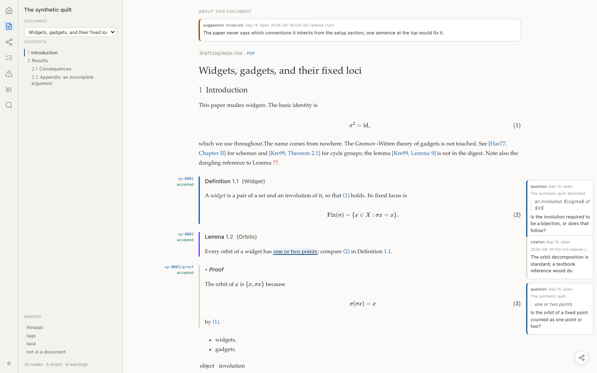 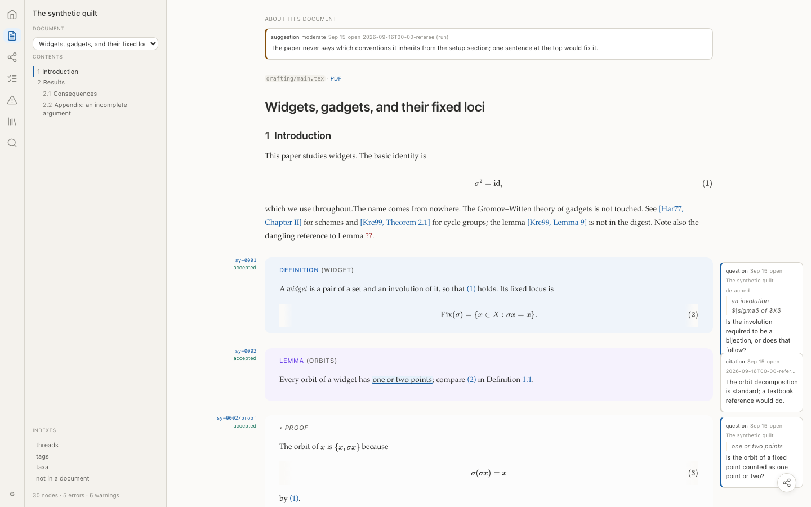

The complaint was that "many things feel a little slow" and "clicking buttons in the settings is laggy". The conformance fixture has twelve formulas and could never show a slow page, so the probe ran against a 145-node corpus: **one document page is ~92,000 elements, 85% of them inside typeset math**, and a settings click cost **308 ms** before the next paint.

Six candidates were timed. The finding that redirected the work: **the synchronous part of the click is 0 ms.** Nothing JavaScript does was ever the problem — it is the browser restyling every element when an inherited token changes, which is also why `contain: layout style` (272 ms) and containment on the math (232 ms) barely helped: containment does not stop inheritance.

| | |
|---|---|
| baseline | 308 ms |
| `contain: layout style` on blocks | 272 ms |
| all math hidden entirely | 217 ms |
| `content-visibility` on math | 232 ms |
| **`content-visibility` on sections** | **33 ms** |
| **after implementation** | **22 ms** |

The top three were implemented: section-level `content-visibility` with `contain-intrinsic-size` so the scrollbar stays honest, the same on math containers, and an annotation index built once per manifest instead of a full scan per key. One honest caveat: the index is the one of the three that corpus could not demonstrate, having no annotations at all, and is justified by its complexity rather than by a measurement.

### Paper or blog, one switch

A global setting, so the read view and a node's own page change together — a result should not read as a different kind of thing depending on which page it stands on. Blog is wider, with sans headings, environments carried by a tinted panel in their taxon's colour, and no theorem numbers: a paper points at a result by number, a website by name.

### Colour coding in the graph

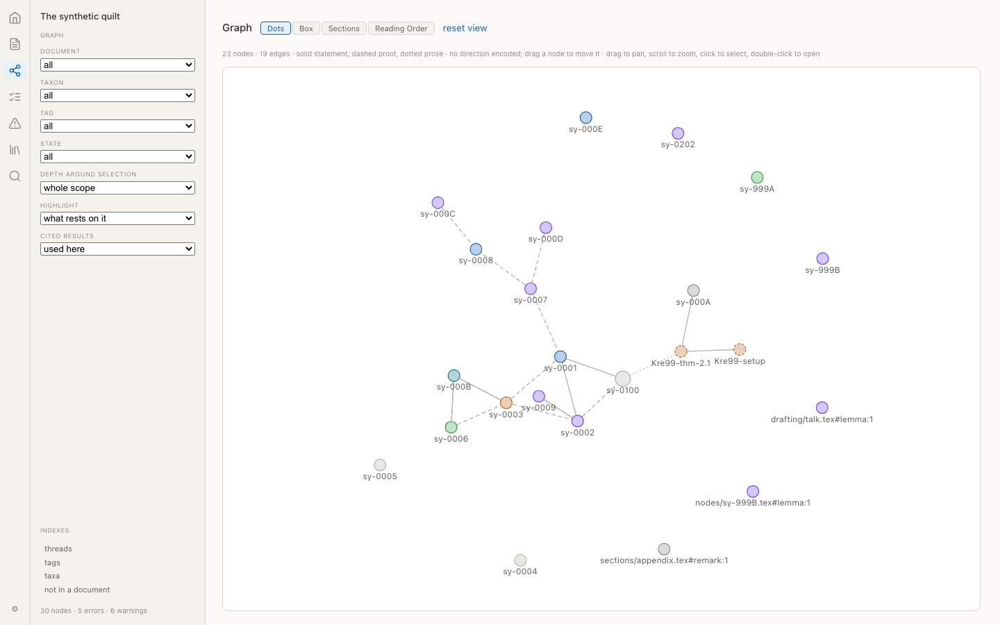

Nodes were coloured by *state*, and since nearly everything is `draft` that read as no coding at all. They take the **taxon's** colour now, and it is the same colour the accent down an environment's left edge uses: one palette declared once, with `$lib/taxonomy` deciding which token a taxon gets and never knowing a value.

This turned out to be a neutrality fix as well. The colours were hard-coded hex keyed by the names `Theorem`, `Lemma`, `Definition` — one publisher's vocabulary in the core. They are keyed by the manifest's own `style` and the taxon's position now, so a corpus whose taxa are `Widget` and `Gadget` is coloured like one using Bourbaki's. Fill is the taxon and the ring is still the state: what a node *is* does not change while you work, and how it stands does.

---

## Bugs these plans found in existing work

Worth listing separately, because each was found by building something that finally used the code:

- **Chapter 11 told an agent to run a command Chapter 11 denies it.** §11.4 sent it to `loom linearize` to read a master; §11.5 denies that command. Had the deny list not caught it, obeying the rule would have superseded the author's master. Replaced by `loom source PATH` (DR-155).
- **An annotation's `run` was a file path while a thread's id was a directory name.** 0.10 declared `run` "the grouping key, which a file path no longer is" and then wrote a file path; comment sessions matched by accident and runs never did, so nothing could ask which thread a finding belonged to (DR-162).
- **Severity and payload were styled in 0.10 and never rendered.** The CSS existed; no markup used it.
- **Reference notes were written by 0.10 and published by nothing**, so the surface meant to show them had no data.
- **`render_markdown` emitted `$x$` as literal dollars** in annotation bodies and thread messages, not only in reports.
- **A collapsed `
` still mounts its contents**, so the closure panel put six statements and their annotation marks into a page showing one. Three unrelated test failures were all saying this.
- **`refresh-fixture.sh` was not vendoring `build/source/`**, found because the verbatim toggle had nothing to show.

## Verification, as of 2026-09-18

| | |
|---|---|
| loom | 324 unit, 13 tex, ruff + format + mypy clean, both generators current |
| arras | 0 type errors, 67 unit, 103 e2e, 32 interface-floor, 4 write-API |
| workspace | `check.py` ok — 18 active queue items, 17 closed, no unfinished business |

The write-API suite is worth naming: it runs the real viewer against a real `loom serve` and asserts that a comment written **in the browser** lands in `annotations/log.jsonl` as `kind: human`, anchored to the quoted phrase. Not that a button appeared — that the file changed.
