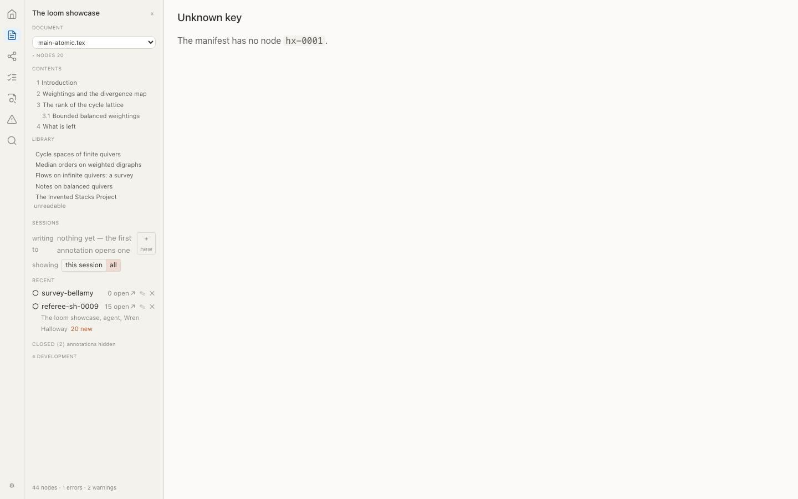
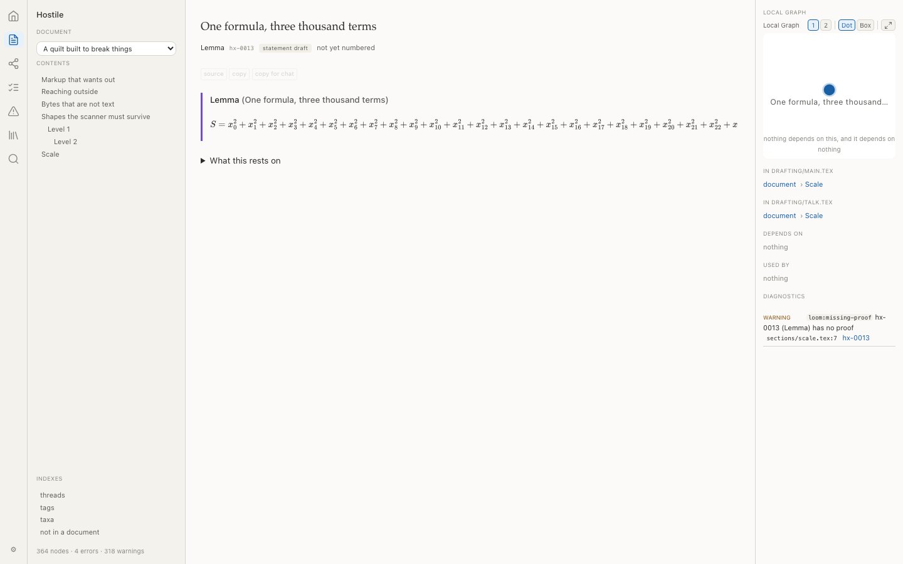
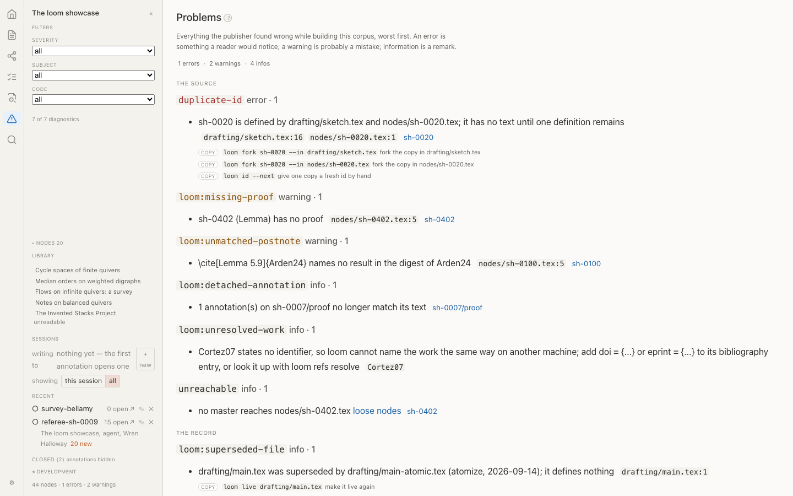

# The hostile demo

A quilt built to break loom and arras, and what happened. Written 2026-09-18. The quilt is `demos/hostile/`; nothing depends on it and no suite runs it.

Six attack directions, each chosen because it exercises a boundary the code actually has. For each, the question is not "did it do something unexpected" but which of three things it did:

- **refuse clearly** — the input is rejected and the reason names the input;
- **degrade visibly** — the input is accepted, something is worse, and a reader can see that it is;
- **fail in a way nobody can debug** — the only one that is a bug.

Loom's defences were better than expected. **Four of six directions were held.** The two that were not are reported first, because they are the ones worth acting on.

---

## What broke

### 1. An inclusion cycle crashes `loom build` — and `loom lint` reports it

**Direction: structural pathology. Verdict: fails in a way nobody can debug.**

```
RecursionError: maximum recursion depth exceeded
  render/fragments.py:249  in _include_html
  render/fragments.py:364  in render_container_body
  render/convert.py:463    in render_range
  render/convert.py:654    in _walk
  ... 99 times
```

Two inputs cause it independently — a file that `\input`s itself, and two files that `\input` each other — and either is enough. Bisected: with both removed the same quilt builds in 1.1 seconds.

What makes this worth fixing rather than merely noting is that **loom already knows**. `loom lint` on the same quilt reports both:

```
error  inclusion-cycle  drafting/main.tex -> sections/structure.tex -> sections/structure.tex
error  inclusion-cycle  drafting/main.tex -> sections/structure.tex -> nodes/cycle-a.tex -> nodes/cycle-b.tex -> nodes/cycle-a.tex
```

The scanner detects the cycle and the renderer walks into it anyway. `_include_html` recurses through the inclusion graph with no visited set and no depth bound, so a diagnostic that exists is never consulted by the code that needs it. A reader gets a Python traceback where they should get the error loom already wrote.

Forty levels of `\nest` — deeper than LaTeX has sectioning levels — are fine. Depth is not the problem; the absence of a cycle guard is.

### 2. The only written contract for the log disagrees with the code

**Direction: the record's own format. Verdict: fails silently.**

The hostile log was written from the documentation, and loom mis-read every line of it.

- The only written column list is in **plan 0.10**: `annotation-kind`, `reply-to`, with hyphens.
- The code reads **`annotation_kind`** and **`reply_to`**, with underscores (`records/log.py:57,60`).
- **Chapter 7, which is the normative specification for the log, never lists the columns at all.**

So a line written from the documentation loses its kind and its parent. Nothing says so, because of the second half of this finding: an absent or unknown `annotation_kind` **silently becomes `objection`**. Every annotation in the first hostile log — questions, suggestions, citations — arrived in the manifest as an objection, and the only way to notice was to already know the answer.

Two smaller things in the same area:

- **`kind` and `severity` are not validated.** A finding of kind `catastrophe` with severity `apocalyptic` reaches the manifest unchanged. That is defensible — `kind` is an open string by design, so a second publisher may use one arras never heard of — but it has a consequence, below.
- **A reply to an annotation that does not exist disappears.** It carries `in_reply_to`, so no surface lists it as a finding; its parent is not there, so nothing nests it. It is in the log, it is in the manifest, and it is on no page. Nothing reports it.

---

## What held

### 3. Markup cannot get out of a fragment

**Direction: injection. Verdict: refused, completely.**



Arras injects every fragment with `{@html}`, so this was the direction most likely to find something. It found nothing. A theorem whose *title* closes its own tag, whose *body* opens an `` and an `<iframe>`, an `\href` to `javascript:`, and an annotation body and payload carrying `<script>` — all of it arrives as text:

```html
<span class="title">(A title that closes its own tag: &lt;/h1&gt;&lt;script&gt;window.__pwned=1&lt;/script&gt;)</span>
```

After loading every hostile page, **`window.__pwned` is `null`**. Markdown in an annotation body is rendered by Commonmark with `html: false`, so `<script>` in a body is escaped too, and `[a link](javascript:…)` is left as literal text rather than becoming a link.

**One gap, found here and fixed:** there were exactly four `kind-*` styles and no fallback, so an annotation of an unknown kind rendered with no treatment at all — invisible as a comment rather than merely unstyled. This was already true of 0.10's own `citation` kind. The base rule now carries a neutral treatment that the four known kinds override.

### 4. Nothing reads outside the quilt

**Direction: path traversal. Verdict: refused.**

`\input{../outside/nodes/secret}` is refused **even when the file exists** — a file was planted outside the quilt root specifically to check:

```
error  missing-include  \input{../outside/nodes/secret} names no file
```

Labels that are paths are refused as identities. `\label{../../escape}` and `\label{hx/0004\%2e\%2e}` do not become ids; the environments carrying them become untagged nodes and are reported as `loom:unlabelled-node`. An id never becomes a filename, because these never become ids.

**One thing does get through:** an annotation **id** that is a relative path (`../../escape`) passes from the log into the manifest unchallenged, and becomes a DOM id and a URL fragment in the viewer. It is not used as a filename anywhere today, so nothing is broken — but it is the one identifier in the system that is not checked, and it would be a filename the first time anyone writes one.

### 5. Bytes that are not text are reported, not swallowed

**Direction: encoding. Verdict: degrades visibly, which is correct.**

A file containing bytes that are neither UTF-8 nor Latin-1:

```
warning  loom:non-utf8-source  sections/encoding.tex is not UTF-8; decoded as mac_roman
```

Decoded, warned about, and the scan continues — DR-47's behaviour, holding under a file designed to defeat it. Two labels that *render identically* (`hx-0005` and `hx-0005` followed by a combining acute) are correctly told apart: they are different strings, and the second is not accepted as an id at all. Right-to-left overrides and zero-width joiners in prose pass through as text.

### 6. Scale degrades, and says so

**Direction: resource exhaustion. Verdict: degrades visibly.**



| | |
|---|---|
| a 4,000-clause statement, a 3,000-term formula, 300 bulk nodes | builds in ~1.1 s |
| resulting manifest | **3.2 MB** |
| node page with the 3,000-term formula | 4.1 s to render |
| graph of 300+ nodes | 3.4 s to settle |
| a single 400 KB annotation body | carried whole in the manifest |

Nothing fails, and nothing pretends the page is ready before it is. But the manifest is **loaded whole on every poll**, and one hostile annotation body put 400 KB into it. `build/source/` exists precisely so that a key's source is fetched one key at a time; annotation bodies and payloads have no such arrangement, and a corpus with a few large ones pays for them on every poll of every page.



The quilt produces **364 nodes, 4 errors and 318 warnings**, and the problems page lists all of them without difficulty.

---

## What was done about it

All five recommendations were acted on the same day, 2026-09-18. What follows is the list as it was written, with what happened to each.

1. **Give `_include_html` a visited set.** Done — and it was **two** walks, not one. The fragment renderer was the site the traceback named; the manifest's inclusion tree (`_inclusion_tree`) has the same flaw and crashed the build as soon as the first was fixed. Both now keep the files they are expanding. The guard sits at the *inclusion* and never at a claimant: a section claimant lives in the file it was already in, and guarding those cut every master's own sections off the tree, which one existing test caught immediately. The renderer emits its ordinary unexpanded-inclusion element carrying `data-cycle` with the chain that closed; the tree marks the node `"cycle": true`. **The hostile quilt now builds in 1.2 s, 365 fragments, 0 dialect problems, with `inclusion-cycle` reported as the error it always was** (DR-164).
2. **Write the log's columns into Chapter 7 and stop assuming a kind.** Done. Chapter 7 carries the list, spelled as the code spells it, and says why the underscores matter. An `annotation_kind` outside the five is now reported and **kept as written** rather than corrected — `kind` is an open string a viewer must tolerate from any publisher, so the silence was the fault and not the value. Plan 0.10's line is corrected in place with a note (DR-165).
3. **Report a reply whose parent is absent.** Done, same place.
4. **Check annotation ids.** Done: an id not of the form `a-YYYY-MM-DD-NNNN` is reported. The hostile log's `../../escape` is now named on the line it appears on.
5. **Annotation bodies beside the manifest.** *Not done, deliberately.* The condition it guards against has not happened — the largest real manifest is relloc's at 772 KB and none of that is annotation prose — and the split costs an interface change, a publisher change and a loading state in every surface that draws a comment. It is [WQ-36](../docs/work-queue/WQ-36-annotation-bodies-beside-the-manifest.md), whose trigger is observable: a manifest crossing a few megabytes because of prose. Its first step is a diagnostic, so the trigger fires by itself rather than waiting to be noticed.

The unknown-kind styling gap found under direction 3 was fixed when it was found.

## What to do

As written on the day, before any of it was acted on:

1. **Give `_include_html` a visited set.** A cycle is already an error; the renderer should skip the repeated inclusion and let the diagnostic stand, rather than recursing until Python stops it. One guard, and the crash becomes the error message loom already writes.
2. **Write the log's columns into Chapter 7**, spelled as the code spells them, and make an unknown `annotation_kind` a `loom:foreign-annotations` warning rather than a silent `objection`. The silence is what made the first problem invisible.
3. **Report a reply whose parent is absent.** It is in the record and on no page; that is exactly the condition `loom:foreign-annotations` exists for.
4. **Decide whether annotation ids are checked.** They are the one identifier that is not, and the cost of checking is a regex.
5. **Consider annotation bodies the way `build/source/` considers node text** — beside the manifest rather than inside it — if any real corpus grows a large one.

Nothing here is urgent except the first, which turns a handled error into a traceback.

*(All five were acted on; see above.)*

## Reproducing

```sh
cp -R demos/hostile /tmp/hostile
loom lint  --quilt /tmp/hostile      # 325 diagnostics, no crash
loom build --quilt /tmp/hostile      # RecursionError
# remove the two cycles in sections/structure.tex and it builds in about a second
```
